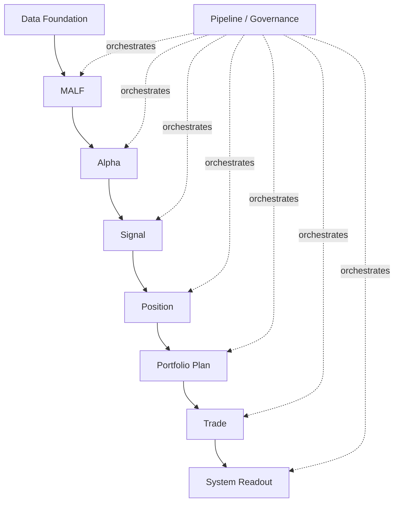

# Asteria 重构总纲 v1

日期：2026-04-27

## 1. 系统命名

| 项 | 名称 |
|---|---|
| 英文名 | Asteria |
| 中文名 | 星脉系统 |
| 全称 | Asteria Market Lifespan Framework |
| 内部核心 | MALF |

一句话定义：

> Asteria 星脉系统，是一个以市场结构为骨架、以波段生命为核心、以 Alpha 解释和组合执行为外部行为的系统化交易研究框架。

## 2. 重构裁决

本次不是在旧系统上继续 demo + debug，而是建立一个目标定义先行的新主线。

核心裁决：

| 问题 | 裁决 |
|---|---|
| 是否大幅重构 | 是。新主线以 MALF 终稿为中心重建 |
| 是否保留旧系统经验 | 保留经验、测试样本、失败教训，不直接继承混乱语义 |
| `data` 是否在策略主线中 | 否。`data` 是基础建设层和 source-fact 服务 |
| 主线从哪里开始 | 从 `MALF` 开始 |
| 是否一次改多个模块 | 否。一次只允许一个模块进入主线施工 |
| 未验证模块是否允许上线 | 否 |

## 2.1 权威资产链

当前治理文档必须同时锚定仓库内 HEAD 和 `H:\Asteria-Validated` 中的正式资产。

| 资产 | 地位 | 用途 |
|---|---|---|
| `H:\Asteria-Validated\MALF_Three_Part_Design_Set_v1_3.zip` | MALF v1.3 语义权威 | 定义 current effective guard、transition boundary、birth descriptors 与 Service 追溯字段 |
| `H:\Asteria-Validated\MALF_Three_Part_Design_Set_v1_3\` | MALF v1.3 语义权威目录 | 供文档桥接、审计和实现逐条引用 |
| `H:\Asteria-Validated\Asteria-docs-code-20260502-104932.zip` | 最新 docs/code 快照 | 记录 Data formal promotion 与 MALF v1.3 formal-data closeout 后的仓库文档与代码基线 |
| `H:\Asteria-Validated\Asteria-data-formal-promotion-evidence-20260502-01.zip` | Data Foundation 首轮正式证据 | 证明 legacy stock backward day/week/month Data DB 已 promote |
| `H:\Asteria-Validated\Asteria-malf-v1-3-formal-rebuild-closeout-20260502-01.zip` | MALF v1.3 formal-data 证据 | 证明 MALF day v1.3 已用正式 Data 输入通过 bounded proof |
| `H:\Asteria-Validated\Asteria-data-market-meta-formalization-20260502-01.zip` | Data market_meta 最小正式证据 | 证明 `market_meta.duckdb` 已按可证事实优先口径落地 |
| `H:\Asteria-Validated\Asteria-data-market-meta-sw-industry-snapshot-20260502-01.zip` | Data 申万行业快照证据 | 证明可匹配正式 Data 标的的申万 2021 当前行业快照已部分释放 |
| `H:\Asteria-Validated\Asteria-data-foundation-production-baseline-seal-20260502-01.zip` | Data baseline seal 证据 | 证明 Data 已封为主线输入底座，后续只走 maintenance card |
| `H:\Asteria-Validated\Asteria-deep-research-report-重构系统最新剖切面研究报告-20260428.*` | 架构剖切面研究 | 支撑治理、主线、数据、编排四个切面的后续裁决 |

裁决：

```text
Validated 保存权威快照和证据资产。
repo HEAD 保存当前实施真相。
快照之后的新事实必须通过执行记录、closeout、manifest 和新 Validated 归档补齐。
```

## 3. 系统分层



## 4. Data 的地位

`data` 不属于策略主线，但属于系统地基。

它只回答：

| 问题 | Data 是否回答 |
|---|---:|
| 原始行情从哪里来 | 是 |
| 日/周/月基础行情如何物化 | 是 |
| 交易日历、标的、行业、停牌/ST 等客观事实如何存放 | 是 |
| MALF 如何解释结构 | 否 |
| Alpha 是否有机会 | 否 |
| 是否建仓 | 否 |
| 是否交易 | 否 |

因此正式表达为：

```text
Data Foundation feeds the mainline.
Data is not the strategy mainline.
```

## 5. 主线铁律

```text
MALF defines structure and position.
Alpha interprets opportunity.
Signal aggregates intent.
Position materializes holding logic.
Portfolio allocates capital.
Trade executes orders.
System reads out the whole chain.
Pipeline orchestrates, but does not redefine business meaning.
```

## 6. 单模块施工门禁

一个模块进入施工前，必须具备：

| 门禁 | 要求 |
|---|---|
| Authority Design | 定义、边界、依赖、状态机已冻结 |
| Schema Spec | 表族、自然键、写入语义已冻结 |
| Runner Contract | 输入、输出、幂等、断点续跑已冻结 |
| Test/Audit Spec | 最小验收、硬规则审计、回归样本已冻结 |
| Build Card | 本次只动什么、不动什么已冻结 |

一个模块上线主线前，必须具备：

| 门禁 | 要求 |
|---|---|
| Unit Tests | 本模块规则测试通过 |
| Contract Tests | 上下游契约测试通过 |
| Database Audit | 目标 DuckDB 表族和自然键审计通过 |
| Evidence | 执行证据落档 |
| Conclusion | 放行/待修结论落档 |

## 7. 不允许的重构方式

| 禁止项 | 原因 |
|---|---|
| 边 debug 边发明主线定义 | 会重复旧系统问题 |
| 下游模块反向修正 MALF 语义 | 会污染结构真值 |
| 一个字段混用多个层级状态 | 会导致接口长期混乱 |
| 一个 DuckDB 承担所有热/冷事实 | 会制造写入和查询瓶颈 |
| 多模块同时上线 | 无法判断错误来源 |

## 8. 第一阶段裁决

当前已完成治理闭环：

```text
docs-authority-refresh-20260429-01
```

当前已冻结主线模块：

```text
MALF
Alpha
Signal
```

当前已通过 bounded proof：

```text
MALF day bounded proof 已通过
Alpha day bounded proof 已通过
Signal day bounded proof 已通过
MALF dense bar-level complete alignment closeout 已通过
Data legacy formal promotion 已通过
Data market meta formalization 已通过
Data market meta SW industry snapshot 已通过
Data foundation production baseline seal 已通过
MALF v1.3 formal-data bounded closeout 已通过
```

下一张允许进入的卡：

```text
Position freeze review reentry card
```

MALF 当前 formal evidence 以
`malf-v1-3-formal-rebuild-closeout-20260502-01` 为准；该证据已经承接 MALF v1.3
day formal-data bounded proof，但 week/month 证明尚未执行。
Data Foundation 当前已封为主线输入底座；`market_meta.duckdb` 已放行从正式 raw/base
行情库推导的最小客观事实，并部分释放可匹配正式 Data 标的的申万 2021 当前行业快照；
ST、停牌、真实上市/退市和历史行业沿革仍不放行，后续只能通过明确 maintenance card 扩展。
Signal bounded proof 已通过；Position freeze review 已登记 blocked；MALF complete
alignment closeout 已被 v1.3 formal-data closeout supersede 为当前 MALF day 正式证据。
下一卡只允许 Position freeze review reentry 的只读评审（review-only），不直接授权
Signal full build、Position bounded proof、Position 施工、下游施工或全链路 pipeline。
