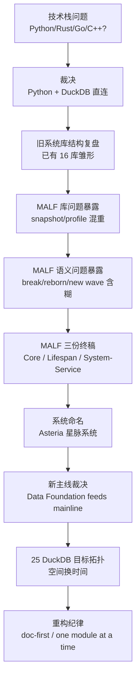
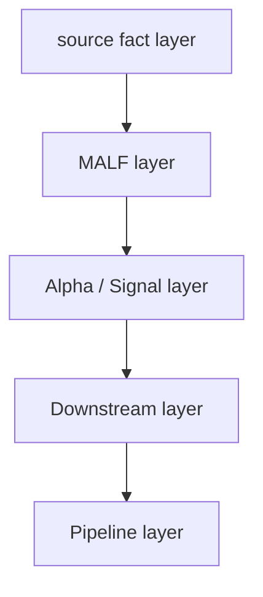
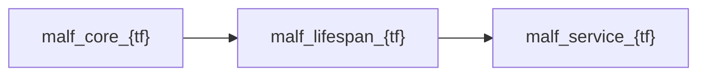
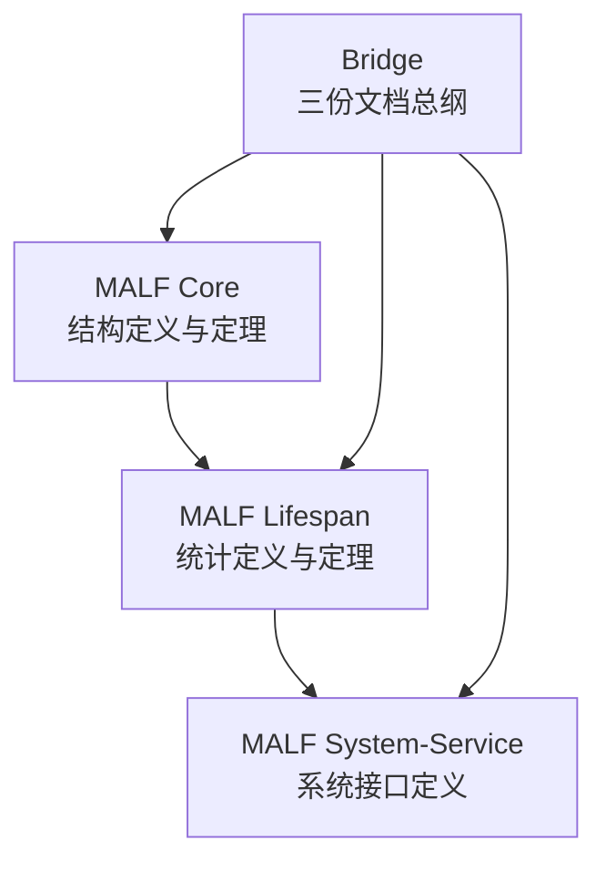
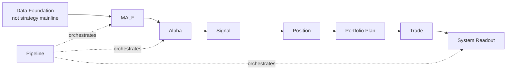

# Asteria 重构来路与决策链 v1

日期：2026-04-27

## 1. 本文件目的

本文件记录 Asteria 重构不是突然开始的，而是由一串具体问题逐步推导出来的。

它回答：

| 问题 | 回答 |
|---|---|
| 为什么选择 Python + DuckDB | 因为当前是日线/周线级批量计算，不需要第二语言 |
| 为什么 MALF 必须重构 | 因为旧 MALF 库与旧 MALF 语义都暴露出结构性问题 |
| 为什么要把 MALF 拆成三份文档 | 因为 Core、Lifespan、System-Service 是三类不同真值 |
| 为什么新系统叫 Asteria | 因为系统已从单个 lifespan/alpha 工具升级为市场生命框架 |
| 为什么 data 不在策略主线中 | 因为 data 只提供 source facts，不解释机会、不决定交易 |
| 为什么必须 doc-first | 因为旧系统多次重构都在 demo + debug 中反复补定义 |

本文件不新增主线模块，不授权旧代码迁移，只为当前权威设计提供来路说明。

## 2. 总体演化图



## 3. 第一阶段：技术栈裁决

最早的问题是量化交易中间数据库和 DuckDB 技术栈如何选择。

当时的候选：

| 技术路线 | 判断 |
|---|---|
| Python + Rust | 长期可行，但当前没有必要 |
| Go | 工程务实，但会增加语言栈 |
| C/C++ | 对当前日线/周线系统收益不足 |
| Python + DuckDB | 当前最合适 |

关键裁决：

```text
Python + DuckDB direct is enough.
```

原因：

| 条件 | 结论 |
|---|---|
| 当前主要是 A 股日线/周线 | 数据增量小 |
| 主要压力在历史回算 | DuckDB 向量化和批量写适合 |
| MALF pattern 是 bars scan + rank query | Python 足够表达，DuckDB 足够承载 |
| 不做 tick/HFT | 不需要 Rust/Go/C++ 先行 |

这条裁决后来变成 Asteria 的环境策略：

```text
D:\miniconda\py310 -> H:\Asteria\.venv -> duckdb/polars/pandas/pytest/ruff/mypy
```

## 4. 第二阶段：旧 16 库雏形

读取前辈系统后，旧系统已自然形成一条 16 库主线：



旧 16 库大致为：

| 层 | 库 |
|---|---|
| source fact | `raw_market.duckdb`, `market_base.duckdb`, `raw_market_week/month`, `market_base_week/month` |
| MALF | `malf_day.duckdb`, `malf_week.duckdb`, `malf_month.duckdb` |
| Alpha / Signal | `alpha_bof`, `alpha_tst`, `alpha_pb`, `alpha_cpb`, `alpha_bpb`, `signal.duckdb` |
| Downstream | `position.duckdb`, `portfolio_plan.duckdb`, `trade.duckdb`, `system.duckdb` |
| Orchestration | `pipeline.duckdb` |

这说明旧系统已经有正确本能：

| 正确本能 | 后来保留为 |
|---|---|
| source fact 与策略模块分离 | Data Foundation |
| MALF 按 timeframe 分库 | MALF day/week/month |
| Alpha 按 family 分库 | Alpha family DB |
| Downstream 按模块分库 | Position / Portfolio / Trade / System |
| Pipeline 独立 | Pipeline 编排层 |

但是旧 16 库还不够，因为 MALF 内部冷热事实混在一起。

## 5. 第三阶段：MALF 库设计问题

旧 `malf_day.duckdb` 同时承担：

| 表族 | 特征 |
|---|---|
| snapshot | 每 bar 一行，重、长、用于回溯 |
| profile | 历史统计摘要，小、热、用于查询 |
| WavePosition | 下游接口，热读、高稳定 |

问题是：

```text
snapshot / profile / service 被放进同一个 MALF 库。
```

这会导致：

| 问题 | 后果 |
|---|---|
| 写入重事实时影响热查询 | 下游读接口变慢 |
| profile 与 snapshot 同库增长 | MALF day 成为最重库 |
| 回溯事实与服务接口耦合 | schema 演化困难 |
| 多股并行写入 DuckDB | 容易撞上单写进程瓶颈 |

因此后来演化为每个 timeframe 三库：



| 新库 | 职责 |
|---|---|
| `malf_core_{tf}` | pivot / structure / wave / break / transition / candidate |
| `malf_lifespan_{tf}` | snapshot / profile / rank sample / rule version |
| `malf_service_{tf}` | WavePosition / latest / interface audit |

这就是 Asteria 从 16 库扩展到 25 库的核心原因。

## 6. 第四阶段：MALF 与 Alpha 边界

旧讨论中一个关键句子是：

```text
MALF 是骨架和神经系统，Alpha 是外部行为系统。
```

后来被固化为正式边界：

| 层 | 回答什么 | 不回答什么 |
|---|---|---|
| MALF Core | 市场结构是什么 | 是否值得买 |
| MALF Lifespan | 波段生命处于什么统计位置 | 是否建仓 |
| MALF Service | 给下游稳定 WavePosition | 资金和订单 |
| Alpha | 这个位置是否构成机会 | 持仓规模 |
| Signal | 多个 Alpha 如何形成正式意图 | 组合资金 |
| Position | 持仓语义 | 组合约束 |
| Portfolio Plan | 资金与容量裁决 | 成交事实 |
| Trade | 订单与成交账本 | 策略解释 |

这条边界后来成为铁律：

```text
MALF defines structure and position.
Alpha interprets opportunity.
```

因此 Alpha、Signal、Position、Portfolio、Trade、System 均不得写回 MALF。

## 7. 第五阶段：MALF 语义升级

旧 MALF 最初是“可用的骨架”，但不是完全有生命的系统。

核心问题集中在：

| 旧问题 | 本质 |
|---|---|
| break 后旧 wave 是否还能延伸 | wave 身份不清 |
| reborn 中同向新高算旧波还是新波 | transition 语义不清 |
| 牛顺/牛逆/熊顺/熊逆 | 口头词，没有正式地位 |
| new-count 何时截止 | terminated 边界不清 |
| new wave 何时确认 | candidate + progress 条件缺失 |

因此 MALF 被重写为定义/定理风格，并拆成三份：



| 文件 | 职责 |
|---|---|
| `MALF_01_Core_Definitions_Theorems_v1_3.md` | Core 结构定义与定理 |
| `MALF_02_Lifespan_Stats_Definitions_Theorems_v1_2.md` | 波段统计学定义 |
| `MALF_03_System_Service_Interface_v1_2.md` | MALF 对系统其它模块的服务接口 |
| `MALF_00_Three_Documents_Bridge_v1_2.md` | 三份文件之间的桥 |

权威路径：

```text
H:\Asteria-Validated\MALF_Three_Part_Design_Set_v1_2
```

## 8. 第六阶段：MALF 评审与漏洞修补

第一轮评审指出七类问题：

| 问题 | 处理结果 |
|---|---|
| 前一相关 H/L 未定义 | 增加 StructureContext 与 reference H/L |
| New Wave 确认条件缺失 | 增加 candidate guard + progress confirmation |
| `core_state` 混入 transition | 拆成 `wave_core_state` 与 `system_state` |
| life-state 阈值不明确 | 增加阈值和版本化 |
| no-new-span 起点不明确 | 增加边界定义 |
| sample scope 不明确 | 增加默认全市场 sample scope |
| 初始 wave 如何建立不清 | 增加 initial wave 序列 |

第二轮评审剩余三类问题：

| 问题 | 最终裁决 |
|---|---|
| transition 中 candidate 方向切换 | 最新 candidate guard 取代旧 candidate |
| candidate context reference H/L 来源 | 来自旧 wave 的 final extreme_price |
| transition 中 direction 可选 | `direction = old_direction`，不为空 |

这些修补把 MALF 从“可运行规则”推进为“可实现的定义定理系统”。

## 9. 第七阶段：系统命名与主线重建

在 MALF 终稿之后，系统不再只是某个 lifespan-alpha 工具，而是一个完整市场生命框架。

命名裁决：

| 项 | 名称 |
|---|---|
| 英文名 | Asteria |
| 中文名 | 星脉系统 |
| 全称 | Asteria Market Lifespan Framework |
| 内部核心 | MALF |

一句话定义：

```text
Asteria 星脉系统，是一个以市场结构为骨架、以波段生命为核心、以 Alpha 解释和组合执行为外部行为的系统化交易研究框架。
```

系统主线被重新裁定为：



旧模块地位：

| 旧模块/概念 | 新地位 |
|---|---|
| `structure` | 退役为 MALF Core 内部事实 |
| `filter` | 降级为 Data 客观事实或 Alpha gate |
| `reborn` | 退役，由 transition/new wave 替代 |
| 牛顺/牛逆/熊顺/熊逆 | 退役，由结构推进/非推进替代 |

## 10. 第八阶段：数据库拓扑裁决

从旧 16 库到新 25 库，不是为了复杂，而是为了把不同热度、不同语义层、不同更新时间的事实拆开。

目标拓扑：

| 层 | 数量 | 说明 |
|---|---:|---|
| Data Foundation | 5 | raw / meta / base day/week/month |
| MALF | 9 | core/lifespan/service x day/week/month |
| Alpha / Signal | 6 | five alpha family DB + signal |
| Downstream | 4 | position / portfolio_plan / trade / system |
| Pipeline | 1 | orchestration ledger |

合计：

```text
25 DuckDB
```

第一批只建最小 MALF day 链路：

| 顺序 | DB |
|---:|---|
| 1 | `market_meta.duckdb` |
| 2 | `market_base_day.duckdb` |
| 3 | `malf_core_day.duckdb` |
| 4 | `malf_lifespan_day.duckdb` |
| 5 | `malf_service_day.duckdb` |
| 6 | `pipeline.duckdb` |

## 11. 第九阶段：治理方式裁决

旧系统的问题不是没有代码，而是主线定义常常在调试过程中补出来。

因此 Asteria 的重构方式被裁定为：

```text
design freeze
-> schema freeze
-> runner implementation
-> bounded proof
-> full build or segmented build
-> audit
-> release gate
-> downstream integration proof
```

硬规则：

| 规则 | 原因 |
|---|---|
| 先有权威设计，再有实现 | 防止边写边发明语义 |
| 一次只动一个主线模块 | 防止错误来源混杂 |
| 未经检验的模块不上线 | 防止 demo 进入主线 |
| data 不是策略主线 | 防止 source facts 被策略解释污染 |
| Pipeline 只编排 | 防止调度层长出业务语义 |
| 下游不得回写 MALF | 防止结构真值被策略反向污染 |

## 12. 当前状态

截至本文件创建时：

| 项 | 状态 |
|---|---|
| 系统命名 | 已冻结 |
| 主线模块顺序 | 已冻结 |
| Data Foundation 地位 | 已冻结 |
| 目标 DuckDB 拓扑 | 已冻结 |
| MALF 三份语义终稿 | 已进入 Validated |
| 前辈系统资产清单 | 已建立 |
| 当前活跃设计卡 | `01-malf-schema-and-runner-contract-freeze-card-20260427` |

当前唯一自然下一步：

```text
把 MALF 三份语义终稿映射为 Asteria day 三库 schema / runner contract / audit spec。
```

## 13. 一句话结论

Asteria 不是旧系统的第六次补丁。

它是从以下四个痛点中推导出来的新主线：

| 痛点 | 新裁决 |
|---|---|
| 技术栈过度设想 | Python + DuckDB 足够 |
| MALF 库冷热混杂 | core/lifespan/service 分库 |
| MALF 语义含糊 | 三份定义/定理终稿 |
| 旧系统边 debug 边定规则 | doc-first 单模块门禁 |

因此，本次重构的真正起点不是代码，而是权威语义、模块边界、数据库拓扑和上线门禁。
