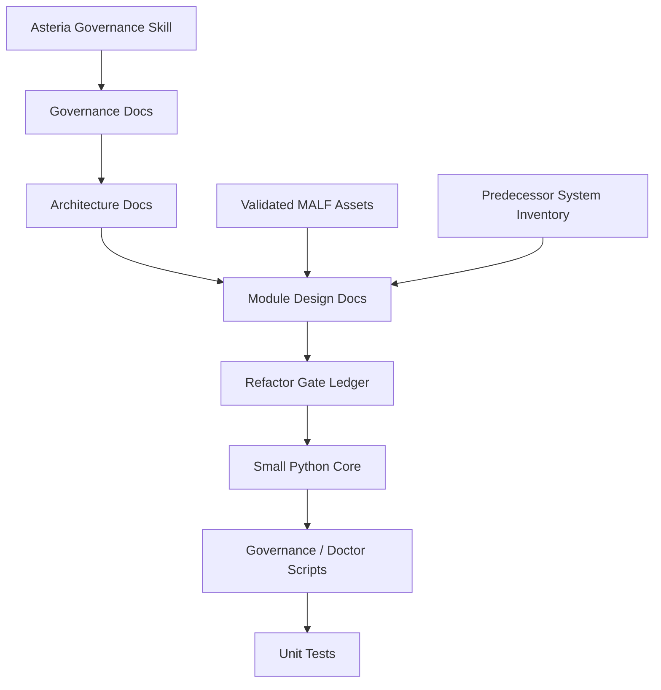

# Asteria 当前系统清单 v1

日期：2026-04-27

## 1. 清单目的

本文件整理 Asteria 当前仓库已经具备的资产。

它回答：

| 问题 | 回答 |
|---|---|
| 当前仓库里有什么 | 是 |
| 当前系统已经冻结了哪些裁决 | 是 |
| 当前有哪些代码、脚本、测试、治理工具 | 是 |
| 当前哪些模块还没有进入实现 | 是 |
| 是否改变当前施工锁 | 否 |

本文件是状态清单，不是新设计，不授权任何主线模块越级施工。

## 2. 当前仓库位置

| 项 | 值 |
|---|---|
| repo root | `H:\Asteria` |
| remote | `https://github.com/everything-is-simple/Asteria.git` |
| branch | `codex/mainline-module-docs-v1` |
| package name | `asteria` |
| version | `0.1.0` |
| Python provider | `D:\miniconda\py310` |
| repo virtualenv | `H:\Asteria\.venv` |

五根目录：

| 路径 | 当前职责 |
|---|---|
| `H:\Asteria` | 代码、文档、测试、治理入口 |
| `H:\Asteria-data` | 未来正式 DuckDB 数据资产 |
| `H:\Asteria-report` | 未来人读报告、图表、运行证据 |
| `H:\Asteria-Validated` | 已验证设计和历史资产 |
| `H:\Asteria-temp` | pytest cache、working DB、临时重建产物 |

## 3. 当前系统总图



当前仓库的主要成果是：

```text
doc-first refactor workspace
```

还不是：

```text
full trading runtime
```

## 4. Git 历史节点

| Commit | 含义 |
|---|---|
| `7e27faa` | Initial Asteria refactor charter |
| `a147378` | Bootstrap Python environment and governance tooling |
| `17086e9` | Document validated asset inventory |
| `8f902b9` | Document predecessor system module inventory |
| `868fb0b` | Document Asteria refactor decision trace |

这些提交完成了 Asteria 的第一层地基：

```text
name -> roots -> governance -> architecture -> topology -> MALF bridge -> asset inventory
```

## 5. 顶层文件资产

| 文件 | 职责 |
|---|---|
| `README.md` | 仓库主入口，说明系统定义、五根目录、阅读入口、开发检查 |
| `AGENTS.md` | agent 施工规则，规定必读文档和硬约束 |
| `pyproject.toml` | Python package、依赖、pytest/ruff/mypy/governance 配置 |
| `environment.yml` | 可选 conda 环境定义 |
| `.gitignore` | 忽略虚拟环境、缓存、DuckDB、临时数据产物 |
| `.gitattributes` | 文本换行治理 |
| `.pre-commit-config.yaml` | 提交前基础检查 |

## 6. 文档资产

### 6.1 Governance

| 文件 | 状态 | 职责 |
|---|---|---|
| `docs/00-governance/00-asteria-refactor-charter-v1.md` | active | 系统命名、重构总纲、主线铁律、单模块门禁 |
| `docs/00-governance/01-asteria-refactor-origin-trace-v1.md` | active | 重构来路与决策链 |
| `docs/00-governance/02-current-system-inventory-v1.md` | active | 当前仓库资产清单 |

### 6.2 Architecture

| 文件 | 状态 | 职责 |
|---|---|---|
| `docs/01-architecture/00-mainline-authoritative-map-v1.md` | active | 主线模块权威图 |
| `docs/01-architecture/01-database-topology-v1.md` | active | 25 DuckDB 目标拓扑 |
| `docs/01-architecture/02-validated-asset-inventory-v1.md` | active | `H:\Asteria-Validated` 资产清单 |
| `docs/01-architecture/03-predecessor-system-module-inventory-v1.md` | active | 四个前辈系统模块资产清单 |
| `docs/01-architecture/04-historical-ledger-incremental-protocol-v1.md` | active | 逻辑历史总账、分批初始化、每日增量与断点续传协议 |

### 6.3 Module Docs

| 文件 | 状态 | 职责 |
|---|---|---|
| `docs/02-modules/00-module-design-document-standard-v1.md` | active | 模块文档标准 |
| `docs/02-modules/01-data-foundation-design-v1.md` | draft | Data Foundation 权威设计草案 |
| `docs/02-modules/02-malf-authoritative-design-bridge-v1.md` | active | MALF 三份终稿到 Asteria 的桥 |
| `docs/02-modules/03-malf-schema-runner-audit-spec-v1.md` | draft | MALF day 三库 schema / runner / audit 规格草案 |

### 6.4 Refactor Gates

| 文件 | 状态 | 职责 |
|---|---|---|
| `docs/03-refactor/00-module-gate-ledger-v1.md` | active | 模块状态和施工锁 |
| `docs/03-refactor/01-malf-schema-and-runner-contract-freeze-card-20260427.md` | draft | 当前 MALF schema/runner/audit 冻结卡 |

### 6.5 Docs Index

| 文件 | 职责 |
|---|---|
| `docs/README.md` | 文档目录入口，连接 Validated、前辈系统、重构来路 |

## 7. Python 代码资产

当前 `src/` 包含最小 core 骨架，以及服务 MALF day bounded proof 输入准备的
Data bounded bootstrap support、机器可读治理执行器和 MALF bounded proof scaffold。

| 文件 | 职责 |
|---|---|
| `src/asteria/__init__.py` | package 入口 |
| `src/asteria/core/__init__.py` | core package 入口 |
| `src/asteria/core/contracts.py` | 基础 contract 类型占位 |
| `src/asteria/core/paths.py` | 五根目录路径解析、数据库路径、temp run root |
| `src/asteria/data/__init__.py` | Data Foundation package 入口 |
| `src/asteria/data/contracts.py` | Data bootstrap 请求、摘要、source manifest contract |
| `src/asteria/data/tdx_text.py` | TDX 离线 txt 发现与解析 |
| `src/asteria/data/schema.py` | `raw_market` 与 `market_base_day` 最小 bootstrap schema |
| `src/asteria/data/bootstrap.py` | TDX txt 到 raw/base day 的 bounded bootstrap 执行入口 |
| `src/asteria/data/legacy_audit.py` | 老 raw/base 库只读覆盖率对账辅助 |
| `src/asteria/governance/checks.py` | 机器可读门禁、DB 拓扑、API contract 与 repo 产物检查 |
| `src/asteria/malf/contracts.py` | MALF day bounded proof 请求合同与摘要 |
| `src/asteria/malf/schema.py` | `malf_core_day` / `malf_lifespan_day` / `malf_service_day` schema bootstrap |
| `src/asteria/malf/bootstrap.py` | MALF day core / lifespan / service / audit scaffold |

当前代码状态：

| 项 | 状态 |
|---|---|
| MALF engine | day bounded proof scaffold 已实现；正式语义引擎仍未实现 |
| Data Foundation bounded bootstrap support | 已实现最小入口；正式 Data Foundation builder 未放行 |
| Alpha engine | 未实现 |
| Signal engine | 未实现 |
| Position / Portfolio / Trade / System | 未实现 |
| Pipeline runtime | 未实现 |

这是有意为之：当前只允许按门禁进入 MALF day bounded proof，不得提前迁移旧实现或放行下游模块。

## 8. 脚本资产

| 文件 | 职责 |
|---|---|
| `scripts/dev/doctor.py` | 输出 Asteria 版本、Python 版本、五根目录 |
| `scripts/governance/check_project_governance.py` | 执行机器可读治理检查：required docs、registry、API contract、禁用产物、施工锁 |
| `scripts/data/run_data_bootstrap.py` | 从 TDX 离线 txt 执行 raw + market_base_day 最小 bounded bootstrap |
| `scripts/malf/run_malf_day_core_build.py` | MALF day Core bounded proof scaffold 入口 |
| `scripts/malf/run_malf_day_lifespan_build.py` | MALF day Lifespan bounded proof scaffold 入口 |
| `scripts/malf/run_malf_day_service_build.py` | MALF day Service bounded proof scaffold 入口 |
| `scripts/malf/run_malf_day_audit.py` | MALF day audit scaffold 入口 |

当前脚本只服务：

```text
environment proof + hard governance proof + Data bounded bootstrap support + MALF bounded proof scaffold
```

仍不服务完整正式 Data Foundation 构建、MALF 正式语义放行或下游主线运行。

## 9. 测试资产

| 文件 | 职责 |
|---|---|
| `tests/unit/core/test_paths.py` | 验证路径解析与数据库路径规则 |
| `tests/unit/governance/test_project_governance.py` | 验证治理检查入口可运行 |
| `tests/unit/data/test_tdx_text.py` | 验证 TDX txt 发现与解析 |
| `tests/unit/data/test_bootstrap_runner.py` | 验证 bounded bootstrap、resume、自然键替换与 dirty scope |
| `tests/unit/data/test_legacy_audit.py` | 验证老 raw/base 库只读覆盖率对账 |
| `tests/unit/malf/test_bounded_proof_runner.py` | 验证 MALF day core / lifespan / service / audit scaffold |

测试配置：

| 项 | 值 |
|---|---|
| pytest root | `tests` |
| pytest temp | `H:/Asteria-temp/pytest-tmp` |
| pytest cache | `H:/Asteria-temp/pytest-cache` |

测试缓存不进入仓库。

## 10. 本地 skill 资产

| 文件 | 职责 |
|---|---|
| `.codex/skills/asteria-governance/SKILL.md` | Asteria 专用治理技能 |
| `.codex/skills/asteria-governance/agents/openai.yaml` | skill agent 配置 |

该 skill 规定：

| 规则 | 状态 |
|---|---|
| doc-first | active |
| 单模块施工 | active |
| data 不是策略主线 | active |
| MALF 是第一主线模块 | active |
| 下游不得写回 MALF | active |

## 11. 环境与依赖

当前 Python 运行环境：

| 项 | 值 |
|---|---|
| Python | `3.10.19` |
| virtualenv | `H:\Asteria\.venv` |
| install mode | editable install |

核心依赖：

| 用途 | 包 |
|---|---|
| DuckDB | `duckdb` |
| DataFrame | `pandas`, `polars` |
| Arrow/Parquet | `pyarrow` |

开发依赖：

| 用途 | 包 |
|---|---|
| test | `pytest`, `pytest-cov` |
| lint/format | `ruff` |
| type check | `mypy` |
| hook | `pre-commit` |
| chart/report support | `matplotlib` |

## 12. 当前权威裁决

| 主题 | 当前裁决 |
|---|---|
| 系统名 | Asteria / 星脉系统 |
| 全称 | Asteria Market Lifespan Framework |
| 内部核心 | MALF |
| 技术栈 | Python + DuckDB 直连 |
| Data 地位 | Foundation，不是策略主线 |
| 主线顺序 | `MALF -> Alpha -> Signal -> Position -> Portfolio Plan -> Trade -> System` |
| Pipeline 地位 | 编排层，不定义业务语义 |
| DB 拓扑 | 25 DuckDB 目标拓扑 |
| 逻辑总账 | 多个 DuckDB 视为统一历史总账的分账本体系 |
| source authority | TDX / 正式生产源进入新 raw；旧 raw/base 只读对账；旧下游库只做旁证 |
| 第一施工模块 | MALF |
| 当前施工状态 | MALF 已冻结，下一施工卡为 MALF day bounded proof |

## 13. 当前数据库状态

当前仓库没有正式 DuckDB 数据库。

| 库类 | 状态 |
|---|---|
| `H:\Asteria-data\*.duckdb` | 尚未由本仓库正式创建 |
| `H:\Asteria-temp\*` | 可用于 pytest 和未来 working DB |
| repo root `*.duckdb` | 禁止 |

第一批目标库仍是：

| 顺序 | DB |
|---:|---|
| 1 | `market_meta.duckdb` |
| 2 | `market_base_day.duckdb` |
| 3 | `malf_core_day.duckdb` |
| 4 | `malf_lifespan_day.duckdb` |
| 5 | `malf_service_day.duckdb` |
| 6 | `pipeline.duckdb` |

但这些库只能在 MALF 卡冻结并进入 bounded proof 实现卡后创建。

## 14. 当前明确没有的东西

| 尚未拥有 | 原因 |
|---|---|
| 正式 MALF engine | 当前只有 bounded proof scaffold；结构语义、WavePosition 发布与正式放行证据尚未实施 |
| 正式 Data Foundation builder | Data 仍未冻结；当前只有 bounded bootstrap support，不抢第一施工位 |
| Alpha/Signal 实现 | 等 MALF WavePosition 放行 |
| Position/Portfolio/Trade/System 实现 | 等上游模块依次放行 |
| Pipeline 全链路运行 | Pipeline 不能先于业务模块定义语义 |
| 正式 DuckDB 文件 | 尚未进入 bounded proof |
| 旧系统代码迁移 | 必须等目标模块设计冻结后逐文件审查 |

## 15. 当前下一步

当前唯一自然下一步：

```text
MALF day bounded proof
```

首轮目标：

| 目标 | 状态 |
|---|---|
| Data 输入 | `market_base_day` 最小输入契约可供 MALF day bounded proof 消费 |
| MALF Core day | scaffold 已实现；结构事实算法尚未实现 |
| MALF Lifespan day | scaffold 已实现；lifespan 统计语义尚未实现 |
| MALF Service WavePosition | service ledger 与接口审计 scaffold 已实现；WavePosition 尚未正式发布 |
| hard audit | 审计报告 scaffold 已形成；硬规则审计尚未实现 |

通过后才进入：

```text
Alpha freeze review
```

## 16. 一句话总结

当前 Asteria 已经拥有：

```text
名字、根目录、环境、治理规则、主线图、数据库拓扑、历史总账协议、MALF 冻结文档、机器可读治理 registry、最小 Python 骨架、Data bounded bootstrap support、MALF bounded proof scaffold、治理检查和基础测试。
```

当前 Asteria 还没有：

```text
正式 Data Foundation builder、MALF 正式语义引擎与 release evidence、下游主线实现、pipeline runtime 或任何未经放行证据支撑的正式主线运行。
```

这正是本轮重构想要的状态：先把地基、边界和证据摆正，再让第一个主线模块进入施工。
