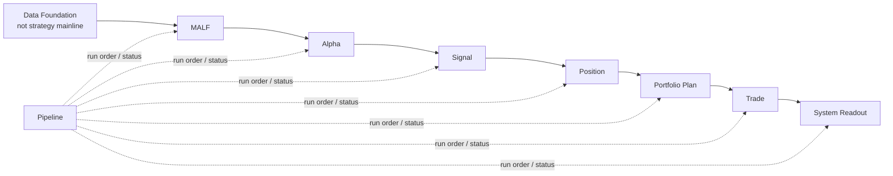
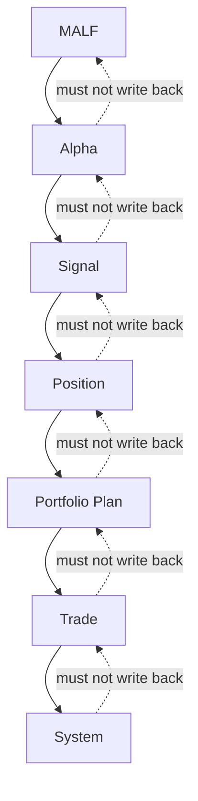

# Asteria 主线模块权威图 v1

日期：2026-04-30

## 1. 主线总图



## 1.1 当前门禁状态

截至 `pipeline-year-replay-coverage-gap-diagnosis-and-repair-scope-freeze-20260509-01` prepared：

| 项 | 当前状态 |
|---|---|
| 当前已冻结主线模块 | `MALF`; `Alpha`; `Signal`; `Position`; `Portfolio Plan`; `Trade`; `System Readout` |
| 当前已通过 bounded proof | `MALF day`; `MALF week`; `MALF month`; `Alpha day`; `Signal day`; `Position day`; `Portfolio Plan day`; `Trade bounded proof`; `System Readout day bounded proof`; `MALF v1.4 day runtime sync implementation` |
| 当前已准备执行卡 | `malf_2024_natural_year_coverage_repair_card` |
| 当前只允许施工 | MALF released day surface 2024 natural-year coverage repair |
| 当前仍禁止 | Position full build、Portfolio Plan full build、Trade full build、System full build、full rebuild、daily incremental、resume/idempotence、v1 complete |

`Signal bounded proof` 已基于已放行的 Alpha candidate 完成最小证明。Data Foundation
已补齐正式 `market_meta.duckdb` 的最小事实，并部分释放可匹配正式 Data 标的的申万
2021 当前行业快照。Data Foundation 已封为主线输入底座，后续只能通过明确
maintenance card 扩展；Data reference target maintenance closeout 已完成 source inventory 裁决，
ST、停牌、真实上市/退市状态、历史行业沿革和 index/block membership 仍因无 approved source manifest 而 retained。Position freeze
review reentry 已完成只读评审并通过；MALF v1.4 day runtime sync implementation 已通过并取代旧 v1.3
runtime evidence。随后 `upstream-pre-position-completeness-synthesis-20260506-01`
裁定：若按最终完整目标衡量，Data / MALF / Alpha / Signal 仍不能给出全部完成的肯定答复，
因此 Position bounded proof 施工暂时搁置。当前仍不授权 Alpha full build、Signal full build、
Position full build、下游施工或全链路 pipeline。
后续七张卡中 Data reference scope、Data reference closeout、MALF week、MALF month、
Alpha production hardening、Signal production hardening、upstream release decision、Position bounded proof
与 Portfolio Plan freeze review、Portfolio Plan bounded proof、Trade freeze review、Trade bounded proof build、
System Readout freeze review 与 System Readout bounded proof build 已通过；随后
`pipeline-freeze-review-20260508-01`、
`pipeline-build-runtime-authorization-scope-freeze-20260508-01`、
`pipeline-single-module-orchestration-build-card-20260508-01` 与
`pipeline-full-chain-dry-run-authorization-scope-freeze-20260508-01` 与
`pipeline-full-chain-dry-run-card-20260508-01` 与
`pipeline-full-chain-bounded-proof-authorization-scope-freeze-20260508-01`、`pipeline-full-chain-bounded-proof-build-card-20260508-01`、
`pipeline-full-chain-bounded-proof-closeout-20260508-01`、`pipeline-one-year-strategy-behavior-replay-authorization-scope-freeze-20260508-01`
与 `pipeline-one-year-strategy-behavior-replay-build-card-20260508-01` 也已闭环。Pipeline 当前已执行最小
`system_readout` 单模块 runtime、full-chain day dry-run、full-chain day bounded proof，并真实执行过一次
one-year strategy behavior replay；该 replay 因 `2024-01-01..2024-01-07` coverage gap 被 truthful blocked。
`pipeline-year-replay-coverage-gap-diagnosis-and-repair-scope-freeze-20260509-01` 已执行并形成正式诊断结论：
Data `2024-01-02..2024-01-05` 已覆盖，但 released MALF day surface 仍从 `2024-01-08` 才开始，因此当前唯一
prepared next card 已切到 `malf_2024_natural_year_coverage_repair_card`。当前只允许修补 MALF released day surface，
不允许重跑 year replay、扩成 Alpha/Signal/System/Pipeline 语义修补，或打开 full rebuild / v1 complete。

## 2. 主线模块

| 顺序 | 模块 | 是否主线 | 核心职责 |
|---:|---|---:|---|
| 0 | Data Foundation | 否 | 提供 source facts、market base、metadata |
| 1 | MALF | 是 | 结构事实、波段生命、WavePosition |
| 2 | Alpha | 是 | 解释机会，不处理资金和执行 |
| 3 | Signal | 是 | 聚合 Alpha 输出为正式信号账本 |
| 4 | Position | 是 | 把信号转为持仓候选和持仓计划 |
| 5 | Portfolio Plan | 是 | 资金、容量、组合约束、准入裁决 |
| 6 | Trade | 是 | 订单意图、执行价格线、成交账本 |
| 7 | System Readout | 是 | 全链路只读汇总、运行读出、审计快照 |
| 8 | Pipeline | 编排层 | 调度模块、记录步骤，不定义业务语义 |

## 3. 退役或降级模块

| 旧模块/概念 | 新地位 | 理由 |
|---|---|---|
| `structure` | 退役为 MALF Core 内部结构事实 | HH/HL/LL/LH 已归入 MALF-Core |
| `filter` | 降级为 Data/Universe 客观事实或 Alpha 前置 gate | 客观可交易性是地基事实，不是策略解释 |
| `reborn` | 退役 | Core 已定义 transition 后 new wave |
| 牛顺/牛逆/熊顺/熊逆 | 退役 | Core 已用结构推进/非推进完整替代 |

## 4. 模块边界

### MALF

MALF 只产出结构事实与统计位置。

```text
Input: market_base bars
Output: WavePosition
No output: buy/sell/weight/order
```

### Alpha

Alpha 读取 MALF 和可用辅助事实，解释机会。

```text
Input: WavePosition + alpha family facts
Output: alpha event / alpha score / alpha signal candidate
No output: position size / portfolio allocation / order
```

### Signal

Signal 只做信号账本聚合。

```text
Input: alpha outputs
Output: formal signal
No output: capital allocation / fill
```

### Position

Position 把信号变成持仓语义。

```text
Input: formal signal
Output: position candidate / entry plan / exit plan
No output: portfolio-wide capital allocation
```

### Portfolio Plan

Portfolio Plan 做组合层裁决。

```text
Input: position candidates
Output: portfolio plan / target exposure / admitted and trimmed plans
No output: actual fill
```

### Trade

Trade 是执行事实层。

```text
Input: portfolio plan
Output: order intent / execution / fill ledger
No output: strategy score
```

### System Readout

System 只读全链路。

```text
Input: all downstream official ledgers
Output: readout / summary / audit
No output: business mutation
```

## 5. 依赖方向



禁止反向依赖：

| 禁止依赖 | 裁决 |
|---|---|
| Alpha 修改 MALF | 禁止 |
| Position 回写 Signal | 禁止 |
| Portfolio Plan 修改 Alpha | 禁止 |
| Trade 影响 Portfolio Plan 历史裁决 | 禁止 |
| System 触发业务重算并改变上游语义 | 禁止 |

## 6. 构建模式

Asteria 采用模块化账本构建：

```text
design freeze
-> schema freeze
-> runner implementation
-> bounded proof
-> full build or segmented build
-> audit
-> release gate
-> downstream integration proof
```

每个模块必须支持：

| 能力 | 要求 |
|---|---|
| 一次性批量建仓 | 必须 |
| 增量更新 | 必须 |
| checkpoint | 必须 |
| dirty queue 或 replay scope | 必须 |
| run ledger | 必须 |
| schema version | 必须 |
| rule version | 语义模块必须 |
| sample version | 统计模块必须 |

## 7. 权威来源与状态更新

主线语义权威与工程治理权威分开：

| 权威输入 | 回答的问题 | 当前用途 |
|---|---|---|
| `H:\Asteria-Validated\MALF_Three_Part_Design_Set_v1_4.zip` | MALF v1.4 语义与操作边界：v1.3 semantic baseline + Core operational boundary rules | 当前 MALF 语义/操作边界权威；day runtime evidence 已升级到 v1.4 day runtime sync closeout，week bounded proof 已通过 |
| `H:\Asteria-Validated\Asteria-docs-code-20260502-104932.zip` | 最新仓库 docs/code 快照 | Data formal promotion 与 MALF v1.3 closeout 后的系统备份 |
| `H:\Asteria-Validated\Asteria-data-market-meta-formalization-20260502-01.zip` | Data market_meta 最小正式证据 | 证明 Data metadata fact 最小表面已落地，reference gaps retained |
| `H:\Asteria-Validated\Asteria-data-market-meta-sw-industry-snapshot-20260502-01.zip` | Data 申万行业快照证据 | 证明 `industry_classification` 已部分释放申万 2021 当前快照 |
| `H:\Asteria-Validated\Asteria-data-foundation-production-baseline-seal-20260502-01.zip` | Data baseline seal 证据 | 证明 Data 已封为主线输入底座，后续只走 maintenance card |
| `H:\Asteria-Validated\Asteria-data-reference-target-maintenance-closeout-20260506-01.zip` | Data reference maintenance closeout 证据 | 证明本轮 source inventory 已闭环，新增 reference facts 未因无源而释放 |
| `H:\Asteria-Validated\Asteria-deep-research-report-重构系统最新剖切面研究报告-20260428.*` | 多 DuckDB、日更、pipeline ledger、release evidence 如何治理 | 支撑逻辑历史总账和增量构建协议 |
| `docs/04-execution/00-conclusion-index-v1.md` | 哪些执行卡已经正式落档 | 当前放行状态入口 |

当前主线图不是“全系统已上线图”。它是模块依赖和施工顺序的法律图：

```text
MALF day 已通过 -> Alpha freeze review 已通过 -> Alpha bounded proof 已通过 -> Signal freeze review 已通过 -> Signal bounded proof 已通过 -> Position freeze review 已阻塞 -> Data formal promotion 已通过 -> MALF v1.4 day runtime sync implementation 已通过 -> Position freeze review reentry 已通过 -> upstream pre-position completeness synthesis 已完成 -> data reference target maintenance scope 已通过 -> data reference target maintenance closeout 已通过 -> malf week bounded proof build 已通过 -> malf month bounded proof build 已通过 -> alpha production builder hardening 已通过 -> signal production builder hardening 已通过 -> upstream pre-position release decision 已通过 -> position bounded proof 已通过 -> portfolio plan freeze review 已通过 -> portfolio plan bounded proof 已通过 -> trade freeze review 已通过 -> trade bounded proof build 已通过 -> system readout freeze review 已通过 -> system readout bounded proof build 已通过 -> pipeline freeze review 已准备
```

任何下游实现都必须等前置模块完成 freeze / proof / release evidence。当前 diagnosis 已经把唯一下一卡
切到 MALF repair，但这仍然是 Pipeline diagnosis 交接出来的 live handoff，不等于 MALF 新 release 已通过。

MALF v1.4 authority package 已形成，并已落实到 day runtime sync implementation；
当前 day runtime 证据由 MALF v1.4 runtime sync closeout 承接，week/month bounded proof 已通过。MALF full build 仍需另开执行卡；Trade freeze review、Trade bounded proof build、System Readout freeze review 与 System Readout bounded proof build 已通过，但仍不授权 Trade full build、System full build 或 Pipeline runtime 扩权。
