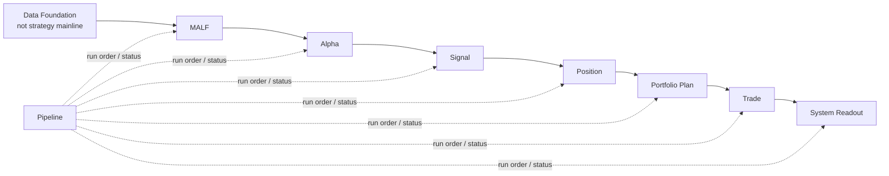
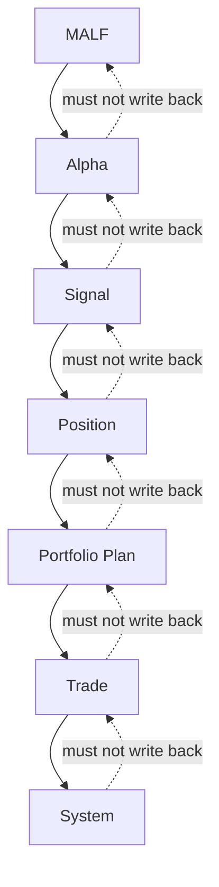

# Asteria 主线模块权威图 v1

日期：2026-04-27

## 1. 主线总图



## 2. 主线模块

| 顺序 | 模块 | 是否主线 | 核心职责 |
|---:|---|---:|---|
| 0 | Data Foundation | 否 | 提供 source facts、market base、metadata |
| 1 | MALF | 是 | 结构事实、波段生命、WavePosition |
| 2 | Alpha | 是 | 解释机会，不处理资金和执行 |
| 3 | Signal | 是 | 聚合 Alpha 输出为正式信号账本 |
| 4 | Position | 是 | 把信号转为持仓候选和持仓计划 |
| 5 | Portfolio Plan | 是 | 资金、容量、组合约束、准入裁决 |
| 6 | Trade | 是 | 订单意图、执行价格线、成交账本 |
| 7 | System Readout | 是 | 全链路只读汇总、运行读出、审计快照 |
| 8 | Pipeline | 编排层 | 调度模块、记录步骤，不定义业务语义 |

## 3. 退役或降级模块

| 旧模块/概念 | 新地位 | 理由 |
|---|---|---|
| `structure` | 退役为 MALF Core 内部结构事实 | HH/HL/LL/LH 已归入 MALF-Core |
| `filter` | 降级为 Data/Universe 客观事实或 Alpha 前置 gate | 客观可交易性是地基事实，不是策略解释 |
| `reborn` | 退役 | Core 已定义 transition 后 new wave |
| 牛顺/牛逆/熊顺/熊逆 | 退役 | Core 已用结构推进/非推进完整替代 |

## 4. 模块边界

### MALF

MALF 只产出结构事实与统计位置。

```text
Input: market_base bars
Output: WavePosition
No output: buy/sell/weight/order
```

### Alpha

Alpha 读取 MALF 和可用辅助事实，解释机会。

```text
Input: WavePosition + alpha family facts
Output: alpha event / alpha score / alpha signal candidate
No output: position size / portfolio allocation / order
```

### Signal

Signal 只做信号账本聚合。

```text
Input: alpha outputs
Output: formal signal
No output: capital allocation / fill
```

### Position

Position 把信号变成持仓语义。

```text
Input: formal signal
Output: position candidate / entry plan / exit plan
No output: portfolio-wide capital allocation
```

### Portfolio Plan

Portfolio Plan 做组合层裁决。

```text
Input: position candidates
Output: portfolio plan / target exposure / admitted and trimmed plans
No output: actual fill
```

### Trade

Trade 是执行事实层。

```text
Input: portfolio plan
Output: order intent / execution / fill ledger
No output: strategy score
```

### System Readout

System 只读全链路。

```text
Input: all downstream official ledgers
Output: readout / summary / audit
No output: business mutation
```

## 5. 依赖方向



禁止反向依赖：

| 禁止依赖 | 裁决 |
|---|---|
| Alpha 修改 MALF | 禁止 |
| Position 回写 Signal | 禁止 |
| Portfolio Plan 修改 Alpha | 禁止 |
| Trade 影响 Portfolio Plan 历史裁决 | 禁止 |
| System 触发业务重算并改变上游语义 | 禁止 |

## 6. 构建模式

Asteria 采用模块化账本构建：

```text
design freeze
-> schema freeze
-> runner implementation
-> bounded proof
-> full build or segmented build
-> audit
-> release gate
-> downstream integration proof
```

每个模块必须支持：

| 能力 | 要求 |
|---|---|
| 一次性批量建仓 | 必须 |
| 增量更新 | 必须 |
| checkpoint | 必须 |
| dirty queue 或 replay scope | 必须 |
| run ledger | 必须 |
| schema version | 必须 |
| rule version | 语义模块必须 |
| sample version | 统计模块必须 |

