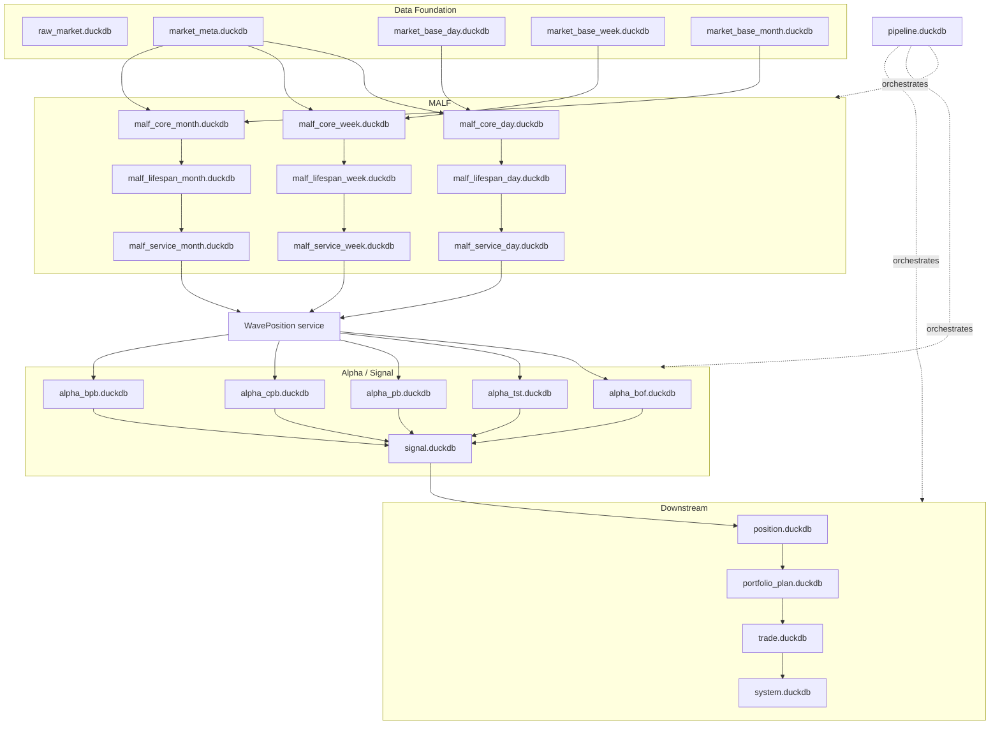

# Asteria DuckDB 数据库拓扑 v1

日期：2026-04-30

## 1. 总裁决

Asteria 采用 DuckDB 多库拓扑，以空间换时间。

正式目标：

```text
25 个 DuckDB
```

其中：

| 层 | 数量 | 是否策略主线 |
|---|---:|---:|
| Data Foundation | 5 | 否 |
| MALF | 9 | 是 |
| Alpha / Signal | 6 | 是 |
| Downstream | 4 | 是 |
| Pipeline | 1 | 编排层 |

主线与编排合计：

```text
20 个 DuckDB
```

完整系统含 Data Foundation：

```text
25 个 DuckDB
```

这些是目标拓扑，不要求第一天全部物理建出。只有模块进入施工并通过 schema gate 后，才创建对应正式库。

当前已由 release evidence 证明存在的正式库只有：

| DB | 状态 | 证据 |
|---|---|---|
| `malf_core_day.duckdb` | MALF complete alignment closeout passed | `docs/04-execution/records/malf/malf-complete-alignment-closeout-20260430-01.evidence-index.md` |
| `malf_lifespan_day.duckdb` | MALF complete alignment closeout passed | `docs/04-execution/records/malf/malf-complete-alignment-closeout-20260430-01.evidence-index.md` |
| `malf_service_day.duckdb` | MALF complete alignment closeout passed | `docs/04-execution/records/malf/malf-complete-alignment-closeout-20260430-01.evidence-index.md` |
| `alpha_bof.duckdb` | Alpha bounded proof passed | `docs/04-execution/records/alpha/alpha-bounded-proof-20260429-01.evidence-index.md` |
| `alpha_tst.duckdb` | Alpha bounded proof passed | `docs/04-execution/records/alpha/alpha-bounded-proof-20260429-01.evidence-index.md` |
| `alpha_pb.duckdb` | Alpha bounded proof passed | `docs/04-execution/records/alpha/alpha-bounded-proof-20260429-01.evidence-index.md` |
| `alpha_cpb.duckdb` | Alpha bounded proof passed | `docs/04-execution/records/alpha/alpha-bounded-proof-20260429-01.evidence-index.md` |
| `alpha_bpb.duckdb` | Alpha bounded proof passed | `docs/04-execution/records/alpha/alpha-bounded-proof-20260429-01.evidence-index.md` |

其他目标库仍是 schema / topology 裁决，不得在对应模块 gate 前创建为正式库。

## 2. 总图



## 3. Data Foundation 库

| DB | 职责 | 主消费者 |
|---|---|---|
| `raw_market.duckdb` | 原始行情、原始同步记录、文件/接口 registry | `market_base` builder |
| `market_meta.duckdb` | 交易日历、标的、行业、宇宙、客观可交易事实 | MALF / Alpha / Portfolio |
| `market_base_day.duckdb` | 日线复权/执行基础行情 | MALF day / Trade |
| `market_base_week.duckdb` | 周线基础行情 | MALF week |
| `market_base_month.duckdb` | 月线基础行情 | MALF month |

说明：

`data` 不是策略主线，但这些库是主线运行的输入地基。

## 4. MALF 库

每个 timeframe 分三库：

| 库型 | 示例 | 职责 |
|---|---|---|
| Core | `malf_core_day.duckdb` | pivot / structure / wave / break / transition / candidate |
| Lifespan | `malf_lifespan_day.duckdb` | lifespan snapshot / profile / rank sample |
| Service | `malf_service_day.duckdb` | WavePosition / Alpha-facing stable interface |

三库拆分理由：

| 拆分 | 理由 |
|---|---|
| Core 与 Lifespan 分开 | Core 是结构事实，Lifespan 是统计派生 |
| Lifespan 与 Service 分开 | snapshot/profile 可重，WavePosition 是热读接口 |
| timeframe 分库 | 日线最重，周/月较轻，写入与查询隔离 |

MALF 目标表族：

| DB | 表族 |
|---|---|
| `malf_core_{tf}` | `malf_pivot_ledger`, `malf_structure_ledger`, `malf_wave_ledger`, `malf_break_ledger`, `malf_transition_ledger`, `malf_candidate_ledger`, `malf_core_run`, `malf_schema_version` |
| `malf_lifespan_{tf}` | `malf_lifespan_snapshot`, `malf_lifespan_profile`, `malf_sample_version`, `malf_rule_version`, `malf_lifespan_run` |
| `malf_service_{tf}` | `malf_wave_position`, `malf_wave_position_latest`, `malf_service_run`, `malf_interface_audit` |

## 5. Alpha / Signal 库

| DB | 职责 |
|---|---|
| `alpha_bof.duckdb` | BOF alpha family event / score / audit |
| `alpha_tst.duckdb` | TST alpha family event / score / audit |
| `alpha_pb.duckdb` | PB alpha family event / score / audit |
| `alpha_cpb.duckdb` | CPB alpha family event / score / audit |
| `alpha_bpb.duckdb` | BPB alpha family event / score / audit |
| `signal.duckdb` | alpha 聚合后的正式 signal 账本 |

Alpha 库可跨 timeframe 存储，以 `timeframe` 字段区分。

## 6. Downstream 库

| DB | 职责 |
|---|---|
| `position.duckdb` | position candidate / entry plan / exit plan |
| `portfolio_plan.duckdb` | portfolio constraints / admission / target exposure |
| `trade.duckdb` | order intent / execution / fill / rejection |
| `system.duckdb` | 全链路 readout / summary / audit snapshot |

## 7. Pipeline 库

| DB | 职责 |
|---|---|
| `pipeline.duckdb` | pipeline_run, pipeline_step_run, module_gate_snapshot, build_manifest |

Pipeline 只能调度和记录，不得定义业务语义。

剖切面研究报告进一步裁定：多 DuckDB 不是散乱中间库，而是一个逻辑历史总账本的
分账本体系。Pipeline ledger 的职责是记录 run、step、checkpoint、manifest 和 gate
snapshot；每个模块仍在自己的单库事务中 promote，不能假设跨库原子写。

## 8. 命名规则

| 对象 | 规则 |
|---|---|
| 正式 DB | `H:\Asteria-data\<name>.duckdb` |
| working DB | `H:\Asteria-temp\<module>\<run_id>\<name>.duckdb` |
| 报告 | `H:\Asteria-report\<module>\<date>\...` |
| 验证资产 | `H:\Asteria-Validated\<asset-set>\...` |

## 9. 第一批实际建库顺序

第一批不建 25 个库。第一批只建能证明 MALF 终稿落地的最小链路：

| 顺序 | DB | 原因 |
|---:|---|---|
| 1 | `market_meta.duckdb` | calendar/universe/source contract |
| 2 | `market_base_day.duckdb` | MALF day 输入 |
| 3 | `malf_core_day.duckdb` | Core 结构事实 |
| 4 | `malf_lifespan_day.duckdb` | Lifespan 统计事实 |
| 5 | `malf_service_day.duckdb` | WavePosition 服务接口 |
| 6 | `pipeline.duckdb` | 记录本轮 build 和 gate |

当前状态：

| 项 | 裁决 |
|---|---|
| MALF day 三库 | 已通过 complete alignment closeout 并重建到 `H:\Asteria-data` |
| `market_meta.duckdb` / `market_base_day.duckdb` 正式化 | 仍受 Data Foundation gate 约束；本轮只承认 bounded bootstrap support |
| `pipeline.duckdb` runtime | 仍未冻结，不得先于业务模块定义语义 |
| week / month MALF | 待另开复制/扩展卡 |

Alpha bounded proof 已通过，五个 Alpha family DB 已在 bounded proof/audit 路径下创建。
Signal bounded proof 已通过，并已在 bounded proof/audit 路径下创建 `signal.duckdb`。
不得因此提前打开 Alpha full build、Signal full build、Position construction 或下游正式库。
