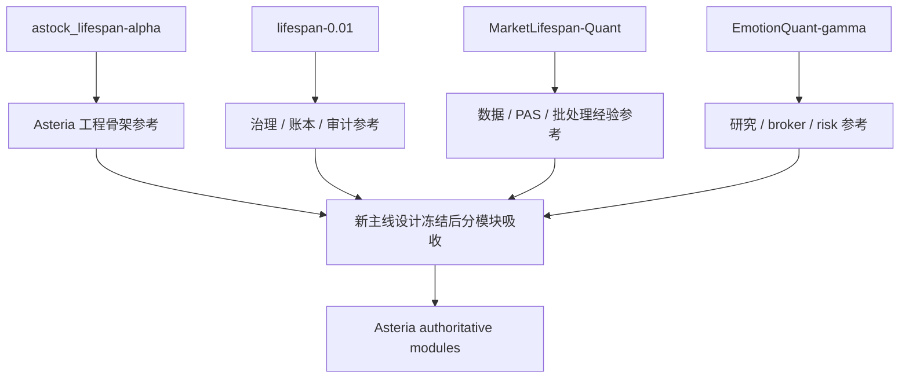

# Asteria 前辈系统主线模块资产清单 v1

日期：2026-04-27

## 1. 目的

本文件记录四个前辈系统中可供 Asteria 重构复用的模块资产。

本文件只回答：

| 问题 | 回答 |
|---|---|
| 前辈系统里哪些模块经验有用 | 是 |
| 哪些代码/测试/脚本可作为设计参考 | 是 |
| 哪些旧概念不得进入新主线 | 是 |
| 是否允许直接迁移旧代码进主线 | 否 |
| 是否改变当前单模块施工锁 | 否 |

当前 Asteria 主线仍然是：

```text
MALF -> Alpha -> Signal -> Position -> Portfolio Plan -> Trade -> System
```

`Data Foundation` 是系统地基，不是策略主线模块。`Pipeline` 是编排层，不定义业务语义。

## 2. 资产地图

| 前辈系统 | 路径 | 主要价值 | 使用方式 |
|---|---|---|---|
| astock_lifespan-alpha | `H:\astock_lifespan-alpha` | 最接近当前 Asteria 目标主线的工程模板 | 优先参考 contracts / schema / runner / tests |
| lifespan-0.01 | `G:\history-lifespan\lifespan-0.01` | 治理、账本化、checkpoint、dirty queue、审计经验较完整 | 参考治理和物化模式，退役 structure/filter 主线地位 |
| MarketLifespan-Quant | `G:\history-lifespan\MarketLifespan-Quant` | 数据、PAS、MALF、交易、系统读出都有深层历史实现 | 作为算法和批处理经验库，不直接继承旧主线 |
| EmotionQuant-gamma | `G:\history-lifespan\EmotionQuant-gamma` | 早期 alpha、broker、risk、backtest、gene/lifespan 研究资产 | 作为研究验证和下游行为参考 |

## 3. 总体裁决



原则：

| 原则 | 裁决 |
|---|---|
| 语义权威 | 以 Asteria 当前文档与 `H:\Asteria-Validated` 为准 |
| 代码继承 | 只在目标模块设计冻结后，逐文件审查吸收 |
| 测试继承 | 优先继承不变量、边界样例、回归样本 |
| 脚本继承 | 优先继承 runner contract、checkpoint、audit ledger 思路 |
| 历史概念 | 可作为反例或旧语义说明，不得反向修改新主线 |

## 4. 系统级可复用资产

### 4.1 astock_lifespan-alpha

这是最接近当前 Asteria 的直接前身。

| 资产 | 可用价值 | Asteria 使用位置 |
|---|---|---|
| `src\astock_lifespan_alpha\*\contracts.py` | 模块输入输出边界写法清晰 | 各模块设计冻结后参考 |
| `src\astock_lifespan_alpha\*\schema.py` | DuckDB 表结构集中声明方式 | schema freeze 阶段参考 |
| `src\astock_lifespan_alpha\*\runner.py` | 最小正式 runner 模式 | runner contract 阶段参考 |
| `tests\unit\test_*_contracts.py` | 模块契约测试模式 | contract tests 参考 |
| `scripts\run_*.py` | 主线阶段化执行入口 | pipeline 编排参考 |
| MALF segmented build / progress / audit | 大库重建经验 | MALF day 首轮施工参考 |

注意：

| 不直接继承项 | 原因 |
|---|---|
| 旧 MALF 语义 | 当前权威已升级为三份 MALF 终稿 |
| 已成型 pipeline 全链路 | Asteria 必须先完成单模块门禁 |
| 任何 Alpha 写回 MALF 的隐含路径 | 违反新主线依赖方向 |

### 4.2 lifespan-0.01

这是治理和账本化意识最强的一代。

| 资产 | 可用价值 | Asteria 使用位置 |
|---|---|---|
| `scripts\governance\*` | doc-first、文件长度、仓库卫生检查 | Asteria governance 扩展参考 |
| `src\mlq\core\*` | path、db、calendar、checkpoint 基础能力 | core/tooling 参考 |
| `src\mlq\data\*` | raw/base/objective source 分层 | Data Foundation 参考 |
| `src\mlq\malf\canonical_*` | 日/周/月 canonical materialization 经验 | MALF schema/runner 参考 |
| `src\mlq\malf\wave_life_*` | wave_life 侧车统计思路 | MALF Lifespan 参考 |
| `src\mlq\malf\zero_one_wave_audit.py` | 极简波段不变量审计 | MALF audit 参考 |
| dirty queue / checkpoint / run ledger | 增量与可恢复构建模式 | 所有正式 runner 参考 |

退役裁决：

| 旧模块 | 新地位 |
|---|---|
| `structure` | 归入 MALF Core，不作为独立主线模块 |
| `filter` | 拆解为 Data 客观事实或 Alpha 前置 gate，不作为独立主线模块 |
| `price_line` 混杂表达 | 在 Asteria 中必须区分 analysis_price_line 与 execution_price_line |

### 4.3 MarketLifespan-Quant

这是更早但更深的一代，尤其适合作为“经验矿”。

| 资产 | 可用价值 | Asteria 使用位置 |
|---|---|---|
| `src\mlq\core\checkpoint.py` | checkpoint 模式 | runner contract 参考 |
| `src\mlq\core\resumable.py` | 断点续跑模式 | 长任务构建参考 |
| `src\mlq\core\result_reuse.py` | 结果复用边界 | 批处理性能参考 |
| `src\mlq\core\table_ownership_manifest.py` | 表归属治理 | 数据库拓扑审计参考 |
| `src\mlq\data\raw\*` | TDX/raw import、provider registry | Data Foundation 参考 |
| `src\mlq\data\audit\*` | 跨源质量审计 | market_base / market_meta 参考 |
| `src\mlq\data\canonical\*` | canonical bar 物化 | market_base day/week/month 参考 |
| `src\mlq\alpha\pas\*` | PAS detector、trigger ledger、rank 经验 | Alpha 设计阶段参考 |
| `src\mlq\trade\*` | broker boundary、rolling、portfolio trade 经验 | Trade 设计阶段参考 |
| `scripts\archive_*.py` | 验证资产归档习惯 | Evidence 落档参考 |

注意：

| 不直接继承项 | 原因 |
|---|---|
| PAS 作为旧主线中心 | Asteria 中 Alpha/Signal 边界已重新定义 |
| 旧五库拓扑 | Asteria 已裁决为 25 库目标拓扑 |
| 大量历史修复脚本 | 可做取证参考，不进入新主线 |

### 4.4 EmotionQuant-gamma

这是早期研究系统，工程形态较旧，但策略行为和风控语义有价值。

| 资产 | 可用价值 | Asteria 使用位置 |
|---|---|---|
| `blueprint` | 早期治理和默认运行思想 | 历史参考 |
| `normandy` | alpha 真相、入场/出场损伤诊断 | Alpha/Signal 研究参考 |
| `positioning` | 仓位、退出、执行纪律 | Position / Trade 研究参考 |
| `gene` | trend/wave/lifespan/environment 解释 | Lifespan 统计验证参考 |
| `src\broker\*` | broker、risk、matcher 边界 | Trade 后续模拟参考 |
| `src\strategy\*` | BOF/PAS 等 detector 旧实现 | Alpha detector 参考 |
| `src\report\*` | backtest/report 输出习惯 | System Readout 参考 |

注意：

| 不直接继承项 | 原因 |
|---|---|
| 旧 backtest 作为正式系统主线 | Asteria 主线是账本系统，不是回测脚本集合 |
| Gene 作为运行硬门 | Asteria 中统计解释必须先经 MALF Lifespan 定义 |
| 旧 broker 风控直接上线 | 需等 Trade 模块设计冻结 |

## 5. 按 Asteria 模块归档

### 5.1 Core / Governance

| 来源 | 可用资产 |
|---|---|
| astock_lifespan-alpha | 模块化 package、runner、contract tests |
| lifespan-0.01 | governance checks、doc-first gating、repo hygiene |
| MarketLifespan-Quant | checkpoint、resumable、result_reuse、table ownership |
| EmotionQuant-gamma | blueprint 历史规范 |

优先吸收：

```text
governance checks -> table ownership -> checkpoint/resume -> run/evidence ledger
```

### 5.2 Data Foundation

| 来源 | 可用资产 |
|---|---|
| astock_lifespan-alpha | data source/base runner 的简化形态 |
| lifespan-0.01 | raw/base/objective materialization、day/week/month base |
| MarketLifespan-Quant | TDX raw import、canonical bars、cross-source audit、factor repair |
| EmotionQuant-gamma | BaoStock/Tushare/TDX import 旧样例、industry/static metadata |

新裁决：

| 主题 | Asteria 表达 |
|---|---|
| 数据地位 | Foundation，不是策略主线 |
| 可交易性 | `market_meta` 客观事实或 Alpha gate |
| 价格线 | `analysis_price_line` 服务 MALF/Alpha；`execution_price_line` 服务 Trade |

### 5.3 MALF

权威来源固定为：

```text
H:\Asteria-Validated\MALF_Three_Part_Design_Set_v1_2
```

| 来源 | 可用资产 |
|---|---|
| astock_lifespan-alpha | MALF runner、segmented build、progress、audit 工程经验 |
| lifespan-0.01 | canonical materialization、wave_life、zero-one audit |
| MarketLifespan-Quant | 旧 MALF 六层历史实现、批处理修复经验 |
| EmotionQuant-gamma | gene/lifespan 研究样本 |

硬边界：

| 禁止项 |
|---|
| 不用旧 MALF 语义覆盖三份终稿 |
| 不把 `transition` 写成 wave 自身状态 |
| 不合并 `wave_core_state` 与 `system_state` |
| 不让 Alpha/Signal/Position/Trade 回写 MALF |

### 5.4 Alpha / Signal

| 来源 | 可用资产 |
|---|---|
| astock_lifespan-alpha | BOF/TST/PB/CPB/BPB factor DB 和 signal runner 模式 |
| lifespan-0.01 | alpha trigger、family、formal_signal 物化 |
| MarketLifespan-Quant | PAS detector、trigger ledger、selector 经验 |
| EmotionQuant-gamma | BOF/PAS 早期 detector、normandy 诊断 |

新边界：

| 模块 | 只回答 |
|---|---|
| Alpha | 是否有机会、机会属于哪类、强弱如何 |
| Signal | 多 Alpha 输出如何形成正式信号账本 |

Alpha/Signal 不回答 position size、portfolio allocation、order、fill。

### 5.5 Position

| 来源 | 可用资产 |
|---|---|
| astock_lifespan-alpha | position schema/runner/contract tests |
| lifespan-0.01 | formal_signal 到 position 的物化经验 |
| MarketLifespan-Quant | position maintenance 与 rolling 经验 |
| EmotionQuant-gamma | positioning 退出纪律和损伤诊断 |

新边界：

```text
Signal -> Position -> Portfolio Plan
```

Position 不做组合层资金分配。

### 5.6 Portfolio Plan

| 来源 | 可用资产 |
|---|---|
| astock_lifespan-alpha | portfolio_plan 最小 runner |
| lifespan-0.01 | active cap、capacity、slow path 日志 |
| MarketLifespan-Quant | portfolio trade 前置经验 |
| EmotionQuant-gamma | sizing/risk 早期样例 |

新边界：

| Portfolio Plan 输出 | Trade 输入 |
|---|---|
| target exposure | order intent |
| admitted plan | executable instruction |
| trimmed/rejected reason | no direct fill |

### 5.7 Trade

| 来源 | 可用资产 |
|---|---|
| astock_lifespan-alpha | trade schema/source/runner |
| lifespan-0.01 | trade runtime and audit |
| MarketLifespan-Quant | broker boundary、benchmark、rolling、result reuse |
| EmotionQuant-gamma | broker/matcher/risk 模型 |

新边界：

```text
Portfolio Plan decides what should be attempted.
Trade records what was attempted and what was filled.
```

Trade 不回改 Portfolio Plan 历史裁决。

### 5.8 System Readout / Pipeline

| 来源 | 可用资产 |
|---|---|
| astock_lifespan-alpha | pipeline minimal orchestration、system readout |
| lifespan-0.01 | system readout、gate check、execution ledger |
| MarketLifespan-Quant | validated archive、backtest readout、ops scripts |
| EmotionQuant-gamma | report 输出样式 |

新边界：

| 层 | 职责 |
|---|---|
| System Readout | 只读全链路事实 |
| Pipeline | 调度、状态、证据，不定义业务语义 |

## 6. 可复用等级

| 等级 | 含义 | 当前资产 |
|---|---|---|
| A | 设计冻结后可优先吸收 | astock contracts/schema/runner/tests；lifespan governance；Market core checkpoint/table ownership |
| B | 需要重写语义后吸收 | old MALF build 工程、PAS detector、wave_life、trade rolling |
| C | 只做研究参考 | EmotionQuant gene/backtest/report；旧修复脚本 |
| 禁止 | 不进入 Asteria 新主线 | structure/filter 独立主线；旧 MALF 语义；旧五库拓扑；Alpha 写回 MALF |

## 7. 下一步使用方式

当前唯一活跃设计卡仍然是：

```text
01-malf-schema-and-runner-contract-freeze-card-20260427
```

MALF 首轮施工前，只允许读取和摘取以下经验：

| 来源 | 读取目标 |
|---|---|
| `H:\astock_lifespan-alpha` | MALF contracts / schema / runner / audit / tests |
| `G:\history-lifespan\lifespan-0.01` | canonical MALF、wave_life、zero-one audit、governance |
| `G:\history-lifespan\MarketLifespan-Quant` | checkpoint、resumable、table ownership、data canonical audit |
| `G:\history-lifespan\EmotionQuant-gamma` | lifespan/gene 样本与 detector 历史行为 |

进入正式实现前，必须先冻结：

```text
MALF day schema -> runner contract -> audit spec -> bounded proof card
```

本清单不解除模块施工锁，不授权迁移旧代码。
