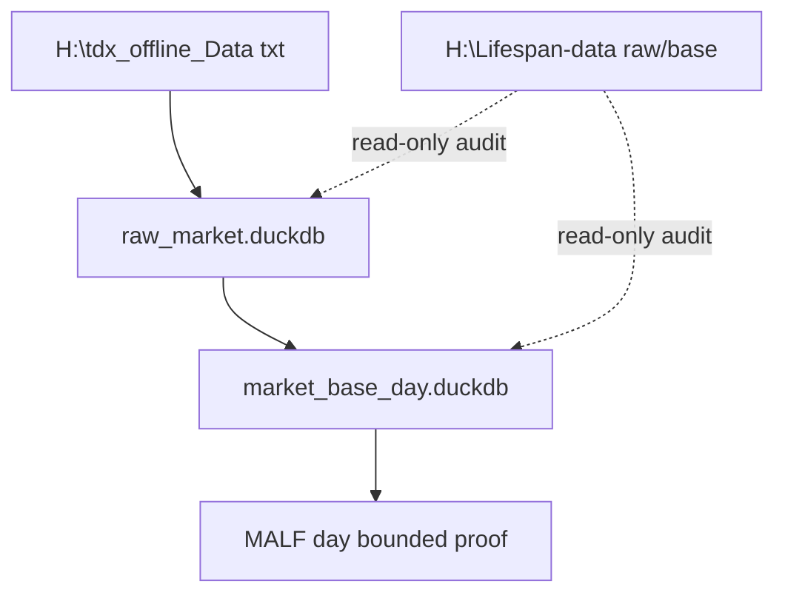
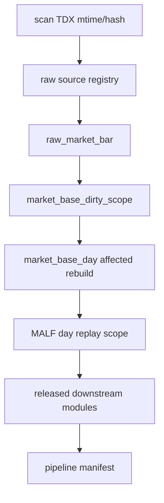

# Asteria 历史总账与增量构建协议 v1

日期：2026-04-28

状态：active / architecture-protocol

## 1. 目标

本协议把 Asteria 的多 DuckDB 拓扑统一为一个逻辑历史总账。

```text
physical DBs stay modular
logical history is connected by source manifest, run ledger, checkpoint, audit
```

它不合并模块 DB，不改变主线依赖方向，也不授权下游模块越过当前门禁施工。

当前状态补充：

| 项 | 状态 |
|---|---|
| MALF day bounded proof | `passed` |
| 已形成 release evidence | `Asteria-malf-day-bounded-proof-20260428-01.zip` |
| 当前允许下一卡 | `Alpha freeze review` |
| Pipeline runtime | 仍未冻结，只保留协议与 registry 裁决 |

机器可读治理入口：

```text
governance/historical_ledger_registry.toml
governance/database_topology_registry.toml
governance/module_api_contracts/*.toml
```

这些 registry 是本协议的执行面。文档说明原则，registry 负责让
`check_project_governance.py` 能够阻断错误数据源、未登记 DB、缺少 checkpoint
策略和越权主线穿透。

## 2. 当前数据来源

| 来源 | 路径 | 用途 |
|---|---|---|
| TDX 离线原始行情 | `H:\tdx_offline_Data` | Data Foundation raw bootstrap 的优先输入 |
| 老 raw/base 库 | `H:\Lifespan-data\raw\raw_market.duckdb`、`H:\Lifespan-data\base\market_base.duckdb` | 只读覆盖率、字段映射、行数和缺口对账 |
| 老下游库 | `H:\Lifespan-data\astock_lifespan_alpha\...` | 历史旁证、回归样本、工程经验，不直接迁入新主线 |

正式 Asteria DuckDB 仍只能写入：

```text
H:\Asteria-data
```

当前已被 release evidence 追溯的正式 DB：

| DB | 角色 |
|---|---|
| `H:\Asteria-data\malf_core_day.duckdb` | MALF day Core structure fact |
| `H:\Asteria-data\malf_lifespan_day.duckdb` | MALF day Lifespan statistical fact |
| `H:\Asteria-data\malf_service_day.duckdb` | MALF day WavePosition service interface |

Data Foundation 正式 builder 仍未冻结；当前 Data 能力只作为 bounded bootstrap support。

## 3. Data bootstrap 路径



首轮 MALF day 默认只消费：

```text
stock-day\Backward-Adjusted -> analysis_price_line
```

`Non-Adjusted` 保留给未来 Trade execution price line，`Forward-Adjusted` 暂作审计备用价格线。

MALF day bounded proof 通过后，这条路径的当前用途变为：

```text
support Alpha freeze review with released WavePosition evidence
```

它不授权 Alpha 代码施工，也不授权正式 Data Foundation builder。

## 4. 分批初始化

初始化必须支持两类分片：

| 分片 | 用途 |
|---|---|
| 日期窗口 | 一批处理几年，例如 `2010-01-01` 到 `2013-12-31` |
| symbol batch | 一批处理几百只标的 |

默认策略：

```text
time-window first
symbol bucket second
```

也就是说，全量初始化优先按 2-3 年日期窗口切批；若单批仍然过重，再在该日期窗口内按
symbol bucket 分桶。这样历史重放、断点续跑和每日增量都可以沿用同一套
`checkpoint + replay_scope` 语义。

每个 batch 必须产生：

```text
run ledger
source manifest
checkpoint
dirty or replay scope
audit summary
```

## 5. 每日增量

每日增量统一按以下顺序穿透：



Pipeline 只能记录 run、step、manifest 和 gate snapshot，不得定义业务字段或绕过模块门禁。

每日增量的治理边界：

| 事项 | 裁决 |
|---|---|
| 数据入口 | 只能从 TDX source scan/hash 进入新 `raw_market` |
| 旧 raw/base | 只读覆盖率、字段映射、行数和缺口对账 |
| 旧下游库 | 只做旁证和回归样本，不得作为 official input |
| mock 数据 | 只能用于单测和 contract test，不得进入 `H:\Asteria-data` |
| 穿透范围 | 只能穿透已 released 或当前 active-allowed 的模块 |
| Pipeline | 当前只定义协议；runtime 必须等待独立 freeze review 与 gate |

当前只允许每日增量协议穿透到 MALF day 的已放行证据边界。Alpha freeze review 通过前，
不得把 Alpha、Signal 或下游模块纳入正式日更链路。

## 6. 最小可执行入口

当前落地的最小入口是：

```powershell
H:\Asteria\.venv\Scripts\python.exe scripts\data\run_data_bootstrap.py `
  --source-root H:\tdx_offline_Data `
  --asset-type stock `
  --adj-mode backward `
  --mode bounded `
  --run-id data-bootstrap-bounded-001 `
  --symbol-limit 10
```

测试和排练可显式把 `--target-root` 指向 `H:\Asteria-temp\...`。正式构建才使用默认 `H:\Asteria-data`。

## 7. 禁止项

| 禁止项 | 裁决 |
|---|---|
| 把 `H:\Lifespan-data\astock_lifespan_alpha` 直接复制成新正式库 | 禁止 |
| MALF runner 直接读取 TDX txt 或旧 `malf_day.duckdb` | 禁止 |
| Alpha / Signal / Position / Portfolio / Trade / System 写回 MALF | 禁止 |
| Pipeline 定义业务语义 | 禁止 |
| 临时 DB、checkpoint、报告写入 repo 根目录 | 禁止 |

## 8. 总账接入硬要求

每个正式 DuckDB 必须在 `governance/database_topology_registry.toml` 中声明：

```text
db_name
module_id
grain
ledger_role
writer
allowed_modes
checkpoint_policy
checkpoint_key
replay_scope
promote_rule
```

每个模块必须在 `governance/module_api_contracts/` 中声明 official inputs、official
outputs、public fields、natural keys、version fields、forbidden inputs 和 forbidden outputs。
下游只能消费 official outputs，不得读取内部表重建上游语义。

## 9. 与剖切面研究报告的关系

`Asteria-deep-research-report-重构系统最新剖切面研究报告-20260428.*`
是本协议的架构依据之一。它给出的核心口径已纳入本协议：

| 报告口径 | 本协议表达 |
|---|---|
| 多 DuckDB 是逻辑历史总账本 | 每个 DB 通过 manifest、run ledger、checkpoint、audit 连接 |
| 每日增量必须可恢复 | 每个模块声明 checkpoint policy 与 replay scope |
| 多库原子性不能误判 | 单库 promote，Pipeline 记录 saga / step 状态 |
| release evidence 必须标准化 | report 入 `H:\Asteria-report`，正式证据入 `H:\Asteria-Validated` |

硬结论：

```text
先 staging，后审计；
先单库 promote，后更新 pipeline ledger；
任何失败都不允许直接覆盖正式库。
```
