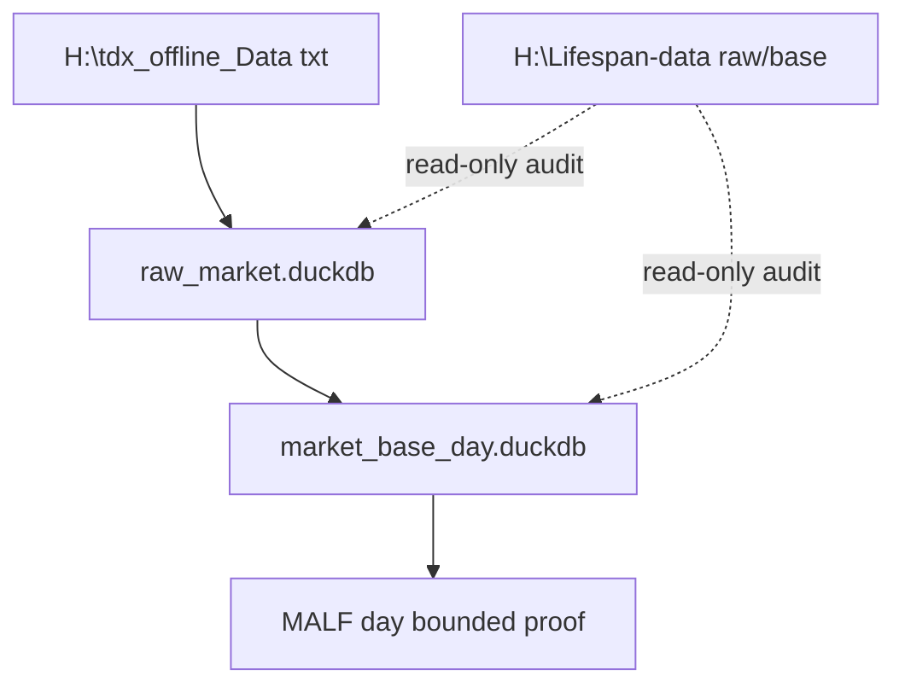
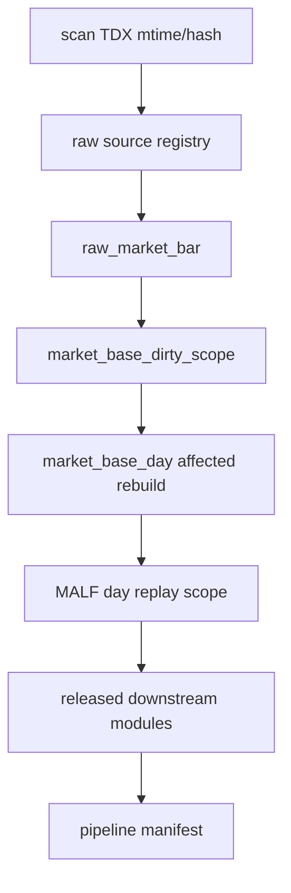

# Asteria 历史总账与增量构建协议 v1

日期：2026-04-28

状态：active / architecture-protocol

## 1. 目标

本协议把 Asteria 的多 DuckDB 拓扑统一为一个逻辑历史总账。

```text
physical DBs stay modular
logical history is connected by source manifest, run ledger, checkpoint, audit
```

它不合并模块 DB，不改变主线依赖方向，也不授权下游模块越过当前门禁施工。

## 2. 当前数据来源

| 来源 | 路径 | 用途 |
|---|---|---|
| TDX 离线原始行情 | `H:\tdx_offline_Data` | Data Foundation raw bootstrap 的优先输入 |
| 老 raw/base 库 | `H:\Lifespan-data\raw\raw_market.duckdb`、`H:\Lifespan-data\base\market_base.duckdb` | 只读覆盖率、字段映射、行数和缺口对账 |
| 老下游库 | `H:\Lifespan-data\astock_lifespan_alpha\...` | 历史旁证、回归样本、工程经验，不直接迁入新主线 |

正式 Asteria DuckDB 仍只能写入：

```text
H:\Asteria-data
```

## 3. Data bootstrap 路径



首轮 MALF day 默认只消费：

```text
stock-day\Backward-Adjusted -> analysis_price_line
```

`Non-Adjusted` 保留给未来 Trade execution price line，`Forward-Adjusted` 暂作审计备用价格线。

## 4. 分批初始化

初始化必须支持两类分片：

| 分片 | 用途 |
|---|---|
| 日期窗口 | 一批处理几年，例如 `2010-01-01` 到 `2013-12-31` |
| symbol batch | 一批处理几百只标的 |

每个 batch 必须产生：

```text
run ledger
source manifest
checkpoint
dirty or replay scope
audit summary
```

## 5. 每日增量

每日增量统一按以下顺序穿透：



Pipeline 只能记录 run、step、manifest 和 gate snapshot，不得定义业务字段或绕过模块门禁。

## 6. 最小可执行入口

当前落地的最小入口是：

```powershell
H:\Asteria\.venv\Scripts\python.exe scripts\data\run_data_bootstrap.py `
  --source-root H:\tdx_offline_Data `
  --asset-type stock `
  --adj-mode backward `
  --mode bounded `
  --run-id data-bootstrap-bounded-001 `
  --symbol-limit 10
```

测试和排练可显式把 `--target-root` 指向 `H:\Asteria-temp\...`。正式构建才使用默认 `H:\Asteria-data`。

## 7. 禁止项

| 禁止项 | 裁决 |
|---|---|
| 把 `H:\Lifespan-data\astock_lifespan_alpha` 直接复制成新正式库 | 禁止 |
| MALF runner 直接读取 TDX txt 或旧 `malf_day.duckdb` | 禁止 |
| Alpha / Signal / Position / Portfolio / Trade / System 写回 MALF | 禁止 |
| Pipeline 定义业务语义 | 禁止 |
| 临时 DB、checkpoint、报告写入 repo 根目录 | 禁止 |
