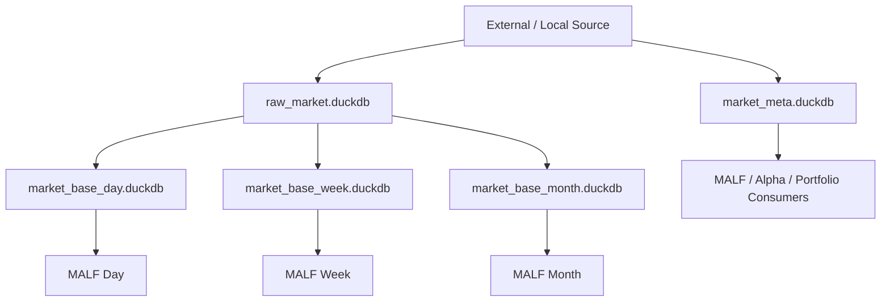

# Data Foundation 权威设计 v1

日期：2026-04-27

## 1. 定义

Data Foundation 是 Asteria 的基础建设层，负责把外部或本地来源的客观市场事实组织为稳定 source-fact 与 market-base 数据产品。

它不是策略主线模块。

```text
Data Foundation = raw facts + metadata + market base
```

## 2. 只回答什么

| 问题 | 是否回答 |
|---|---:|
| 哪些标的存在 | 是 |
| 哪些交易日存在 | 是 |
| 原始行情如何入库 | 是 |
| 复权/执行基础价格如何形成 | 是 |
| 标的是否客观可交易 | 是 |
| 当前波段是什么 | 否 |
| 当前是否有 Alpha 机会 | 否 |
| 是否买入卖出 | 否 |

## 3. 数据流



## 4. 输出库

| DB | 状态 | 说明 |
|---|---|---|
| `raw_market.duckdb` | target | 原始行情和同步记录 |
| `market_meta.duckdb` | target | calendar / instrument / universe / objective profile |
| `market_base_day.duckdb` | target | day bars |
| `market_base_week.duckdb` | target | week bars |
| `market_base_month.duckdb` | target | month bars |

## 5. 对主线的服务

Data Foundation 向主线提供只读输入：

| 消费者 | 输入 |
|---|---|
| MALF | `market_base_{day/week/month}` bars |
| Alpha | universe / industry / objective metadata |
| Portfolio Plan | universe / tradability / capacity metadata |
| Trade | execution price line |

## 6. 边界

Data Foundation 不得：

| 禁止项 | 原因 |
|---|---|
| 写入 MALF | 不能反向污染结构真值 |
| 产生 Alpha 分数 | 策略解释属于 Alpha |
| 产生持仓建议 | 持仓属于 Position / Portfolio |
| 根据交易结果修正历史 market_base | 交易结果不是行情事实 |

## 7. 本轮裁决

Data Foundation 在 Asteria 中先冻结设计与路径契约，不作为第一主线施工模块。

第一主线施工模块仍是：

```text
MALF
```

但 MALF 施工前必须有 Data Foundation 的输入表契约。

