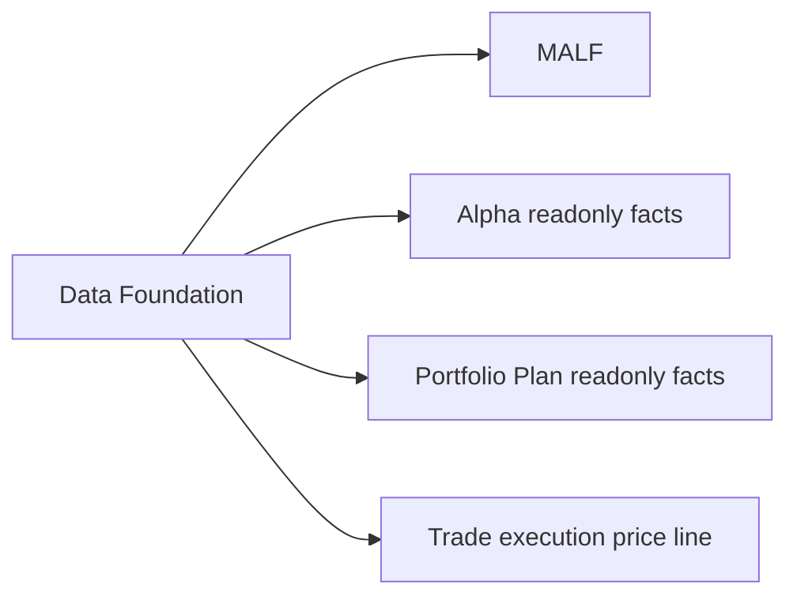

# Data Foundation Design Bridge v1

日期：2026-04-29

## 1. 目的

本文件作为 Data Foundation 的稳定入口页，用来把旧的单文档入口桥接到新的六件套文档集。

Data Foundation 仍然是 Asteria 的基础建设层，不是策略主线模块。

本页按 `H:\Asteria-Validated\Asteria-docs-code-20260428-214427.zip`
之后的治理结论刷新。该快照是文档基线；MALF day bounded proof 已通过的事实
来自 repo 内执行记录和 Validated release evidence，不来自旧快照覆盖。

## 2. 六件套位置

Data Foundation 六件套文档位于：

```text
docs/02-modules/data/
```

具体包括：

| 文档 | 位置 |
|---|---|
| Authority Design | `docs/02-modules/data/00-authority-design-v1.md` |
| Semantic Contract | `docs/02-modules/data/01-semantic-contract-v1.md` |
| Database Schema Spec | `docs/02-modules/data/02-database-schema-spec-v1.md` |
| Runner Contract | `docs/02-modules/data/03-runner-contract-v1.md` |
| Audit Spec | `docs/02-modules/data/04-audit-spec-v1.md` |
| Build Card | `docs/02-modules/data/05-build-card-v1.md` |

## 3. 模块摘要

Data Foundation 负责输出：

```text
raw_market.duckdb
market_meta.duckdb
market_base_day.duckdb
market_base_week.duckdb
market_base_month.duckdb
```

它只提供客观 source-fact、reference fact 和 market-base fact，不定义任何主线业务语义。

## 4. 与主线关系



## 5. 当前裁决

Data Foundation 已补齐 foundation six-doc draft，并已有最小 bounded bootstrap
support 服务过 MALF day bounded proof 的输入准备；后续 Data production release 已放行
raw/base day-week-month 与 day execution line，`data-market-meta-formalization-20260502-01`
已放行最小正式 `market_meta.duckdb`。

当前已完成的第一主线放行事实是：

```text
MALF day bounded proof passed
```

当前 Data Foundation 可提供：

```text
market_meta.duckdb
market_base_day.duckdb
market_base_week.duckdb
market_base_month.duckdb
```

下一步只允许进入：

```text
Position freeze review reentry
```

Data Foundation 仍不得被当作策略模块；market_meta 最小正式化不授权 Position
construction、下游施工或全链路 Pipeline。
