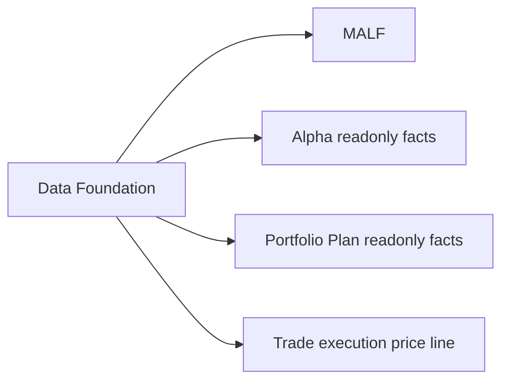

# Data Foundation Design Bridge v1

日期：2026-04-27

## 1. 目的

本文件作为 Data Foundation 的稳定入口页，用来把旧的单文档入口桥接到新的六件套文档集。

Data Foundation 仍然是 Asteria 的基础建设层，不是策略主线模块。

## 2. 六件套位置

Data Foundation 六件套文档位于：

```text
docs/02-modules/data/
```

具体包括：

| 文档 | 位置 |
|---|---|
| Authority Design | `docs/02-modules/data/00-authority-design-v1.md` |
| Semantic Contract | `docs/02-modules/data/01-semantic-contract-v1.md` |
| Database Schema Spec | `docs/02-modules/data/02-database-schema-spec-v1.md` |
| Runner Contract | `docs/02-modules/data/03-runner-contract-v1.md` |
| Audit Spec | `docs/02-modules/data/04-audit-spec-v1.md` |
| Build Card | `docs/02-modules/data/05-build-card-v1.md` |

## 3. 模块摘要

Data Foundation 负责输出：

```text
raw_market.duckdb
market_meta.duckdb
market_base_day.duckdb
market_base_week.duckdb
market_base_month.duckdb
```

它只提供客观 source-fact、reference fact 和 market-base fact，不定义任何主线业务语义。

## 4. 与主线关系



## 5. 当前裁决

Data Foundation 本轮已补齐 foundation six-doc draft，但仍不作为当前施工模块。

第一主线施工模块仍是：

```text
MALF
```

但 MALF day bounded proof 的最小输入契约仍依赖：

```text
market_meta.duckdb
market_base_day.duckdb
```
