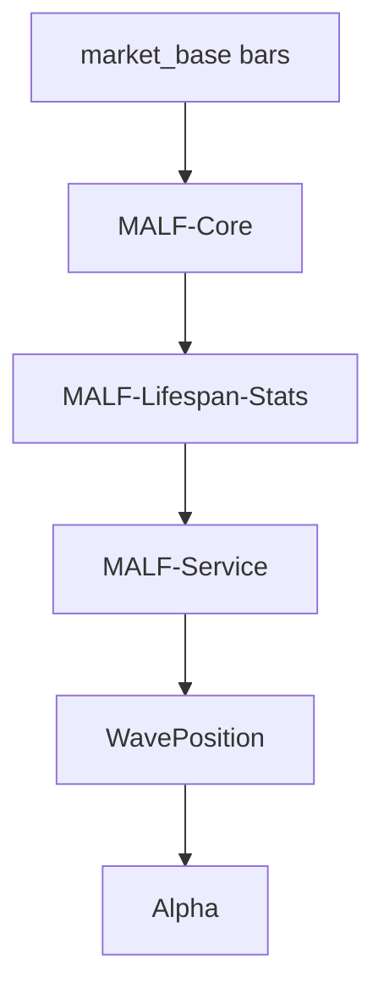
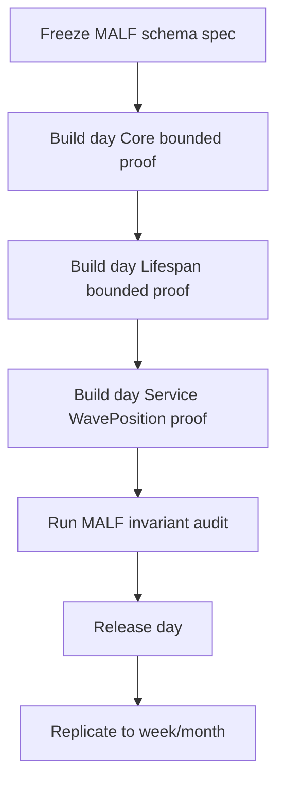

# MALF 权威设计桥接 v1

日期：2026-04-27

## 1. 权威锚点

Asteria 的 MALF 设计以以下文件为唯一语义权威：

```text
H:\Asteria-Validated\MALF_Three_Part_Design_Set_v1_2
```

| 文件 | Asteria 内部地位 |
|---|---|
| `MALF_01_Core_Definitions_Theorems_v1_3.md` | Core 真值定义 |
| `MALF_02_Lifespan_Stats_Definitions_Theorems_v1_2.md` | Lifespan 统计定义 |
| `MALF_03_System_Service_Interface_v1_2.md` | Service 接口定义 |
| `MALF_00_Three_Documents_Bridge_v1_2.md` | 三文件关系定义 |

## 2. Asteria 中的 MALF

MALF 是 Asteria 第一主线模块。



## 3. 三段式落库

MALF 在 Asteria 中按 timeframe 拆为三库：

| 语义层 | DB 示例 | 来源文件 |
|---|---|---|
| Core | `malf_core_day.duckdb` | MALF-Core |
| Lifespan | `malf_lifespan_day.duckdb` | MALF-Lifespan-Stats |
| Service | `malf_service_day.duckdb` | MALF-System-Service |

## 4. Core 必须实现的对象

| 对象 | 表族 |
|---|---|
| Pivot | `malf_pivot_ledger` |
| Structure Primitive | `malf_structure_ledger` |
| Wave | `malf_wave_ledger` |
| Break | `malf_break_ledger` |
| Transition | `malf_transition_ledger` |
| Candidate Guard | `malf_candidate_ledger` |

## 5. Lifespan 必须实现的对象

| 对象 | 表族 |
|---|---|
| new-count | `malf_lifespan_snapshot` |
| no-new-span | `malf_lifespan_snapshot` |
| update-rank | `malf_lifespan_profile` |
| stagnation-rank | `malf_lifespan_profile` |
| life-state | `malf_lifespan_snapshot` |
| sample scope | `malf_sample_version` |
| rule version | `malf_rule_version` |

## 6. Service 必须实现的对象

| 对象 | 表族 |
|---|---|
| WavePosition | `malf_wave_position` |
| latest view | `malf_wave_position_latest` |
| interface audit | `malf_interface_audit` |

## 7. MALF 不得输出

| 禁止输出 | 归属模块 |
|---|---|
| 买入/卖出 | Alpha / Signal |
| 仓位大小 | Position / Portfolio Plan |
| 订单 | Trade |
| 收益预测 | Alpha 或 Research，不属于 MALF |

## 8. MALF 第一施工顺序

MALF 不直接全量上 day/week/month。

第一施工顺序：



## 9. 必须验收的不变量

| 不变量 | 来源 |
|---|---|
| terminated wave 不得重新 alive | Core |
| break 后不得延伸旧 wave | Core |
| transition 必须关联 old_wave_id | Core / Service |
| transition.direction 必须等于 old_direction | Lifespan / Service |
| transition 中同一时刻只能有一个 active candidate | Core |
| new wave 必须有 active candidate_guard + progress_confirmation | Core |
| new wave confirmation bar 的 no_new_span = 0 | Lifespan |
| transition_span 不并入 no_new_span | Lifespan |
| wave_core_state 不得取 transition | Service |

