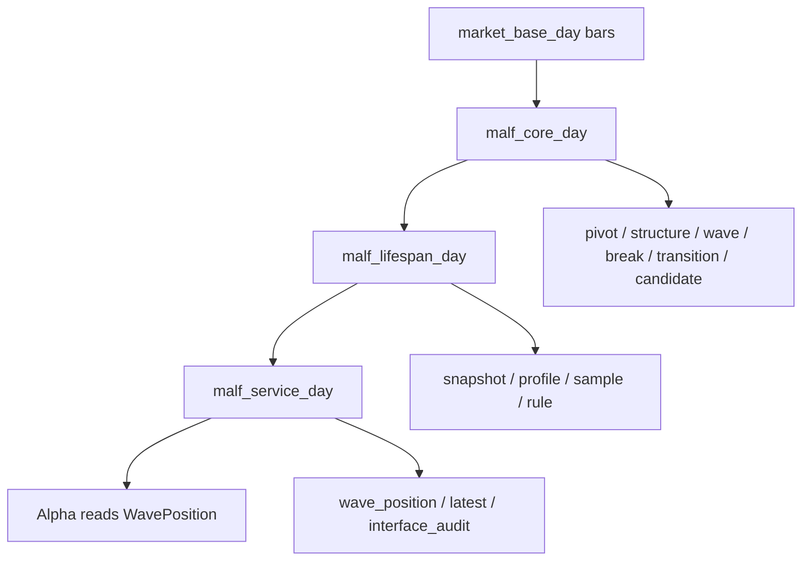

# MALF Schema / Runner / Audit 规格 v1

日期：2026-04-27

## 1. 规格目标

本文件把 MALF 三份终稿映射为 Asteria 可实现的数据库、runner 与审计规格。

第一实施对象只覆盖：

```text
timeframe = day
```

对应三库：

```text
H:\Asteria-data\malf_core_day.duckdb
H:\Asteria-data\malf_lifespan_day.duckdb
H:\Asteria-data\malf_service_day.duckdb
```

week / month 在 day 通过 gate 后复制同一规格。

## 2. 语义来源

| 规格部分 | 语义来源 |
|---|---|
| Core 表族 | `MALF_01_Core_Definitions_Theorems_v1_3.md` |
| Lifespan 表族 | `MALF_02_Lifespan_Stats_Definitions_Theorems_v1_2.md` |
| Service 表族 | `MALF_03_System_Service_Interface_v1_2.md` |

## 3. 三库关系



## 4. Core DB

### 4.1 `malf_core_run`

| 字段 | 含义 |
|---|---|
| `run_id` | 审计 run id |
| `timeframe` | `day` |
| `build_mode` | `bounded / segmented / full / resume` |
| `source_db_path` | 输入 market_base 路径 |
| `source_table` | 输入表 |
| `scope_start_dt` | 构建起始日期，可空 |
| `scope_end_dt` | 构建结束日期，可空 |
| `symbol_start` | 分段起始标的，可空 |
| `symbol_end` | 分段结束标的，可空 |
| `symbol_limit` | 调试上限，可空 |
| `schema_version` | schema 版本 |
| `core_rule_version` | Core 规则版本 |
| `status` | `running / completed / failed / interrupted` |
| `started_at` | 开始时间 |
| `finished_at` | 结束时间 |
| `error_message` | 失败信息 |

### 4.2 `malf_pivot_ledger`

自然键：

```text
symbol + timeframe + pivot_dt + pivot_type + pivot_seq_in_bar + core_rule_version
```

| 字段 | 含义 |
|---|---|
| `pivot_id` | 稳定 pivot id |
| `symbol` | 标的 |
| `timeframe` | 时间级别 |
| `pivot_dt` | 极值所在 bar 日期 |
| `confirmed_dt` | 极值确认日期 |
| `pivot_type` | `H / L` |
| `pivot_price` | 极值价格 |
| `pivot_seq_in_bar` | 同 bar 内顺序 |
| `source_bar_dt` | 来源 bar 日期 |
| `core_rule_version` | Core 规则版本 |
| `run_id` | 审计 run |

### 4.3 `malf_structure_ledger`

自然键：

```text
pivot_id + structure_context + reference_pivot_id + core_rule_version
```

| 字段 | 含义 |
|---|---|
| `primitive_id` | 结构原语 id |
| `pivot_id` | 当前 pivot |
| `structure_context` | `active_wave / transition_candidate / initial_candidate` |
| `reference_pivot_id` | 相关 H/L |
| `reference_price` | 比较基准价格 |
| `primitive` | `HH / HL / LL / LH` |
| `direction_context` | `up / down / candidate_up / candidate_down` |
| `core_rule_version` | Core 规则版本 |
| `run_id` | 审计 run |

### 4.4 `malf_wave_ledger`

自然键：

```text
symbol + timeframe + wave_seq + core_rule_version
```

| 字段 | 含义 |
|---|---|
| `wave_id` | wave id |
| `symbol` | 标的 |
| `timeframe` | 时间级别 |
| `wave_seq` | 标的内 wave 序号 |
| `direction` | `up / down` |
| `birth_type` | `initial / same_direction_after_break / opposite_direction_after_break` |
| `start_pivot_id` | 起点 pivot |
| `candidate_guard_pivot_id` | 创建时守护候选 |
| `confirm_pivot_id` | progress confirmation pivot |
| `confirm_dt` | new wave confirmation 日期 |
| `wave_core_state` | `alive / terminated` |
| `terminated_dt` | 终止日期，可空 |
| `terminated_by_break_id` | break id，可空 |
| `final_progress_extreme_pivot_id` | 最终推进极值 pivot |
| `final_progress_extreme_price` | 最终推进极值价格 |
| `core_rule_version` | Core 规则版本 |
| `run_id` | 审计 run |

### 4.5 `malf_break_ledger`

自然键：

```text
wave_id + break_dt + guard_pivot_id + core_rule_version
```

| 字段 | 含义 |
|---|---|
| `break_id` | break id |
| `wave_id` | 被终止 wave |
| `direction` | 旧 wave 方向 |
| `guard_pivot_id` | 被 break 的 guard |
| `break_dt` | break 日期 |
| `break_price` | break 价格 |
| `system_state_after` | 必须为 `transition` |
| `core_rule_version` | Core 规则版本 |
| `run_id` | 审计 run |

### 4.6 `malf_transition_ledger`

自然键：

```text
old_wave_id + break_id + core_rule_version
```

| 字段 | 含义 |
|---|---|
| `transition_id` | transition id |
| `old_wave_id` | 被终止旧 wave |
| `break_id` | 触发 transition 的 break |
| `old_direction` | 必填 |
| `old_progress_extreme_pivot_id` | 旧 wave 最终推进极值 |
| `old_progress_extreme_price` | 旧 wave 最终推进极值价格 |
| `break_dt` | 进入 transition 日期 |
| `state` | `open / confirmed` |
| `confirmed_dt` | 新 wave 确认日期，可空 |
| `new_wave_id` | 新 wave，可空 |
| `core_rule_version` | Core 规则版本 |
| `run_id` | 审计 run |

### 4.7 `malf_candidate_ledger`

自然键：

```text
transition_id + candidate_guard_pivot_id + candidate_direction + core_rule_version
```

| 字段 | 含义 |
|---|---|
| `candidate_id` | candidate id |
| `transition_id` | 所属 transition |
| `candidate_guard_pivot_id` | candidate guard |
| `candidate_direction` | `up / down` |
| `is_active_at_close` | 当前 candidate 是否最终有效 |
| `invalidated_by_candidate_id` | 被哪个更新 candidate 替代 |
| `reference_progress_extreme_price` | old final HH / old final LL |
| `confirmed_by_pivot_id` | progress confirmation pivot |
| `confirmed_wave_id` | 创建的新 wave |
| `core_rule_version` | Core 规则版本 |
| `run_id` | 审计 run |

## 5. Lifespan DB

### 5.1 `malf_lifespan_run`

| 字段 | 含义 |
|---|---|
| `run_id` | 审计 run |
| `core_run_id` | 来源 core run |
| `timeframe` | `day` |
| `sample_version` | 样本版本 |
| `lifespan_rule_version` | 统计规则版本 |
| `status` | `running / completed / failed / interrupted` |
| `started_at` | 开始时间 |
| `finished_at` | 结束时间 |

### 5.2 `malf_lifespan_snapshot`

自然键：

```text
wave_id + bar_dt + lifespan_rule_version
```

| 字段 | 含义 |
|---|---|
| `wave_id` | wave id |
| `symbol` | 标的 |
| `timeframe` | 时间级别 |
| `bar_dt` | 日期 |
| `wave_core_state` | `alive / terminated` |
| `system_state` | `up_alive / down_alive / transition` |
| `direction` | `up / down`，transition 中为 old_direction |
| `progress_updated` | 当前 bar 是否推进 |
| `new_count` | 推进次数 |
| `no_new_span` | 未推进持续 bar 数 |
| `transition_span` | transition 持续 bar 数 |
| `update_rank` | 推进分位 |
| `stagnation_rank` | 停滞分位 |
| `life_state` | `early / developing / extended / stagnant / terminal` |
| `position_quadrant` | 二维象限 |
| `sample_version` | 样本版本 |
| `lifespan_rule_version` | 规则版本 |
| `run_id` | 审计 run |

### 5.3 `malf_lifespan_profile`

自然键：

```text
timeframe + direction + sample_version + metric_name + sample_cutoff
```

| 字段 | 含义 |
|---|---|
| `sample_version` | 样本版本 |
| `timeframe` | 时间级别 |
| `direction` | `up / down` |
| `sample_cutoff` | 样本截止日期 |
| `metric_name` | `new_count / no_new_span` |
| `sample_size` | 样本数 |
| `p25` | 25 分位 |
| `p50` | 50 分位 |
| `p75` | 75 分位 |
| `p90` | 90 分位 |
| `created_by_run_id` | 审计 run |

### 5.4 `malf_sample_version`

| 字段 | 含义 |
|---|---|
| `sample_version` | 样本版本 |
| `universe` | 默认 `all_eligible_symbols` |
| `timeframe` | 时间级别 |
| `direction` | `up / down / both` |
| `birth_type` | `all` 或配置值 |
| `sample_cutoff_rule` | `<= current bar_dt` |
| `created_at` | 创建时间 |

### 5.5 `malf_rule_version`

| 字段 | 含义 |
|---|---|
| `lifespan_rule_version` | 规则版本 |
| `low_update_threshold` | 默认 `0.25` |
| `high_update_threshold` | 默认 `0.75` |
| `high_stagnation_threshold` | 默认 `0.75` |
| `created_at` | 创建时间 |

## 6. Service DB

### 6.1 `malf_service_run`

| 字段 | 含义 |
|---|---|
| `run_id` | 审计 run |
| `lifespan_run_id` | 来源 lifespan run |
| `timeframe` | `day` |
| `service_version` | 服务接口版本 |
| `status` | `running / completed / failed / interrupted` |
| `started_at` | 开始时间 |
| `finished_at` | 结束时间 |

### 6.2 `malf_wave_position`

自然键：

```text
symbol + timeframe + bar_dt + service_version
```

| 字段 | 含义 |
|---|---|
| `symbol` | 标的 |
| `timeframe` | 时间级别 |
| `bar_dt` | 日期 |
| `system_state` | `up_alive / down_alive / transition` |
| `wave_id` | active wave；transition 中为空 |
| `old_wave_id` | transition 中旧 wave |
| `wave_core_state` | `alive / terminated` |
| `direction` | `up / down`，transition 中必填 old_direction |
| `new_count` | 推进次数 |
| `no_new_span` | 停滞 bar 数 |
| `transition_span` | transition bar 数 |
| `update_rank` | 推进分位 |
| `stagnation_rank` | 停滞分位 |
| `life_state` | life-state |
| `position_quadrant` | 二维象限 |
| `guard_boundary_price` | 结构失效边界，可空 |
| `sample_scope` | 样本范围 |
| `sample_version` | 样本版本 |
| `lifespan_rule_version` | lifespan 规则版本 |
| `service_version` | 接口版本 |
| `source_core_run_id` | 来源 core run |
| `source_lifespan_run_id` | 来源 lifespan run |
| `run_id` | service run |

### 6.3 `malf_wave_position_latest`

每个 `symbol + timeframe + service_version` 保留最新一行。

自然键：

```text
symbol + timeframe + service_version
```

### 6.4 `malf_interface_audit`

记录 WavePosition 对 Alpha 的接口完整性检查。

| 字段 | 含义 |
|---|---|
| `audit_id` | audit id |
| `run_id` | service run |
| `check_name` | 检查项 |
| `severity` | `hard / soft` |
| `status` | `pass / fail / observe` |
| `failed_count` | 失败行数 |
| `sample_payload` | 样例 |

## 7. Runner Contract

第一批 runner：

```text
scripts/malf/run_malf_day_core_build.py
scripts/malf/run_malf_day_lifespan_build.py
scripts/malf/run_malf_day_service_build.py
scripts/malf/run_malf_day_audit.py
```

构建模式：

| 模式 | 要求 |
|---|---|
| `bounded` | 必须传 `start_dt / end_dt` 或 `symbol_limit` |
| `segmented` | 必须传 symbol range 或 batch id |
| `full` | 只能在 bounded 通过后开启 |
| `resume` | 必须读取 checkpoint |
| `audit-only` | 不写业务表，只写 audit 或报告 |

## 8. 写入规则

| 规则 | 裁决 |
|---|---|
| 业务表写入 | 批量写入，不逐 symbol 单次提交 |
| 单库写入 | 单进程写 |
| 计算并行 | 允许 |
| 写入并行 | 禁止同一 DB 多写 |
| 旧数据替换 | 先 staging，审计通过后 promote |
| run_id | 只做审计，不做业务主键 |

## 9. 硬审计

| 检查项 | 来源 |
|---|---|
| `wave_core_state` 不得为 `transition` | Service |
| `system_state=transition` 时 `direction` 不为空 | Lifespan / Service |
| `system_state=transition` 时 `direction=old_direction` | Lifespan / Service |
| terminated wave 不得重新 alive | Core |
| break 后不得延伸旧 wave | Core |
| transition 必须有 old_wave_id | Core |
| confirmed transition 必须有 new_wave_id | Core |
| 同一 transition 同一时刻只能一个 active candidate | Core |
| new wave 必须由 active candidate + progress confirmation 创建 | Core |
| candidate up confirmation 必须高于 old final HH | Core |
| candidate down confirmation 必须低于 old final LL | Core |
| new wave confirmation bar 的 `no_new_span=0` | Lifespan |
| transition_span 不并入 no_new_span | Lifespan |

## 10. 首轮验收样本

首轮只做 bounded proof。

建议范围：

| 参数 | 值 |
|---|---|
| timeframe | day |
| symbols | 3 到 10 个 |
| date window | 至少覆盖多个 break / transition / same-direction new wave / opposite-direction new wave |
| output | 三库 + audit report |

若样本无法覆盖 transition 双方向确认，必须补人工 fixture。
