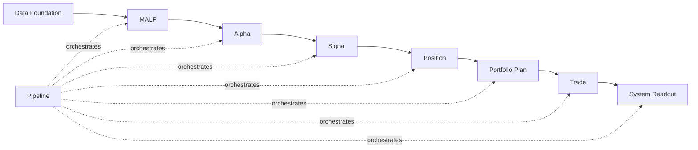

# Asteria 主线模块文档交付索引 v1

日期：2026-04-29

## 1. 目的

本索引用来回答：

```text
主线模块文档交付到哪里？
哪些模块已经冻结？
哪些模块只是占位？
哪些模块允许进入施工？
```

正式模块文档存放在：

```text
H:\Asteria\docs\02-modules\
```

正式可交付压缩包存放在：

```text
H:\Asteria-Validated\Asteria-mainline-module-docs-v1.zip
```

当前 docs/code 快照基线：

```text
H:\Asteria-Validated\Asteria-docs-code-20260428-214427.zip
H:\Asteria-Validated\Asteria-docs-code-20260429-130309.zip
H:\Asteria-Validated\Asteria-docs-code-20260502-104932.zip
```

`214427` 是 2026-04-28 锚点；`130309` 是三天重构成果的历史系统 docs/code
快照；`101006` 是当前系统 docs/code 快照。快照之后的 repo HEAD 事实由治理执行记录、commit history 和新的 Validated
归档补充，不得用任何旧 zip 覆盖当前仓库。

## 2. 权威来源

MALF 的语义权威来自：

```text
H:\Asteria-Validated\MALF_Three_Part_Design_Set_v1_3.zip
H:\Asteria-Validated\MALF_Three_Part_Design_Set_v1_3\
```

该资产包含：

| 文件 | Asteria 地位 |
|---|---|
| `MALF_00_Three_Documents_Bridge_v1_2.md` | 三文档关系桥接 |
| `MALF_01_Core_Definitions_Theorems_v1_3.md` | Core 结构真值 |
| `MALF_02_Lifespan_Stats_Definitions_Theorems_v1_2.md` | Lifespan 统计真值 |
| `MALF_03_System_Service_Interface_v1_2.md` | WavePosition 服务接口真值 |
| `MALF_00_Three_Documents_Bridge_v1_3.md` | v1.3 三文档关系与边界 |
| `MALF_01_Core_Definitions_Theorems_v1_3.md` | v1.3 Core 结构真值 |
| `MALF_02_Lifespan_Stats_Definitions_Theorems_v1_3.md` | v1.3 Lifespan 统计与 birth descriptors |
| `MALF_03_System_Service_Interface_v1_3.md` | v1.3 WavePosition 服务接口与 trace 字段 |
| `MALF_04_Core_Chart_View_v1_3.md` | v1.3 Core 图表辅助理解 |
| `MALF_05_Lifespan_Chart_View_v1_3.md` | v1.3 Lifespan 图表辅助理解 |
| `MALF_06_Service_Chart_View_v1_3.md` | v1.3 Service 图表辅助理解 |
| `MALF_07_Definition_Theorem_Review_and_Implementation_Delta_v1_3.md` | v1.3 定义/定理评审与实现差异 |

当前执行权威补充：

| 资产 | 地位 |
|---|---|
| `docs/04-execution/records/malf/malf-day-bounded-proof-20260428-01.conclusion.md` | MALF day bounded proof 已通过 |
| `H:\Asteria-Validated\Asteria-malf-day-bounded-proof-20260428-01.zip` | MALF day release evidence |
| `docs/04-execution/records/alpha/alpha-bounded-proof-20260429-01.conclusion.md` | Alpha bounded proof 已通过 |
| `H:\Asteria-Validated\Asteria-alpha-bounded-proof-20260429-01.zip` | Alpha bounded proof release evidence |
| `docs/04-execution/records/signal/signal-freeze-review-20260429-01.conclusion.md` | Signal freeze review 已通过 |
| `H:\Asteria-Validated\Asteria-signal-freeze-review-20260429-01.zip` | Signal freeze review evidence |
| `docs/04-execution/records/signal/signal-bounded-proof-20260429-01.conclusion.md` | Signal bounded proof 已通过 |
| `H:\Asteria-Validated\Asteria-signal-bounded-proof-20260429-01.zip` | Signal bounded proof evidence |
| `H:\Asteria-Validated\Asteria-docs-authority-refresh-20260429-01.zip` | 文档权威链刷新归档 |
| `docs/04-execution/records/governance/malf-authority-compatibility-audit-20260429-01.conclusion.md` | 当前系统快照未偏移 MALF 权威 |
| `docs/04-execution/records/malf/malf-v1-3-formal-rebuild-closeout-20260502-01.conclusion.md` | MALF v1.3 day formal-data bounded proof 已通过 |

## 3. 交付状态表

| 顺序 | 模块 | 文档位置 | 文档状态 | 是否允许施工 | 等待条件 |
|---:|---|---|---|---:|---|
| 0 | Data Foundation | `docs/02-modules/data/` | foundation six-doc draft | 否 | 作为地基输入契约继续审阅，不占主线施工位 |
| 1 | MALF | `docs/02-modules/malf/` | frozen / complete alignment closeout passed / v1.3 sync plan prepared | 否 | day dense evidence 已通过；v1.3 代码修订、week/month 或 full build 另需新卡 |
| 2 | Alpha | `docs/02-modules/alpha/` | frozen six-doc set / bounded proof passed | 否 | full build 另需新卡 |
| 3 | Signal | `docs/02-modules/signal/` | frozen six-doc set / bounded proof passed | 否 | full build 另需新卡 |
| 4 | Position | `docs/02-modules/position/` | pre-gate six-doc draft | 是，review-only | 当前只允许 Position freeze review |
| 5 | Portfolio Plan | `docs/02-modules/portfolio_plan/` | pre-gate six-doc draft | 否 | 等 Position 放行后重新审阅并冻结 |
| 6 | Trade | `docs/02-modules/trade/` | pre-gate six-doc draft | 否 | 等 Portfolio Plan 放行后重新审阅并冻结 |
| 7 | System Readout | `docs/02-modules/system_readout/` | pre-gate six-doc draft | 否 | 等 Trade 放行后重新审阅并冻结 |
| 8 | Pipeline | `docs/02-modules/pipeline/` | pre-gate six-doc draft | 否 | MALF gate 已过但当前不占主线卡位；不得建立全链路 |

## 4. 主线顺序



## 5. 交付裁决

已冻结并完成当前 proof：

```text
MALF day bounded proof
Alpha bounded proof
Signal freeze review
Signal bounded proof
```

当前已打开执行卡：

```text
Position freeze review card
```

当前只允许施工对象：

```text
Position freeze review
```

除 MALF day proof、Alpha freeze review、Alpha bounded proof passed、Signal freeze
review passed 和 Signal bounded proof passed 外，仍只保留
foundation draft 或 pre-gate draft，不冻结：

```text
Position
Portfolio Plan
Trade
System Readout
Pipeline
```

Data Foundation foundation draft 与 Position / Portfolio Plan / Trade /
System Readout / Pipeline pre-gate draft 都不得被解释为语义冻结、schema 冻结或施工许可。
Signal freeze review passed 只冻结 Signal 六件套，不表示代码施工许可。
Alpha bounded proof build card 只授权 Alpha bounded proof，不授权 Alpha full build、
Signal construction、Pipeline 或任何下游施工。Signal freeze review passed 后，下一步
只允许 Signal bounded proof build card。Signal bounded proof passed 后，下一步只允许
Position freeze review，不允许 Position 施工。

## 6. 硬边界

| 边界 | 裁决 |
|---|---|
| MALF 输出 | 只输出结构事实、lifespan 统计位置、WavePosition |
| Alpha 以后写回 MALF | 禁止 |
| `wave_core_state` 与 `system_state` | 必须分离 |
| Pipeline | 只编排和记录，不定义业务语义 |
| 正式 DB | 只能放在 `H:\Asteria-data` |
| 临时构建物 | 只能放在 `H:\Asteria-temp` |
