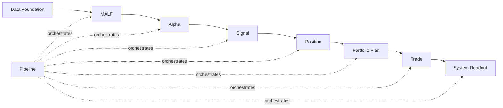

# Asteria 主线模块文档交付索引 v1

日期：2026-04-29

## 1. 目的

本索引用来回答：

```text
主线模块文档交付到哪里？
哪些模块已经冻结？
哪些模块只是占位？
哪些模块允许进入施工？
```

正式模块文档存放在：

```text
H:\Asteria\docs\02-modules\
```

正式可交付压缩包存放在：

```text
H:\Asteria-Validated\Asteria-mainline-module-docs-v1.zip
```

当前 docs/code 快照基线：

```text
H:\Asteria-Validated\Asteria-docs-code-20260428-214427.zip
H:\Asteria-Validated\Asteria-docs-code-20260429-130309.zip
H:\Asteria-Validated\Asteria-docs-code-20260502-104932.zip
```

`214427` 是 2026-04-28 锚点；`130309` 是三天重构成果的历史系统 docs/code
快照；`101006` 是当前系统 docs/code 快照。快照之后的 repo HEAD 事实由治理执行记录、commit history 和新的 Validated
归档补充，不得用任何旧 zip 覆盖当前仓库。

## 2. 权威来源

MALF 的语义权威来自：

```text
H:\Asteria-Validated\MALF_Three_Part_Design_Set_v1_4.zip
H:\Asteria-Validated\MALF_Three_Part_Design_Set_v1_4\
```

该资产包含：

| 文件 | Asteria 地位 |
|---|---|
| `MALF_00_Three_Documents_Bridge_v1_2.md` | 三文档关系桥接 |
| `MALF_01_Core_Definitions_Theorems_v1_4.md` | Core 结构真值 |
| `MALF_02_Lifespan_Stats_Definitions_Theorems_v1_2.md` | Lifespan 统计真值 |
| `MALF_03_System_Service_Interface_v1_2.md` | WavePosition 服务接口真值 |
| `MALF_00_Three_Documents_Bridge_v1_4.md` | v1.4 包入口、版本关系与治理边界 |
| `MALF_01_Core_Definitions_Theorems_v1_4.md` | 继承 v1.3 的 Core 结构真值 |
| `MALF_01B_Core_Operational_Boundary_Rules_v1_4.md` | v1.4 Core 操作边界规则 |
| `MALF_02_Lifespan_Stats_Definitions_Theorems_v1_4.md` | 继承 v1.3 的 Lifespan 统计与 birth descriptors |
| `MALF_03_System_Service_Interface_v1_4.md` | 继承 v1.3 的 WavePosition 服务接口与 trace 字段 |
| `MALF_04_Core_Chart_View_v1_4.md` | v1.4 Core 图表辅助理解 |
| `MALF_05_Lifespan_Chart_View_v1_4.md` | v1.4 Lifespan 图表辅助理解 |
| `MALF_06_Service_Chart_View_v1_4.md` | v1.4 Service 图表辅助理解 |
| `MALF_07_Definition_Theorem_Review_and_Implementation_Delta_v1_4.md` | 继承 v1.3 定义/定理评审，并由 01B 补足工程边界 |

当前执行权威补充：

| 资产 | 地位 |
|---|---|
| `docs/04-execution/records/malf/malf-day-bounded-proof-20260428-01.conclusion.md` | MALF day bounded proof 已通过 |
| `H:\Asteria-Validated\Asteria-malf-day-bounded-proof-20260428-01.zip` | MALF day release evidence |
| `docs/04-execution/records/alpha/alpha-bounded-proof-20260429-01.conclusion.md` | Alpha bounded proof 已通过 |
| `H:\Asteria-Validated\Asteria-alpha-bounded-proof-20260429-01.zip` | Alpha bounded proof release evidence |
| `docs/04-execution/records/signal/signal-freeze-review-20260429-01.conclusion.md` | Signal freeze review 已通过 |
| `H:\Asteria-Validated\Asteria-signal-freeze-review-20260429-01.zip` | Signal freeze review evidence |
| `docs/04-execution/records/signal/signal-bounded-proof-20260429-01.conclusion.md` | Signal bounded proof 已通过 |
| `H:\Asteria-Validated\Asteria-signal-bounded-proof-20260429-01.zip` | Signal bounded proof evidence |
| `docs/04-execution/records/portfolio_plan/portfolio-plan-freeze-review-20260507-01.conclusion.md` | Portfolio Plan freeze review 已通过 |
| `H:\Asteria-Validated\Asteria-portfolio-plan-freeze-review-20260507-01.zip` | Portfolio Plan freeze review evidence |
| `docs/04-execution/records/portfolio_plan/portfolio-plan-bounded-proof-build-card-20260507-01.conclusion.md` | Portfolio Plan bounded proof 已通过 |
| `H:\Asteria-Validated\Asteria-portfolio-plan-bounded-proof-build-card-20260507-01.zip` | Portfolio Plan bounded proof evidence |
| `docs/04-execution/records/trade/trade-freeze-review-20260507-01.conclusion.md` | Trade freeze review 已通过 |
| `H:\Asteria-Validated\Asteria-trade-freeze-review-20260507-01.zip` | Trade freeze review evidence |
| `docs/04-execution/records/trade/trade-bounded-proof-build-card-20260507-01.conclusion.md` | Trade bounded proof 已通过 |
| `H:\Asteria-Validated\Asteria-trade-bounded-proof-build-card-20260507-01.zip` | Trade bounded proof evidence |
| `docs/04-execution/records/system_readout/system-readout-freeze-review-20260507-01.conclusion.md` | System Readout freeze review 已通过 |
| `H:\Asteria-Validated\Asteria-system-readout-freeze-review-20260507-01.zip` | System Readout freeze review evidence |
| `H:\Asteria-Validated\Asteria-docs-authority-refresh-20260429-01.zip` | 文档权威链刷新归档 |
| `docs/04-execution/records/governance/malf-authority-compatibility-audit-20260429-01.conclusion.md` | 当前系统快照未偏移 MALF 权威 |
| `docs/04-execution/records/malf/malf-v1-3-formal-rebuild-closeout-20260502-01.conclusion.md` | MALF v1.3 day formal-data bounded proof 已通过 |
| `docs/04-execution/records/data/data-market-meta-formalization-20260502-01.conclusion.md` | Data market_meta 最小正式化已通过 |

## 3. 交付状态表

| 顺序 | 模块 | 文档位置 | 文档状态 | 是否允许施工 | 等待条件 |
|---:|---|---|---|---:|---|
| 0 | Data Foundation | `docs/02-modules/data/` | production foundation released / market_meta minimal formalized | 是，foundation maintenance only | 不占主线施工位；reference gaps retained |
| 1 | MALF | `docs/02-modules/malf/` | frozen / v1.3 day formal-data closeout passed / v1.4 operational boundary authority synced | 否 | day runtime evidence 已通过；v1.4 实现同步、week/month 或 full build 另需新卡 |
| 2 | Alpha | `docs/02-modules/alpha/` | frozen six-doc set / bounded proof passed | 否 | full build 另需新卡 |
| 3 | Signal | `docs/02-modules/signal/` | frozen six-doc set / bounded proof passed | 否 | full build 另需新卡 |
| 4 | Position | `docs/02-modules/position/` | freeze review passed / bounded proof passed / full build not executed | 否 | full build 另需新卡 |
| 5 | Portfolio Plan | `docs/02-modules/portfolio_plan/` | frozen six-doc set / freeze review passed / bounded proof passed / full build not executed | 否 | full build 另需新卡 |
| 6 | Trade | `docs/02-modules/trade/` | frozen six-doc set / freeze review passed / bounded proof passed | 否 | Trade bounded proof 已通过；`fill_ledger` retained gap；full build 另需新卡 |
| 7 | System Readout | `docs/02-modules/system_readout/` | frozen six-doc set / freeze review passed / bounded proof passed / full build not executed | 否 | bounded proof 已通过；`system.duckdb` 与 runner 已创建为 day bounded surface |
| 8 | Pipeline | `docs/02-modules/pipeline/` | frozen six-doc set / freeze review passed / single-module orchestration build passed / full-chain dry-run passed / full-chain day bounded proof passed / one-year strategy behavior replay blocked / coverage gap diagnosis executed / MALF repair passed / year replay rerun blocked | 否 | freeze review、三张 scope freeze、single-module orchestration build、full-chain dry-run、full-chain bounded proof build 与其 closeout、year replay scope freeze、coverage gap diagnosis、MALF minimal repair 与 rerun 均已真实执行；`pipeline.duckdb` 已创建，但 rerun 证明 released Alpha/Signal 观察链仍未跟上 repaired MALF source |

## 4. 主线顺序



## 5. 交付裁决

已冻结并完成当前 proof：

```text
MALF day bounded proof
Alpha bounded proof
Signal freeze review
Signal bounded proof
Trade freeze review
Trade bounded proof build
System Readout freeze review
```

当前已打开执行卡：

```text
alpha_signal_2024_coverage_repair_card
```

当前只允许施工对象：

```text
minimal Alpha / Signal released day surface repair
```

除 MALF day proof、Alpha freeze review、Alpha bounded proof passed、Signal freeze
review passed、Signal bounded proof passed、Trade freeze review passed 和 Trade bounded proof passed 外，仍只保留
foundation draft 或 pre-gate draft，不冻结：

```text
none
```

Data Foundation maintenance release 与 Position / Portfolio Plan / Trade /
System Readout / Pipeline freeze review passed 都不得被解释为下游施工许可。
Signal freeze review passed 只冻结 Signal 六件套，不表示代码施工许可。
Alpha bounded proof build card 只授权 Alpha bounded proof，不授权 Alpha full build、
Signal construction、Pipeline 或任何下游施工。Signal freeze review passed 后，下一步
只允许 Signal bounded proof build card。Signal bounded proof passed 后，Position freeze review
reentry 已通过；随后上游完整性总控卡裁定在最终完整目标标准下暂停 Position bounded proof
施工。Data reference target maintenance scope 已通过并冻结下一张 Data closeout 范围；
Position bounded proof、Portfolio Plan freeze review、Portfolio Plan bounded proof、Trade freeze review、Trade bounded proof build、System Readout freeze review、System Readout bounded proof build、Pipeline freeze review、Pipeline build/runtime authorization scope freeze、Pipeline single-module orchestration build、Pipeline full-chain dry-run authorization scope freeze、Pipeline full-chain dry-run、Pipeline full-chain bounded proof authorization scope freeze、Pipeline full-chain bounded proof build、Pipeline full-chain bounded proof closeout、Pipeline one-year strategy behavior replay、year replay coverage gap diagnosis、MALF natural-year coverage repair 与 year replay rerun 已执行；当前唯一下一卡是 `alpha_signal_2024_coverage_repair_card`，只允许最小 Alpha / Signal released day surface repair，仍不允许 Trade full build、Position full build、System full build、full rebuild、daily incremental 或 `v1 complete` 扩权。

## 6. 硬边界

| 边界 | 裁决 |
|---|---|
| MALF 输出 | 只输出结构事实、lifespan 统计位置、WavePosition |
| Alpha 以后写回 MALF | 禁止 |
| `wave_core_state` 与 `system_state` | 必须分离 |
| Pipeline | 只编排和记录，不定义业务语义 |
| 正式 DB | 只能放在 `H:\Asteria-data` |
| 临时构建物 | 只能放在 `H:\Asteria-temp` |
