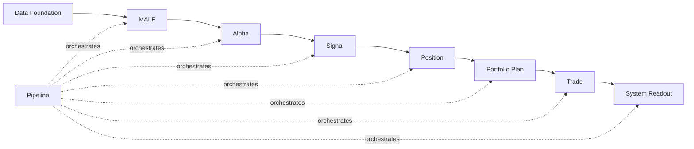

# Asteria 主线模块文档交付索引 v1

日期：2026-04-27

## 1. 目的

本索引用来回答：

```text
主线模块文档交付到哪里？
哪些模块已经冻结？
哪些模块只是占位？
哪些模块允许进入施工？
```

正式模块文档存放在：

```text
H:\Asteria\docs\02-modules\
```

正式可交付压缩包存放在：

```text
H:\Asteria-Validated\Asteria-mainline-module-docs-v1.zip
```

## 2. 权威来源

MALF 的语义权威来自：

```text
H:\Asteria-Validated\MALF_Three_Part_Design_Set_v1_2.zip
H:\Asteria-Validated\MALF_Three_Part_Design_Set_v1_2\
```

该资产包含：

| 文件 | Asteria 地位 |
|---|---|
| `MALF_00_Three_Documents_Bridge_v1_2.md` | 三文档关系桥接 |
| `MALF_01_Core_Definitions_Theorems_v1_3.md` | Core 结构真值 |
| `MALF_02_Lifespan_Stats_Definitions_Theorems_v1_2.md` | Lifespan 统计真值 |
| `MALF_03_System_Service_Interface_v1_2.md` | WavePosition 服务接口真值 |

## 3. 交付状态表

| 顺序 | 模块 | 文档位置 | 文档状态 | 是否允许施工 | 等待条件 |
|---:|---|---|---|---:|---|
| 0 | Data Foundation | `docs/02-modules/01-data-foundation-design-v1.md` | draft | 否 | 作为地基输入契约继续冻结 |
| 1 | MALF | `docs/02-modules/malf/` | frozen | 是 | 仅允许 MALF 下一施工卡 |
| 2 | Alpha | `docs/02-modules/alpha/` | pre-gate six-doc draft | 否 | 等 MALF WavePosition 放行后重新审阅并冻结 |
| 3 | Signal | `docs/02-modules/signal/` | pending placeholder | 否 | 等 Alpha 放行 |
| 4 | Position | `docs/02-modules/position/` | pending placeholder | 否 | 等 Signal 放行 |
| 5 | Portfolio Plan | `docs/02-modules/portfolio_plan/` | pending placeholder | 否 | 等 Position 放行 |
| 6 | Trade | `docs/02-modules/trade/` | pending placeholder | 否 | 等 Portfolio Plan 放行 |
| 7 | System Readout | `docs/02-modules/system_readout/` | pending placeholder | 否 | 等 Trade 放行 |
| 8 | Pipeline | `docs/02-modules/pipeline/` | pending placeholder | 否 | 等主线 gate registry 放行 |

## 4. 主线顺序



## 5. 交付裁决

本轮交付冻结：

```text
MALF
```

本轮只建立占位或 pre-gate draft，不冻结：

```text
Signal
Position
Portfolio Plan
Trade
System Readout
Pipeline
```

Alpha pre-gate draft 和下游占位文档不得被解释为语义冻结、schema 冻结或施工许可。

## 6. 硬边界

| 边界 | 裁决 |
|---|---|
| MALF 输出 | 只输出结构事实、lifespan 统计位置、WavePosition |
| Alpha 以后写回 MALF | 禁止 |
| `wave_core_state` 与 `system_state` | 必须分离 |
| Pipeline | 只编排和记录，不定义业务语义 |
| 正式 DB | 只能放在 `H:\Asteria-data` |
| 临时构建物 | 只能放在 `H:\Asteria-temp` |
