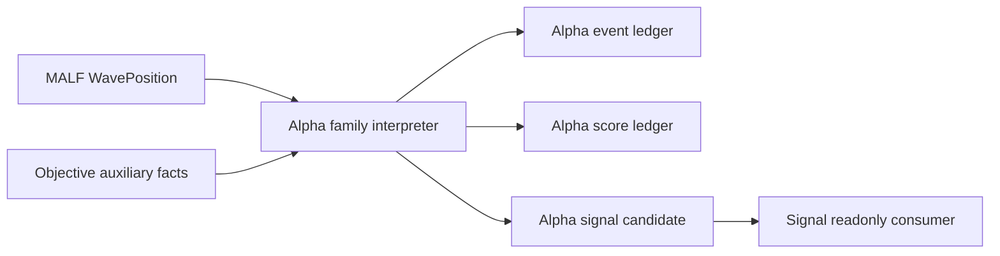

# Alpha Authority Design v1

日期：2026-04-29

状态：draft / pre-gate / not frozen / freeze review next

## 1. 模块定义

Alpha 是 Asteria 主线中位于 MALF 之后、Signal 之前的机会解释模块。

Alpha 只负责把已发布的 MALF WavePosition 与可审计的辅助事实解释为 Alpha family 机会事件、评分和候选意图。Alpha 不定义市场结构，不修正 MALF，不处理仓位、组合资金或订单。

## 2. 前置门槛

Alpha 设计冻结和施工必须等待：

```text
MALF day WavePosition release evidence passed
Alpha freeze review passed
```

该门槛至少要求：

| 项 | 要求 |
|---|---|
| MALF Service DB | 已存在可审计的 `malf_wave_position` |
| Interface Audit | `malf_interface_audit` 硬规则通过 |
| Release Evidence | MALF day release evidence 已落档并结论为 passed |
| Alpha Contract | WavePosition 字段可被 Alpha 只读消费 |

MALF day release evidence 已满足第一项前置条件；但在 Alpha freeze review
完成并形成冻结结论前，本文件仍只作为 pre-gate draft，不允许施工。

## 3. 权威来源

Alpha 的上游语义权威只来自 MALF Service 发布的 WavePosition。

```text
MALF defines structure and position.
Alpha interprets opportunity.
```

历史 Alpha 资产、BOF/TST/PB/CPB/BPB 报告和旧系统经验只能作为旁证，不得反向定义 Asteria Alpha 的正式语义。

## 4. 模块只回答什么

| 问题 | Alpha 是否回答 |
|---|---:|
| 某个 WavePosition 是否构成可解释机会 | 是 |
| 机会属于哪个 alpha family | 是 |
| 机会强弱评分是多少 | 是 |
| 机会是否足以成为 Signal 的候选输入 | 是 |
| 多个 Alpha 如何聚合成正式信号 | 否 |
| 是否建仓、持仓多少 | 否 |
| 是否下单、成交价格是什么 | 否 |

## 5. 模块不回答什么

| 禁止输出 | 归属模块 |
|---|---|
| Wave / Break / Transition 结构事实 | MALF |
| 正式 signal 账本 | Signal |
| position size / entry / exit plan | Position |
| 组合资金、容量、准入裁决 | Portfolio Plan |
| order intent / fill | Trade |
| 全链路 readout | System Readout |

## 6. 输入

Alpha 第一阶段只读消费 MALF Service：

```text
H:\Asteria-data\malf_service_day.duckdb
```

核心输入表：

```text
malf_wave_position
malf_wave_position_latest
```

允许读取的辅助事实必须来自 Data Foundation 或已放行的只读事实服务。可交易性、停牌、ST、行业、日历等客观事实不得在 Alpha 内部重新定义。

## 7. 输出

Alpha 目标拓扑为五个 alpha family DB：

| Alpha family | DB | 职责 |
|---|---|---|
| BOF | `alpha_bof.duckdb` | BOF opportunity event / score / candidate |
| TST | `alpha_tst.duckdb` | TST opportunity event / score / candidate |
| PB | `alpha_pb.duckdb` | PB opportunity event / score / candidate |
| CPB | `alpha_cpb.duckdb` | CPB opportunity event / score / candidate |
| BPB | `alpha_bpb.duckdb` | BPB opportunity event / score / candidate |

正式路径：

```text
H:\Asteria-data\alpha_bof.duckdb
H:\Asteria-data\alpha_tst.duckdb
H:\Asteria-data\alpha_pb.duckdb
H:\Asteria-data\alpha_cpb.duckdb
H:\Asteria-data\alpha_bpb.duckdb
```

这些 DB 只能在 Alpha 设计冻结且 MALF WavePosition 放行后创建。

## 8. 数据流



## 9. 核心表族

每个 alpha family DB 使用同构表族：

| 表 | 职责 |
|---|---|
| `alpha_family_run` | family build 审计 |
| `alpha_schema_version` | schema 版本 |
| `alpha_rule_version` | family 规则版本 |
| `alpha_event_ledger` | Alpha 机会事件 |
| `alpha_score_ledger` | Alpha 评分 |
| `alpha_signal_candidate` | 给 Signal 的候选输入 |
| `alpha_source_audit` | 上游输入与只读边界审计 |

## 10. 自然键

| 表 | 自然键 |
|---|---|
| `alpha_family_run` | `run_id` |
| `alpha_schema_version` | `schema_version` |
| `alpha_rule_version` | `alpha_family + alpha_rule_version` |
| `alpha_event_ledger` | `alpha_family + symbol + timeframe + bar_dt + event_type + alpha_rule_version` |
| `alpha_score_ledger` | `alpha_event_id + score_name + alpha_rule_version` |
| `alpha_signal_candidate` | `alpha_event_id + candidate_type + alpha_rule_version` |
| `alpha_source_audit` | `audit_id` |

## 11. 版本字段

正式 Alpha 表默认包含：

```text
run_id
schema_version
alpha_family
alpha_rule_version
source_malf_service_version
source_malf_run_id
created_at
```

若 Alpha family 使用统计样本或校准样本，必须增加：

```text
sample_version
sample_scope
```

## 12. 上下游边界

上游：

```text
MALF Service -> WavePosition
Data Foundation -> objective facts
```

下游：

```text
Signal -> readonly alpha_signal_candidate
```

Alpha、Signal、Position、Portfolio Plan、Trade、System Readout 均不得写回 MALF。

## 13. 上线门禁

Alpha 未来冻结必须满足：

| 门禁 | 要求 |
|---|---|
| MALF Release | WavePosition service released，MALF day proof passed |
| Design | Alpha 六件套从 pre-gate draft 升级并审阅 |
| Schema | 五个 alpha family DB 表族、自然键、版本字段冻结 |
| Runner | bounded / segmented / full / resume 语义冻结 |
| Audit | 只读 MALF、无持仓资金订单输出、自然键唯一等硬审计冻结 |
| Evidence | Alpha bounded proof 证据落入 `H:\Asteria-report` 或 `H:\Asteria-Validated` |

当前唯一允许推进的是 `Alpha freeze review`。该 review 只审阅并裁决六件套是否可冻结，
不创建正式 Alpha DB，不迁移旧 Alpha engine，不运行下游 Signal/Position/Trade。
