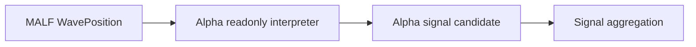

# Alpha Semantic Contract v1

日期：2026-04-27

状态：draft / pre-gate / not frozen

## 1. 合同目的

本合同定义 Alpha 在 Asteria 主线中的语义边界。Alpha 只能解释 MALF 已发布结构位置上的机会，不得重定义 WavePosition，不得写回 MALF，不得输出资金、仓位或订单语义。

## 2. 前置门槛

本合同在以下条件满足前不得冻结：

```text
MALF WavePosition service released
```

Alpha 的任何正式输入字段必须以 MALF Service 已放行字段为准。

## 3. 输入语义

Alpha 只读消费 WavePosition 的最小字段：

| 字段 | 语义来源 |
|---|---|
| `symbol` | MALF Service |
| `timeframe` | MALF Service |
| `bar_dt` | MALF Service |
| `system_state` | MALF Service |
| `wave_core_state` | MALF Service |
| `direction` | MALF Service |
| `new_count` | MALF Service |
| `no_new_span` | MALF Service |
| `transition_span` | MALF Service |
| `update_rank` | MALF Service |
| `stagnation_rank` | MALF Service |
| `life_state` | MALF Service |
| `position_quadrant` | MALF Service |
| `sample_version` | MALF Service |
| `lifespan_rule_version` | MALF Service |
| `service_version` | MALF Service |

Alpha 不解释缺失 WavePosition 行为数据错误。缺行语义仍按 MALF 规定处理：尚未初始化或尚未发布。

## 4. 辅助事实语义

Alpha 可读取辅助事实，但辅助事实必须是只读客观事实或已放行上游账本。

| 事实 | 归属 |
|---|---|
| 交易日历 | Data Foundation |
| universe | Data Foundation |
| 停牌 / ST / 涨跌停等客观事实 | Data Foundation |
| 行业分类 | Data Foundation |
| WavePosition | MALF Service |

Alpha 不得在自身 schema 中重新定义这些事实的权威含义。

## 5. Alpha family 语义

第一阶段 Alpha family 名称只作为机会解释族：

| family | 语义位置 |
|---|---|
| BOF | Alpha opportunity family |
| TST | Alpha opportunity family |
| PB | Alpha opportunity family |
| CPB | Alpha opportunity family |
| BPB | Alpha opportunity family |

具体规则必须在 Alpha 设计冻结前另行审阅，不能由旧系统报告直接继承。

## 6. 输出语义

Alpha 正式输出分三层：

| 输出 | 语义 |
|---|---|
| `alpha_event` | 某 family 在某 WavePosition 上观察到机会解释事件 |
| `alpha_score` | 对 alpha_event 的可审计评分 |
| `alpha_signal_candidate` | 给 Signal 聚合的候选输入，不是正式 signal |

`alpha_signal_candidate` 不得被解释为买卖指令、建仓计划、仓位建议或订单。

## 7. Alpha Event 最小字段

| 字段 | 要求 |
|---|---|
| `alpha_event_id` | 必填 |
| `alpha_family` | `BOF / TST / PB / CPB / BPB` |
| `symbol` | 必填 |
| `timeframe` | 必填 |
| `bar_dt` | 必填 |
| `event_type` | 必填，由 family rule 定义 |
| `opportunity_state` | `observed / qualified / rejected` |
| `source_wave_position_key` | 必填 |
| `source_malf_service_version` | 必填 |
| `alpha_rule_version` | 必填 |

## 8. Alpha Score 最小字段

| 字段 | 要求 |
|---|---|
| `alpha_event_id` | 必填 |
| `score_name` | 必填 |
| `score_value` | 必填 |
| `score_direction` | `higher_is_stronger / lower_is_stronger / neutral` |
| `score_bucket` | 可空但字段必有 |
| `alpha_rule_version` | 必填 |

## 9. Alpha Candidate 最小字段

| 字段 | 要求 |
|---|---|
| `alpha_candidate_id` | 必填 |
| `alpha_event_id` | 必填 |
| `candidate_type` | family 内定义 |
| `candidate_state` | `candidate / filtered / expired` |
| `opportunity_bias` | `up_opportunity / down_opportunity / neutral` |
| `confidence_bucket` | `low / medium / high / unranked` |
| `reason_code` | 必填 |
| `alpha_rule_version` | 必填 |

`opportunity_bias` 只表达机会方向，不表达买入、卖出、做多仓位、做空仓位或订单。

## 10. 不允许表达

| 表达 | 裁决 |
|---|---|
| Alpha 写回 MALF | 禁止 |
| Alpha 修改 WavePosition 字段 | 禁止 |
| Alpha 自定义 `system_state` 或 `wave_core_state` | 禁止 |
| Alpha 输出 position size / weight | 禁止 |
| Alpha 输出 order intent / fill | 禁止 |
| Alpha 把客观可交易事实当作自身策略语义 | 禁止 |
| Signal 使用 Alpha candidate 反向修正 Alpha event | 禁止 |

## 11. 下游消费原则



Signal 只能读取 Alpha 的正式候选输出并形成自身账本。Signal 不得修改 Alpha 历史事件，也不得借 Alpha candidate 回写 MALF。
