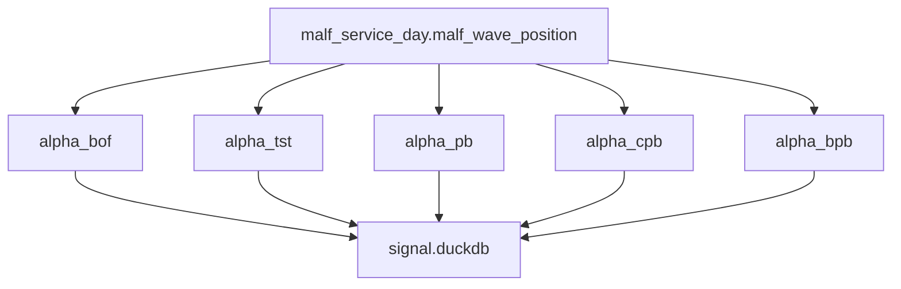
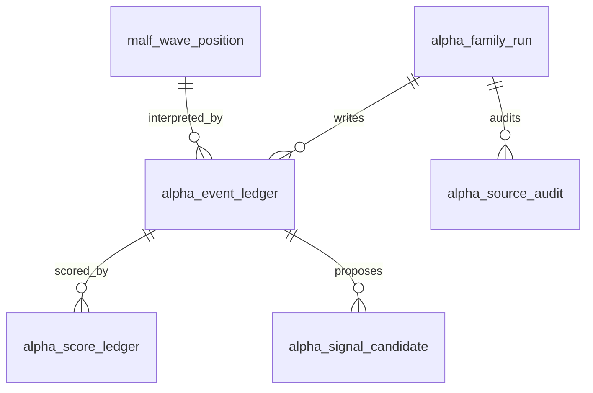

# Alpha Database Schema Spec v1

日期：2026-04-29

状态：draft / pre-gate / not frozen / freeze review next

## 1. 规格范围

本规格为 Alpha pre-gate draft。正式 schema 冻结必须等待：

```text
MALF day WavePosition release evidence passed
Alpha freeze review passed
```

当前只允许对本规格做 freeze review。不得创建正式 Alpha DuckDB，不得把
pre-gate schema 当作 released schema。

目标 Alpha DB：

```text
H:\Asteria-data\alpha_bof.duckdb
H:\Asteria-data\alpha_tst.duckdb
H:\Asteria-data\alpha_pb.duckdb
H:\Asteria-data\alpha_cpb.duckdb
H:\Asteria-data\alpha_bpb.duckdb
```

这些库在 Alpha 设计冻结前不得创建。

## 2. 五库关系



Alpha family DB 只向 Signal 提供只读候选输入。Signal 负责聚合，不得写回 Alpha 或 MALF。

## 3. 通用表族

每个 alpha family DB 使用同构表族：

| 表 | 自然键 | 说明 |
|---|---|---|
| `alpha_family_run` | `run_id` | family build 审计 |
| `alpha_schema_version` | `schema_version` | schema 版本 |
| `alpha_rule_version` | `alpha_family + alpha_rule_version` | family 规则版本 |
| `alpha_event_ledger` | `alpha_family + symbol + timeframe + bar_dt + event_type + alpha_rule_version` | 机会事件 |
| `alpha_score_ledger` | `alpha_event_id + score_name + alpha_rule_version` | 评分事实 |
| `alpha_signal_candidate` | `alpha_event_id + candidate_type + alpha_rule_version` | Signal 候选输入 |
| `alpha_source_audit` | `audit_id` | 上游来源和只读边界审计 |

## 4. 通用审计字段

Alpha 正式表必须带：

```text
run_id
schema_version
alpha_family
alpha_rule_version
source_malf_service_version
source_malf_run_id
created_at
```

如果 family 使用样本分布或校准模型，还必须带：

```text
sample_version
sample_scope
```

## 5. alpha_event_ledger

最小字段：

| 字段 | 要求 |
|---|---|
| `alpha_event_id` | 主体 id |
| `alpha_family` | 必填 |
| `symbol` | 必填 |
| `timeframe` | 必填 |
| `bar_dt` | 必填 |
| `event_type` | 必填 |
| `opportunity_state` | `observed / qualified / rejected` |
| `source_wave_position_key` | `symbol + timeframe + bar_dt + service_version` |
| `source_malf_service_version` | 必填 |
| `source_malf_run_id` | 必填 |
| `alpha_rule_version` | 必填 |

## 6. alpha_score_ledger

最小字段：

| 字段 | 要求 |
|---|---|
| `alpha_score_id` | 主体 id |
| `alpha_event_id` | 必填 |
| `score_name` | 必填 |
| `score_value` | 必填 |
| `score_direction` | `higher_is_stronger / lower_is_stronger / neutral` |
| `score_bucket` | 可空但字段必有 |
| `alpha_rule_version` | 必填 |

## 7. alpha_signal_candidate

最小字段：

| 字段 | 要求 |
|---|---|
| `alpha_candidate_id` | 主体 id |
| `alpha_event_id` | 必填 |
| `candidate_type` | 必填 |
| `candidate_state` | `candidate / filtered / expired` |
| `opportunity_bias` | `up_opportunity / down_opportunity / neutral` |
| `confidence_bucket` | `low / medium / high / unranked` |
| `reason_code` | 必填 |
| `alpha_rule_version` | 必填 |

## 8. alpha_source_audit

最小字段：

| 字段 | 说明 |
|---|---|
| `audit_id` | 审计 id |
| `run_id` | Alpha run |
| `check_name` | 检查项 |
| `severity` | `hard / soft` |
| `status` | `pass / fail / observe` |
| `failed_count` | 失败行数 |
| `sample_payload` | 样例 |

## 9. ER 图



## 10. 写入裁决

| 规则 | 裁决 |
|---|---|
| 正式 DB 路径 | `H:\Asteria-data` |
| working DB 路径 | `H:\Asteria-temp\alpha\<run_id>\` |
| 写入方式 | 批量写入 |
| 同库多写 | 禁止 |
| 旧数据替换 | staging 审计通过后 promote |
| `run_id` | 审计字段，不作为业务自然键 |
| formal DB create | Alpha design freeze 后才允许 |

## 11. 不允许的 schema

| 字段或表 | 裁决 |
|---|---|
| `position_size` | 禁止，归属 Position / Portfolio Plan |
| `target_weight` | 禁止，归属 Portfolio Plan |
| `order_intent_id` | 禁止，归属 Trade |
| 自定义 `wave_core_state` | 禁止，归属 MALF |
| 自定义 `system_state` | 禁止，归属 MALF |
