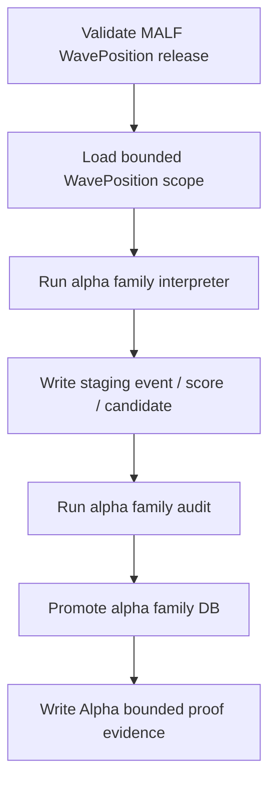

# Alpha Runner Contract v1

日期：2026-04-27

状态：draft / pre-gate / not frozen

## 1. Runner 目标

Alpha runner 负责在 MALF WavePosition released 之后，对单个 alpha family 执行 bounded proof、segmented build、full build、resume 和 audit-only。

在 Alpha 设计冻结前，本文件只冻结草案方向，不要求创建代码文件。

## 2. 前置门槛

所有 Alpha runner 必须在运行前验证：

```text
MALF WavePosition service released
```

缺少 `malf_wave_position`、缺少 `malf_interface_audit` 通过结论、或缺少 MALF release evidence 时，runner 必须拒绝正式 build。

## 3. Runner 列表

| Runner | 职责 |
|---|---|
| `scripts/alpha/run_alpha_family_build.py` | 对单个 alpha family 构建 event / score / candidate |
| `scripts/alpha/run_alpha_family_audit.py` | 对单个 alpha family 执行输入、输出、边界审计 |
| `scripts/alpha/run_alpha_bounded_proof.py` | 编排五个 family 的 bounded proof |

这些 runner 在 pre-gate draft 阶段不创建代码文件。

## 4. 构建顺序



## 5. 运行模式

| 模式 | 要求 |
|---|---|
| `bounded` | 必须传 `start_dt / end_dt` 或 `symbol_limit` |
| `segmented` | 必须传 symbol range、batch id 或 family scope |
| `full` | 只能在 bounded proof 通过后开启 |
| `resume` | 必须读取 checkpoint |
| `audit-only` | 不写业务表，只写 audit 或报告 |

## 6. 公共参数

| 参数 | 要求 |
|---|---|
| `--alpha-family` | `BOF / TST / PB / CPB / BPB` |
| `--timeframe` | 第一阶段固定为 `day` |
| `--mode` | `bounded / segmented / full / resume / audit-only` |
| `--run-id` | 可传入；未传入时由 runner 生成 |
| `--source-malf-db` | MALF Service DB 路径 |
| `--target-alpha-db` | 当前 family 目标 DB 路径 |
| `--start-dt` | bounded 可选条件 |
| `--end-dt` | bounded 可选条件 |
| `--symbol-limit` | bounded 可选条件 |
| `--schema-version` | 必填 |
| `--alpha-rule-version` | 必填 |
| `--source-malf-service-version` | 必填 |

## 7. 幂等与断点

| 规则 | 裁决 |
|---|---|
| 同一 run 重跑 | 必须可识别并拒绝重复 promote |
| bounded 重算 | 允许覆盖同 scope staging |
| promote | 只能在审计通过后执行 |
| checkpoint | 存放在 `H:\Asteria-temp\alpha\<run_id>\` |
| 失败恢复 | resume 必须从 checkpoint 或 staging 状态恢复 |
| source lock | 必须记录 source MALF service version |

## 8. 输出证据

每个 runner 必须产生：

| 证据 | 位置 |
|---|---|
| run ledger | 对应 alpha family DB |
| source audit | 对应 alpha family DB |
| audit report | `H:\Asteria-report\alpha\<date>\` |
| release evidence | `H:\Asteria-Validated\` |

正式证据不得写入 repo 根目录。

## 9. 禁止行为

| 行为 | 裁决 |
|---|---|
| 修改 MALF DB | 禁止 |
| 创建 Signal DB | 禁止 |
| 写入 position / portfolio / trade 字段 | 禁止 |
| 在 runner 中定义 WavePosition 语义 | 禁止 |
| 绕过 MALF release gate 启动 full build | 禁止 |
