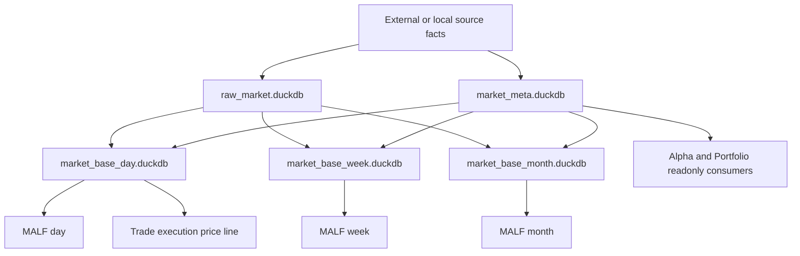

# Data Foundation Authority Design v1

日期：2026-05-02

状态：production-foundation released / execution day line live / market_meta minimal formalized / reference gaps retained

## 1. 模块定义

Data Foundation 是 Asteria 的基础建设层，负责把外部或本地来源的客观市场事实整理为稳定、可追溯、可重复构建的 source-fact 与 market-base 数据产品。

它不是策略主线模块，也不参与机会解释、持仓裁决、交易执行或系统读出。

截至 2026-05-02，Data Foundation 已完成生产级地基闭环，并已把 day
`execution_price_line = none` 正式物化到 live `market_base_day.duckdb`：现有四个正式库
`raw_market.duckdb`、`market_base_day.duckdb`、`market_base_week.duckdb` 与
`market_base_month.duckdb` 作为本版全量 Data 底座；`market_meta.duckdb` 已按
可证事实优先口径完成最小正式化。

```text
Data Foundation = raw facts + metadata + market base
```

## 2. 模块只回答什么

| 问题 | Data Foundation 是否回答 |
|---|---:|
| 哪些原始市场数据被接入 | 是 |
| 哪些交易日存在 | 是 |
| 哪些标的存在、如何映射 | 是 |
| 客观可交易事实如何表达 | 是 |
| 日/周/月基础价格线如何物化 | 是 |
| 当前波段属于什么结构 | 否 |
| 当前是否存在 Alpha 机会 | 否 |
| 是否该持仓、配资或交易 | 否 |

## 3. 模块不回答什么

| 禁止输出 | 归属模块 |
|---|---|
| Wave / Break / Transition 结构事实 | MALF |
| Alpha family event / score | Alpha |
| formal signal | Signal |
| position candidate / entry / exit plan | Position |
| portfolio constraints / target exposure | Portfolio Plan |
| order intent / fill | Trade |
| whole-chain readout | System Readout |

## 4. 输入

Data Foundation 的输入来自外部或本地客观数据源：

```text
vendor market files
vendor market api
calendar files
instrument master files
industry and universe reference files
legacy Lifespan raw/base DuckDB source-fact inputs
```

这些输入必须保持来源可追溯，不得在导入阶段掺入任何策略解释字段。

### 4.1 Legacy Lifespan source intake

首轮旧库导入只接收以下 source-fact 输入：

| 源路径 | 范围 | 首轮用途 |
|---|---|---|
| `H:\Lifespan-data\raw\raw_market.duckdb` | `stock / day / backward` raw bars | raw 追溯与审计 |
| `H:\Lifespan-data\raw\raw_market_week.duckdb` | `stock / week / backward` raw bars | raw 追溯与审计 |
| `H:\Lifespan-data\raw\raw_market_month.duckdb` | `stock / month / backward` raw bars | raw 追溯与审计 |
| `H:\Lifespan-data\base\market_base.duckdb` | `stock / day / backward` adjusted base | MALF day source-fact input |
| `H:\Lifespan-data\base\market_base_week.duckdb` | `stock / week / backward` adjusted base | MALF week source-fact input after gate |
| `H:\Lifespan-data\base\market_base_month.duckdb` | `stock / month / backward` adjusted base | MALF month source-fact input after gate |

`index` 与 `block` 表族只登记为可用客观事实旁证，不进入 MALF v1.3 首轮证明输入。
旧库本身不是新系统语义权威；它只提供 Data Foundation 可追溯 source facts。

## 5. 输出

Data Foundation 的正式目标库为：

| DB | 路径 | 职责 |
|---|---|---|
| `raw_market.duckdb` | `H:\Asteria-data\raw_market.duckdb` | 原始行情与同步审计 |
| `market_meta.duckdb` | `H:\Asteria-data\market_meta.duckdb` | 日历、标的、行业、宇宙、客观可交易事实 |
| `market_base_day.duckdb` | `H:\Asteria-data\market_base_day.duckdb` | 日线基础价格线 |
| `market_base_week.duckdb` | `H:\Asteria-data\market_base_week.duckdb` | 周线基础价格线 |
| `market_base_month.duckdb` | `H:\Asteria-data\market_base_month.duckdb` | 月线基础价格线 |

生产级地基闭环放行 `raw_market.duckdb` 与 `market_base_day/week/month.duckdb`。
`data-market-meta-formalization-20260502-01` 放行最小正式 `market_meta.duckdb`：
交易日历、标的主数据、源代码别名、观测宇宙和执行价线可交易事实。index/block
主线接入仍需另开卡。

价格线裁决：

| 价格线 | 来源口径 | 主用途 |
|---|---|---|
| `analysis_price_line` | `stock / backward` | MALF / Alpha / Signal 分析结构 |
| `execution_price_line` | `stock / none` | 未来 Position / Trade 的成交、fill、现金账本 |

后复权价格不得作为真实成交价、fill price、order price 或现金结算价格。

## 6. 数据流



## 7. 核心表族

| DB | 核心表族 |
|---|---|
| `raw_market.duckdb` | `raw_market_sync_run`, `raw_market_source_file`, `raw_market_bar`, `raw_market_reject_audit`, `raw_schema_version` |
| `market_meta.duckdb` | `trade_calendar`, `instrument_master`, `instrument_alias`, `industry_classification`, `universe_membership`, `tradability_fact`, `meta_run`, `meta_schema_version`, `meta_source_manifest` |
| `market_base_{tf}.duckdb` | `market_base_bar`, `market_base_latest`, `market_base_run`, `market_base_schema_version` |

## 8. 自然键

| 表 | 自然键 |
|---|---|
| `raw_market_sync_run` | `sync_run_id` |
| `raw_market_source_file` | `source_vendor + source_batch_id + source_file_name` |
| `raw_market_bar` | `source_vendor + source_symbol + timeframe + bar_dt + price_line + source_revision` |
| `trade_calendar` | `calendar_code + trade_date` |
| `instrument_master` | `instrument_id` |
| `industry_classification` | `instrument_id + industry_schema + effective_date` |
| `universe_membership` | `universe_name + instrument_id + effective_date` |
| `tradability_fact` | `instrument_id + trade_date + fact_name` |
| `market_base_bar` | `symbol + timeframe + bar_dt + price_line + adj_mode` |
| `market_base_latest` | `symbol + timeframe + price_line + adj_mode` |

## 9. 版本字段

正式表默认包含：

```text
run_id
schema_version
created_at
source_vendor
source_batch_id
source_revision
```

如果某个表来自映射或规则归一化，还必须带有：

```text
mapping_version
calendar_version
```

## 10. 上游依赖

上游只允许是：

```text
external market source
local validated source files
reference metadata source
```

Data Foundation 不依赖 MALF、Alpha、Signal、Position、Portfolio Plan、Trade 或 System Readout。

## 11. 下游消费者

| 消费者 | 读取内容 |
|---|---|
| MALF | `market_base_{day/week/month}` |
| Alpha | `market_meta` 中的客观事实 |
| Portfolio Plan | `market_meta` 中的客观可交易与宇宙事实 |
| Trade | `market_base_day` 执行价格线 |

## 12. 不变量检查

Data Foundation 必须长期满足：

| 不变量 | 要求 |
|---|---|
| 客观性 | 不出现策略分数、持仓建议、订单字段 |
| 可追溯性 | 每个正式事实都可追溯到 `source_*` |
| 去重一致性 | 同一自然键不得出现多条冲突正式事实 |
| 时间一致性 | `trade_date`、`bar_dt` 与日历口径一致 |
| 时间框架一致性 | week / month 只能由明确定义的 base build 物化 |

当前 `market_meta.duckdb` 的行业分类、ST、停牌和真实上市/退市状态均为 source gap。
这些缺口必须保留为后续 reference-source expansion 卡，不得在本卡中伪造。

## 13. 上线门禁

Data Foundation 当前生产级地基已通过 `data-production-release-closeout-20260502-01`。
后续扩展仍必须满足：

| 门禁 | 要求 |
|---|---|
| Design | 六件套审阅完成 |
| Schema | 五个目标库表族、自然键、版本字段冻结 |
| Runner | raw / meta / base build runner 契约冻结 |
| Audit | source traceability、客观性、去重、日历一致性审计冻结 |
| Evidence | bounded proof 或首次构建证据落入 `H:\Asteria-report` 或 `H:\Asteria-Validated` |

当前放行只覆盖 Data Foundation 地基能力，不打开 Position、Trade、System 或全链路
Pipeline 施工，也不得被当作策略模块施工位。
