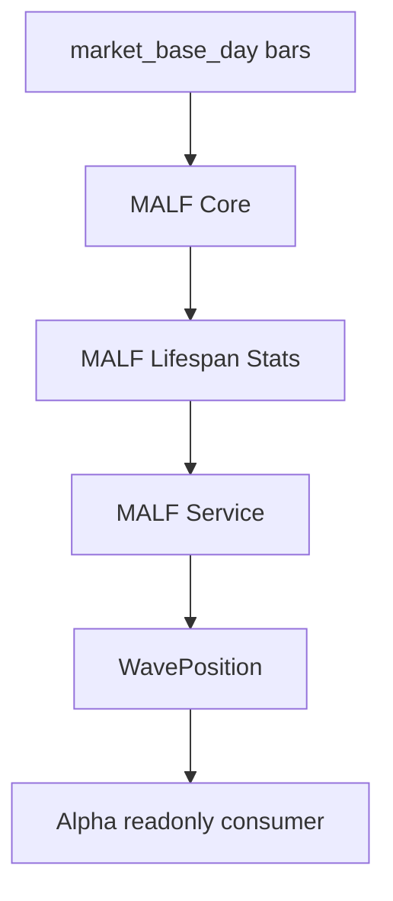
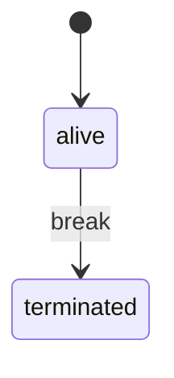
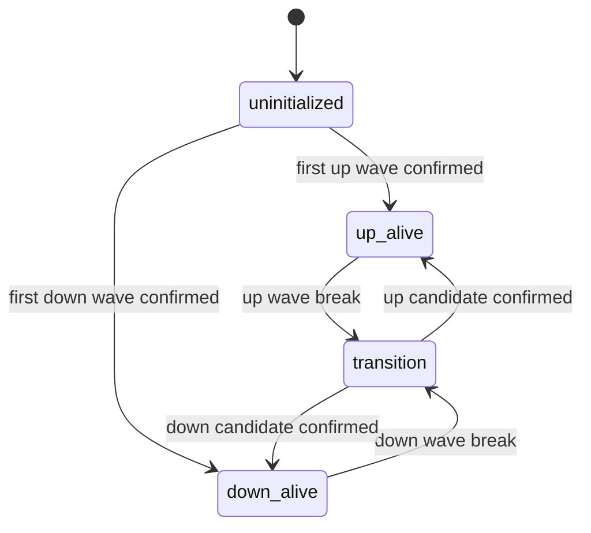

# MALF Authority Design v1

日期：2026-04-30

状态：frozen / day bounded proof 已通过 / v1.3 formal-data bounded closeout 已通过

## 1. 模块定义

MALF 是 Asteria 第一主线模块，负责把 Data Foundation 提供的基础行情事实转化为市场结构事实、波段生命统计位置和下游只读服务接口。

MALF 全称：

```text
Market Lifespan Framework
```

## 2. 权威来源

MALF 当前语义权威为：

```text
H:\Asteria-Validated\MALF_Three_Part_Design_Set_v1_3
H:\Asteria-Validated\MALF_Three_Part_Design_Set_v1_3.zip
```

MALF v1.2 作为历史 closeout 锚点保留：

```text
H:\Asteria-Validated\MALF_Three_Part_Design_Set_v1_2
H:\Asteria-Validated\MALF_Three_Part_Design_Set_v1_2.zip
```

当前 repo 以 `malf-v1-3-formal-rebuild-closeout-20260502-01` 作为已通过的 MALF
day formal-data bounded evidence。该证据已承接 v1.3 新增字段、runner mode 修订和
hard audit 扩展；week/month 证明与 full build 仍需另开卡。

本文件按 `H:\Asteria-Validated\Asteria-docs-code-20260502-104932.zip`
之后的执行结论刷新：Data formal promotion 与 MALF v1.3 formal-data closeout 均已
通过。当前下一步只允许 `MALF v1.4 Core formal rebuild / runtime proof closeout`；不授权
Position bounded proof、Position construction、Signal pinning、下游施工或 full-chain
Pipeline。

| 权威文档 | 本模块承接范围 |
|---|---|
| `MALF_00_Three_Documents_Bridge_v1_3.md` | Core、Lifespan、Service 的关系；v1.3 不改变当前 gate |
| `MALF_01_Core_Definitions_Theorems_v1_3.md` | pivot、structure primitive、wave、current effective guard、break、transition boundary、candidate、new wave |
| `MALF_02_Lifespan_Stats_Definitions_Theorems_v1_3.md` | new-count、no-new-span、rank、life-state、position quadrant、birth descriptors |
| `MALF_03_System_Service_Interface_v1_3.md` | WavePosition、transition trace、birth descriptors 与 Alpha-facing readonly interface |
| `MALF_04_Core_Chart_View_v1_3.md` | Core 图表辅助理解 |
| `MALF_05_Lifespan_Chart_View_v1_3.md` | Lifespan 图表辅助理解 |
| `MALF_06_Service_Chart_View_v1_3.md` | Service 图表辅助理解 |
| `MALF_07_Definition_Theorem_Review_and_Implementation_Delta_v1_3.md` | v1.3 定义/定理评审结论与实现差异 |

## 3. 模块只回答什么

| 问题 | MALF 是否回答 |
|---|---:|
| 当前结构 wave 是什么 | 是 |
| wave 是否 alive 或 terminated | 是 |
| 系统是否处于 transition | 是 |
| 波段推进次数与停滞跨度 | 是 |
| 当前 lifespan 位置和象限 | 是 |
| Alpha 能否稳定只读消费结构位置 | 是 |

## 4. 模块不回答什么

| 禁止输出 | 归属模块 |
|---|---|
| 买入、卖出、看多、看空 | Alpha / Signal |
| 仓位大小、入场计划、退出计划 | Position |
| 组合资金与容量裁决 | Portfolio Plan |
| 订单与成交 | Trade |
| 全链路读出与运行摘要 | System Readout |

## 5. 输入

MALF 第一施工对象只读取 day 级别基础行情：

```text
H:\Asteria-data\market_base_day.duckdb
```

Data Foundation 仍是地基服务，不属于策略主线模块。

## 6. 输出

MALF 按 timeframe 拆为三库：

| 层 | day DB | 职责 |
|---|---|---|
| Core | `malf_core_day.duckdb` | 结构事实 |
| Lifespan | `malf_lifespan_day.duckdb` | 统计位置 |
| Service | `malf_service_day.duckdb` | WavePosition 服务接口 |

正式路径：

```text
H:\Asteria-data\malf_core_day.duckdb
H:\Asteria-data\malf_lifespan_day.duckdb
H:\Asteria-data\malf_service_day.duckdb
```

## 7. 状态与数据流



`wave_core_state` 与 `system_state` 是两个状态空间，不得合并。

Wave 状态机：



System 状态读出：



## 8. 核心表族

| DB | 表族 |
|---|---|
| `malf_core_day` | `malf_pivot_ledger`, `malf_structure_ledger`, `malf_wave_ledger`, `malf_break_ledger`, `malf_transition_ledger`, `malf_candidate_ledger`, `malf_core_run`, `malf_schema_version` |
| `malf_lifespan_day` | `malf_lifespan_snapshot`, `malf_lifespan_profile`, `malf_sample_version`, `malf_rule_version`, `malf_lifespan_run` |
| `malf_service_day` | `malf_wave_position`, `malf_wave_position_latest`, `malf_service_run`, `malf_interface_audit` |

## 9. 上下游边界

上游：

```text
Data Foundation -> market_base_day
```

下游：

```text
Alpha -> readonly WavePosition
```

Alpha、Signal、Position、Portfolio Plan、Trade、System Readout 均不得写回 MALF。

## 10. 上线门禁

MALF day 首轮放行必须满足：

| 门禁 | 要求 |
|---|---|
| Design | 三份 MALF 终稿已映射到 Asteria 文档 |
| Schema | day 三库表族、自然键、版本字段冻结 |
| Runner | bounded proof / segmented / full / resume 语义冻结 |
| Audit | Core、Lifespan、Service 硬审计冻结 |
| Evidence | 构建证据落入 `H:\Asteria-report` 或 `H:\Asteria-Validated` |

当前 `malf-day-bounded-proof-20260428-01` 与
`malf-v1-3-formal-rebuild-closeout-20260502-01` 均已形成 `passed` 结论。
该结论只覆盖 day bounded proof 与 v1.3 formal-data WavePosition closeout；
week/month、full build 和下游施工仍需后续卡。

## 11. v1.3 当前承接裁决

MALF v1.3 的定义与定理评审结论为：定义清晰、定理自洽。当前 day formal-data
closeout 已承接以下内容：

| 项 | 已承接要求 |
|---|---|
| Core | 显式追踪 `current_effective_HL` / `current_effective_LH` 与 broken guard |
| Core | 记录 `transition_boundary_high` / `transition_boundary_low` |
| Core | 区分 candidate guard 与 progress confirmation，不使用 `candidate confirmed` 混词 |
| Lifespan | 增加 `birth_type`、`candidate_wait_span`、`candidate_replacement_count`、`confirmation_distance_abs`、`confirmation_distance_pct` |
| Service | 发布 transition boundary、active candidate guard、confirmation pivot、new wave id 等追溯字段 |
| Runner | build runner 不得以 `audit-only` 写业务表；`segmented` 必须有 segmented scope |
| Audit | 新增 v1.3 hard audit 与回归测试 |
