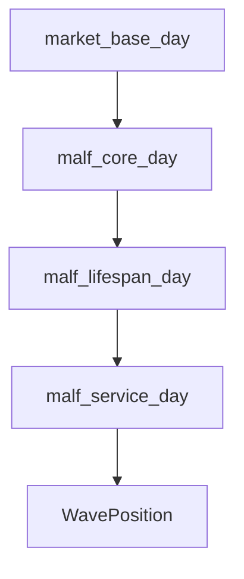
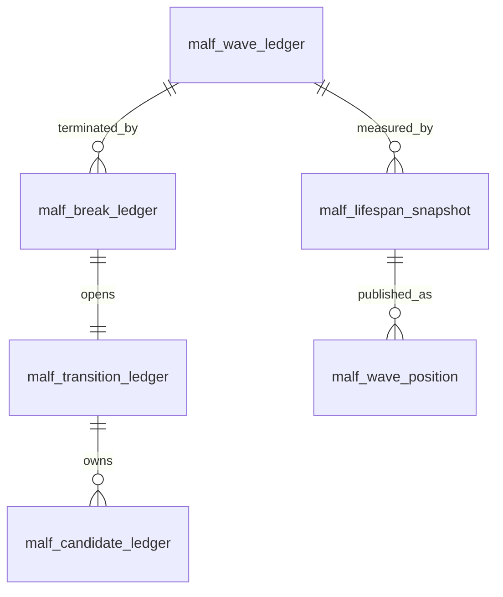

# MALF Database Schema Spec v1

日期：2026-04-27

状态：frozen

## 1. 规格范围

第一阶段只冻结 day 级别三库：

```text
H:\Asteria-data\malf_core_day.duckdb
H:\Asteria-data\malf_lifespan_day.duckdb
H:\Asteria-data\malf_service_day.duckdb
```

week / month 在 day gate 通过后复用同一规格。

## 2. 三库关系



## 3. Core DB

| 表 | 自然键 | 说明 |
|---|---|---|
| `malf_core_run` | `run_id` | Core 构建审计 |
| `malf_schema_version` | `schema_version` | schema 版本 |
| `malf_pivot_ledger` | `symbol + timeframe + pivot_dt + pivot_type + pivot_seq_in_bar + core_rule_version` | pivot 事实 |
| `malf_structure_ledger` | `pivot_id + structure_context + reference_pivot_id + core_rule_version` | 结构原语 |
| `malf_wave_ledger` | `symbol + timeframe + wave_seq + core_rule_version` | wave 账本 |
| `malf_break_ledger` | `wave_id + break_dt + guard_pivot_id + core_rule_version` | break 账本 |
| `malf_transition_ledger` | `old_wave_id + break_id + core_rule_version` | transition 账本 |
| `malf_candidate_ledger` | `transition_id + candidate_guard_pivot_id + candidate_direction + core_rule_version` | candidate 账本 |

Core 表必须带：

```text
run_id
schema_version
core_rule_version
created_at
```

## 4. Lifespan DB

| 表 | 自然键 | 说明 |
|---|---|---|
| `malf_lifespan_run` | `run_id` | Lifespan 构建审计 |
| `malf_lifespan_snapshot` | `wave_id + bar_dt + lifespan_rule_version` | 每 bar lifespan 状态 |
| `malf_lifespan_profile` | `timeframe + direction + sample_version + metric_name + sample_cutoff` | rank 样本分布 |
| `malf_sample_version` | `sample_version` | 样本范围版本 |
| `malf_rule_version` | `lifespan_rule_version` | lifespan 规则版本 |

Lifespan 表必须带：

```text
run_id
schema_version
lifespan_rule_version
sample_version
created_at
```

## 5. Service DB

| 表 | 自然键 | 说明 |
|---|---|---|
| `malf_service_run` | `run_id` | Service 构建审计 |
| `malf_wave_position` | `symbol + timeframe + bar_dt + service_version` | Alpha-facing WavePosition |
| `malf_wave_position_latest` | `symbol + timeframe + service_version` | 最新 WavePosition |
| `malf_interface_audit` | `audit_id` | 接口完整性审计 |

Service 表必须带：

```text
run_id
schema_version
service_version
source_core_run_id
source_lifespan_run_id
created_at
```

## 6. WavePosition 最小字段

| 字段 | 要求 |
|---|---|
| `symbol` | 必填 |
| `timeframe` | 必填，第一阶段为 `day` |
| `bar_dt` | 必填 |
| `system_state` | `up_alive / down_alive / transition` |
| `wave_id` | alive 状态必填，transition 中为空 |
| `old_wave_id` | transition 中必填 |
| `wave_core_state` | `alive / terminated` |
| `direction` | 必填，transition 中为 old_direction |
| `new_count` | 必填 |
| `no_new_span` | 必填 |
| `transition_span` | 必填 |
| `update_rank` | 可空但字段必有 |
| `stagnation_rank` | 可空但字段必有 |
| `life_state` | 必填 |
| `position_quadrant` | 必填 |
| `guard_boundary_price` | 可空 |
| `sample_scope` | 必填 |
| `sample_version` | 必填 |
| `lifespan_rule_version` | 必填 |
| `service_version` | 必填 |

## 7. ER 图



## 8. 写入裁决

| 规则 | 裁决 |
|---|---|
| 正式 DB 路径 | `H:\Asteria-data` |
| working DB 路径 | `H:\Asteria-temp\malf\<run_id>\` |
| 写入方式 | 批量写入 |
| 同库多写 | 禁止 |
| 旧数据替换 | staging 审计通过后 promote |
| `run_id` | 审计字段，不作为业务自然键 |
