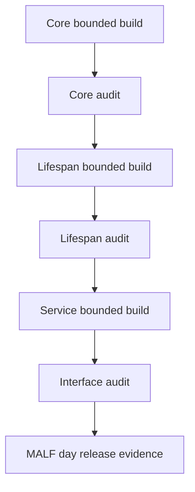

# MALF Runner Contract v1

日期：2026-04-30

状态：frozen / v1.4 day runtime sync passed / week bounded proof passed / v1.4 authority sync passed

## 1. Runner 目标

MALF runner 必须支持 bounded proof 先行，再进入 segmented / full / resume。当前已执行 day 与 week
bounded proof；month 仍需独立执行卡。
`audit-only` 仅用于 audit runner，不用于 Core / Lifespan / Service build runner。

当前待修 gap：build path 必须显式拒绝 `audit-only` 写业务表；`segmented` 必须校验
symbol range、batch id 或等价 segmented scope。该修订纳入
`malf-v1-3-authority-sync-code-revision-20260501-01`，不改变当前 closeout 结论。

## 2. Runner 列表

| Runner | 职责 |
|---|---|
| `scripts/malf/run_malf_day_core_build.py` | 构建 Core 三类结构事实 |
| `scripts/malf/run_malf_day_lifespan_build.py` | 基于 Core 构建 lifespan 统计 |
| `scripts/malf/run_malf_day_service_build.py` | 基于 Lifespan 发布 WavePosition |
| `scripts/malf/run_malf_day_audit.py` | 执行 Core / Lifespan / Service 审计 |
| `scripts/malf/run_malf_day_supplemental_build.py` | MALF day 分批补数、断点续跑、staging audit promote 样板 |

这些 runner 已用于 `malf-v1-4-core-runtime-sync-implementation-20260505-01` 与
`malf-week-bounded-proof-build-20260506-01` 执行闭环并形成当前 `passed` 结论。
后续扩大到 month、segmented / full / resume 仍需单独门禁。
`run_malf_day_supplemental_build.py` 是项目级数据库分批补数准则的第一套 MALF day
样板实现，只覆盖 day，不打开 week/month 或 Pipeline runtime。

## 3. 构建顺序



## 4. 运行模式

| 模式 | 要求 |
|---|---|
| `bounded` | 必须传 `start_dt / end_dt` 或 `symbol_limit` |
| `segmented` | 必须传 symbol range 或 batch id |
| `full` | 只能在 bounded proof 通过后开启 |
| `resume` | 必须读取 checkpoint |
| `audit-only` | 仅 audit runner 使用；不写业务表，只写 audit 或报告 |

build runner 模式裁决：

```text
Core / Lifespan / Service build runner accepted modes:
    bounded
    segmented
    full
    resume

Audit runner accepted modes:
    bounded
    segmented
    full
    resume
    audit-only
```

任何 build runner 若收到 `audit-only`，必须 fail fast。任何 `segmented` run 若缺少
segmented scope，也必须 fail fast。

## 5. 公共参数

| 参数 | 要求 |
|---|---|
| `--timeframe` | bounded proof 已放行 `day / week`；`month` 仍需独立卡执行 |
| `--mode` | build runner: `bounded / segmented / full / resume`; audit runner: `bounded / segmented / full / resume / audit-only` |
| `--run-id` | 可传入；未传入时由 runner 生成 |
| `--source-db` | 输入 DB 路径 |
| `--target-db` | 当前层目标 DB 路径 |
| `--start-dt` | bounded 可选条件 |
| `--end-dt` | bounded 可选条件 |
| `--symbol-limit` | bounded 可选条件 |
| `--symbols-file` / `--symbol-start` / `--symbol-end` / `--batch-size` | supplemental builder 的分批补数范围 |
| `--schema-version` | 必填 |
| `--rule-version` | Core 或 Lifespan 必填 |
| `--service-version` | Service 必填 |

当前 day/week Core 正式读取面固定为：

```text
market_base_<timeframe>.market_base_bar
timeframe = day 或 week
price_line = analysis_price_line
adj_mode = backward
```

Supplemental builder 中，用户指定的 year/month/day/date range 是 `target_scope`；
MALF Core 实际计算默认从该 symbol 可用最早 day bar 开始到 `target_scope.end_dt`，
再只 promote 目标范围内的发布结果。没有已审计 `malf_core_state_checkpoint` 前，不得
从中途日期硬切计算 Core 状态。

## 6. 幂等与断点

| 规则 | 裁决 |
|---|---|
| 同一 run 重跑 | 必须可识别并拒绝重复 promote |
| bounded 重算 | 允许覆盖同 scope staging |
| promote | 只能在审计通过后执行 |
| checkpoint | 存放在 `H:\Asteria-temp\malf\<run_id>\` |
| 失败恢复 | resume 必须从 checkpoint 或 staging 状态恢复 |

## 7. 输出证据

每个 runner 必须产生：

| 证据 | 位置 |
|---|---|
| run ledger | 对应模块 DB |
| audit report | `H:\Asteria-report\malf\<date>\` |
| release evidence | `H:\Asteria-Validated\` |

正式证据不得写入 repo 根目录。
