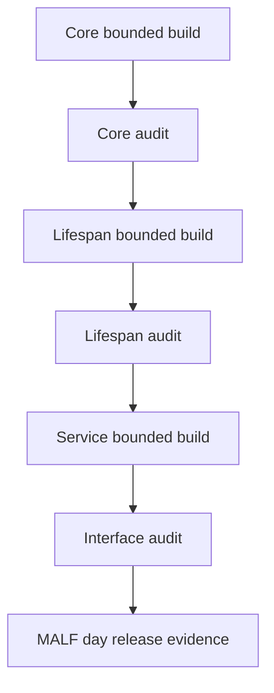

# MALF Runner Contract v1

日期：2026-04-27

状态：frozen

## 1. Runner 目标

MALF runner 必须支持 bounded proof 先行，再进入 segmented / full / resume。第一阶段只执行 day。

## 2. Runner 列表

| Runner | 职责 |
|---|---|
| `scripts/malf/run_malf_day_core_build.py` | 构建 Core 三类结构事实 |
| `scripts/malf/run_malf_day_lifespan_build.py` | 基于 Core 构建 lifespan 统计 |
| `scripts/malf/run_malf_day_service_build.py` | 基于 Lifespan 发布 WavePosition |
| `scripts/malf/run_malf_day_audit.py` | 执行 Core / Lifespan / Service 审计 |

这些 runner 在本轮文档交付中只冻结契约，不要求创建代码文件。

## 3. 构建顺序

## 4. 运行模式

| 模式 | 要求 |
|---|---|
| `bounded` | 必须传 `start_dt / end_dt` 或 `symbol_limit` |
| `segmented` | 必须传 symbol range 或 batch id |
| `full` | 只能在 bounded proof 通过后开启 |
| `resume` | 必须读取 checkpoint |
| `audit-only` | 不写业务表，只写 audit 或报告 |

## 5. 公共参数

| 参数 | 要求 |
|---|---|
| `--timeframe` | 第一阶段固定为 `day` |
| `--mode` | `bounded / segmented / full / resume / audit-only` |
| `--run-id` | 可传入；未传入时由 runner 生成 |
| `--source-db` | 输入 DB 路径 |
| `--target-db` | 当前层目标 DB 路径 |
| `--start-dt` | bounded 可选条件 |
| `--end-dt` | bounded 可选条件 |
| `--symbol-limit` | bounded 可选条件 |
| `--schema-version` | 必填 |
| `--rule-version` | Core 或 Lifespan 必填 |
| `--service-version` | Service 必填 |

## 6. 幂等与断点

| 规则 | 裁决 |
|---|---|
| 同一 run 重跑 | 必须可识别并拒绝重复 promote |
| bounded 重算 | 允许覆盖同 scope staging |
| promote | 只能在审计通过后执行 |
| checkpoint | 存放在 `H:\Asteria-temp\malf\<run_id>\` |
| 失败恢复 | resume 必须从 checkpoint 或 staging 状态恢复 |

## 7. 输出证据

每个 runner 必须产生：

| 证据 | 位置 |
|---|---|
| run ledger | 对应模块 DB |
| audit report | `H:\Asteria-report\malf\<date>\` |
| release evidence | `H:\Asteria-Validated\` |

正式证据不得写入 repo 根目录。
