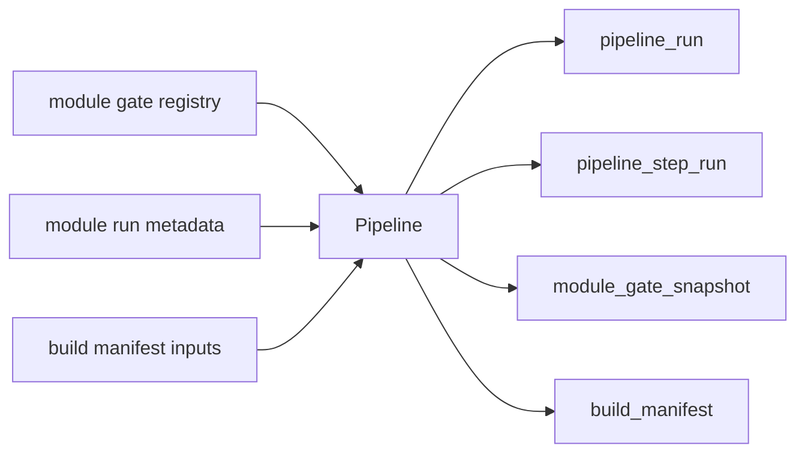

# Pipeline Authority Design v1

日期：2026-04-27

状态：draft / pre-gate / not frozen

## 1. 模块定义

Pipeline 是 Asteria 的编排层与治理记录层，不是业务语义模块，也不属于策略主线。

Pipeline 只负责记录模块运行顺序、步骤状态、门禁快照和构建 manifest。Pipeline 不定义 MALF、Alpha、Signal、Position、Portfolio Plan、Trade 或 System Readout 的业务含义，不回写业务真值，不以自身状态代替模块 release 状态。

## 2. 前置门槛

Pipeline 设计冻结和施工必须等待：

```text
MALF bounded proof gate
```

该门槛至少要求：

| 项 | 要求 |
|---|---|
| MALF bounded proof | 已存在最小单模块运行证据 |
| Module gate registry | 门禁状态可被记录 |
| Build manifest convention | run / step / gate / manifest 字段口径已明确 |
| Governance rule | 仍坚持单模块施工门禁 |

在上述条件满足前，本文件只作为 pre-gate draft，不允许施工。

## 3. 权威来源

Pipeline 的输入只来自模块运行元数据、门禁账本和构建 manifest 约定：

```text
module gate status
module run metadata
build manifest inputs
```

Pipeline 不得定义任何业务字段，不得通过编排层改写业务模块 contract。

## 4. 模块只回答什么

| 问题 | Pipeline 是否回答 |
|---|---:|
| 某次构建运行了哪些模块步骤 | 是 |
| 每个步骤的状态、起止时间、输入输出是什么 | 是 |
| 当前门禁快照是什么 | 是 |
| 本轮 build manifest 记录了哪些 source / target | 是 |
| MALF / Alpha / Signal 等业务字段代表什么 | 否 |
| 是否该买卖、是否该持仓 | 否 |
| 是否覆盖上游历史事实 | 否 |

## 5. 模块不回答什么

| 禁止输出 | 归属模块 |
|---|---|
| WavePosition 结构事实 | MALF |
| Alpha opportunity event / score | Alpha |
| formal signal 聚合 | Signal |
| position candidate / entry / exit plan | Position |
| portfolio constraints / target exposure | Portfolio Plan |
| order intent / fill | Trade |
| 全链路业务读出 | System Readout |

## 6. 输入

Pipeline 第一阶段只读消费治理和运行元数据：

```text
docs/03-refactor/00-module-gate-ledger-v1.md
module run metadata
build manifest inputs
```

若后续落地正式 DB，Pipeline 也只读取模块 run ledger 和门禁状态，不读取业务表来定义业务语义。

## 7. 输出

Pipeline 目标 DB：

```text
H:\Asteria-data\pipeline.duckdb
```

输出表族：

| 表 | 职责 |
|---|---|
| `pipeline_run` | Pipeline 级运行审计 |
| `pipeline_step_run` | 单步运行记录 |
| `module_gate_snapshot` | 门禁快照 |
| `build_manifest` | source / target / artifact manifest |
| `pipeline_audit` | Pipeline 审计 |

该 DB 只能在 Pipeline 设计冻结且 MALF bounded proof gate 之后创建。

## 8. 数据流



## 9. 状态边界

Pipeline 的状态只描述编排状态，不描述业务状态。

| 状态域 | 允许值示例 | 含义 |
|---|---|---|
| `pipeline_step_status` | `planned / running / passed / failed / skipped` | 编排步骤状态 |
| `module_gate_status` | `draft / frozen / building / verifying / released / integrated / blocked` | 模块门禁状态 |
| 业务状态 | 禁止复用 | 归属各业务模块 |

## 10. 自然键

| 表 | 自然键 |
|---|---|
| `pipeline_run` | `pipeline_run_id` |
| `pipeline_step_run` | `pipeline_run_id + step_seq` |
| `module_gate_snapshot` | `pipeline_run_id + module_name + gate_name` |
| `build_manifest` | `pipeline_run_id + artifact_name + artifact_role` |
| `pipeline_audit` | `audit_id` |

## 11. 版本字段

正式 Pipeline 表默认包含：

```text
run_id
schema_version
pipeline_version
created_at
```

如需追溯配置，还必须记录：

```text
gate_registry_version
manifest_version
```

## 12. 上下游边界

上游：

```text
module gate registry / module run metadata / build manifest inputs
```

下游：

```text
operator review / release review / audit review
```

Pipeline 是编排层末端记录，不得写回任何业务模块。

## 13. 上线门禁

Pipeline 未来冻结必须满足：

| 门禁 | 要求 |
|---|---|
| MALF Gate | MALF bounded proof gate 已通过并可记录 |
| Design | Pipeline 六件套从 pre-gate draft 升级并审阅 |
| Schema | `pipeline.duckdb` 表族、自然键、版本字段冻结 |
| Runner | bounded / segmented / resume / audit-only 语义冻结 |
| Audit | 不定义业务语义、不回写业务模块、单模块施工纪律可验证 |
| Evidence | Pipeline bounded proof 证据落入 `H:\Asteria-report` 或 `H:\Asteria-Validated` |
