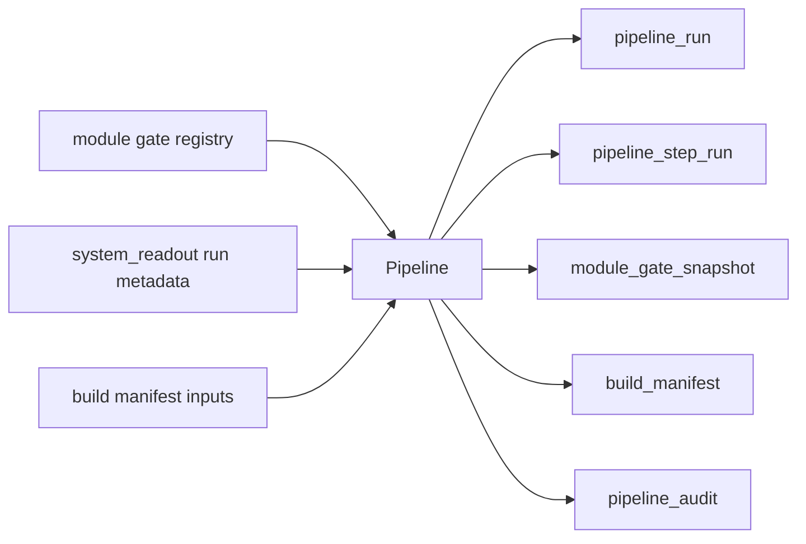

# Pipeline Authority Design v1

日期：2026-04-29

状态：frozen / freeze review passed / single-module orchestration build passed / full-chain dry-run passed / full-chain day bounded proof passed / one-year strategy behavior replay blocked / coverage gap diagnosis executed / MALF natural-year coverage repair passed / year replay rerun blocked / alpha-signal coverage repair passed / downstream coverage gap evidence closeout passed / position 2024 coverage repair passed / portfolio plan 2024 coverage repair passed / trade 2024 coverage repair passed / system_readout 2024 coverage repair prepared

## 1. 模块定义

Pipeline 是 Asteria 的编排层与治理记录层，不是业务语义模块，也不属于策略主线。

Pipeline 当前已释放三层运行事实：`system_readout` 单模块 orchestration、`full_chain_day` dry-run、以及 `full_chain_day` bounded proof。此后有两次 year replay 类执行：第一次 `year_replay` 因完整自然年不足而 blocked；第二次 `year_replay_rerun` 也已真实执行；随后 `alpha-signal-2024-coverage-repair-card-20260509-01` 已通过，把 released Alpha / Signal day surface 前移到 `2024-01-02`；再随后 `coverage-gap-evidence-incomplete-closeout-card-20260509-01` 已通过，把当时下一步收口到 Position 2024 released day surface repair；随后 `position-2024-coverage-repair-card-20260509-01` 已通过，把 live next card 下移到 Portfolio Plan；再随后 `portfolio-plan-2024-coverage-repair-card-20260509-01` 与 `trade-2024-coverage-repair-card-20260509-01` 也都已通过，把 live next card 继续下移到 System Readout 2024 released day surface repair。它只记录运行、步骤、门禁快照、构建清单和审计结果；不定义 MALF、Alpha、Signal、Position、Portfolio Plan、Trade 或 System Readout 的业务含义，不回写业务真值，不以自身状态代替模块 release 状态。

## 2. 当前放行事实

```text
pipeline-freeze-review-20260508-01 passed
pipeline-build-runtime-authorization-scope-freeze-20260508-01 passed
pipeline-single-module-orchestration-build-card-20260508-01 passed
pipeline-full-chain-dry-run-authorization-scope-freeze-20260508-01 passed
pipeline-full-chain-dry-run-card-20260508-01 passed
pipeline-full-chain-bounded-proof-build-card-20260508-01 passed
pipeline-full-chain-bounded-proof-closeout-20260508-01 passed
pipeline-one-year-strategy-behavior-replay-authorization-scope-freeze-20260508-01 passed
pipeline-one-year-strategy-behavior-replay-build-card-20260508-01 blocked
pipeline-year-replay-coverage-gap-diagnosis-and-repair-scope-freeze-20260509-01 passed
malf-2024-natural-year-coverage-repair-card-20260509-01 passed
pipeline-one-year-strategy-behavior-replay-rerun-build-card-20260509-01 blocked
alpha-signal-2024-coverage-repair-card-20260509-01 passed
```

当前 Pipeline 已证明：

| 项 | 当前状态 |
|---|---|
| formal DB | `H:\Asteria-data\pipeline.duckdb` 已创建 |
| released module scope | `system_readout` single-module orchestration + `full_chain_day` dry-run + `full_chain_day` bounded proof |
| released run modes | `bounded / dry-run / resume / audit-only` |
| current next card | `system_readout_2024_coverage_repair_card` |
| full-chain dry-run | 已执行 / 已通过 |
| full-chain bounded proof | 已执行 / 已通过 |
| one-year strategy behavior replay | 已执行 / `blocked`（完整自然年覆盖不足） |
| one-year strategy behavior replay rerun | 已执行 / `blocked`（历史 released system 仍停在旧观察链） |

## 3. 权威来源

Pipeline 输入只来自编排元数据：

```text
module gate registry
module run metadata
build manifest inputs
```

它不读取业务表来重新解释业务语义。

## 4. 只回答什么

| 问题 | Pipeline 是否回答 |
|---|---:|
| 某次编排运行了哪些步骤 | 是 |
| 当前门禁快照是什么 | 是 |
| source / target / artifact 清单是什么 | 是 |
| 审计是否通过 | 是 |
| 业务模块字段代表什么 | 否 |
| 是否买卖、是否持仓、是否分配资金 | 否 |

## 5. 当前输出

目标 DB：

```text
H:\Asteria-data\pipeline.duckdb
```

当前正式表族：

| 表 | 职责 |
|---|---|
| `pipeline_run` | 编排运行记录 |
| `pipeline_step_run` | 单步运行记录 |
| `module_gate_snapshot` | 门禁快照 |
| `build_manifest` | artifact 清单 |
| `pipeline_audit` | Pipeline 审计 |

## 6. 数据流



## 7. 边界

| 边界 | 裁决 |
|---|---|
| released module scope | `system_readout` single-module orchestration + `full_chain_day` dry-run + `full_chain_day` bounded proof |
| business mutation | 禁止 |
| downstream writeback | 禁止 |
| year replay release truth | 完整自然年不足时不得 passed |

## 8. 下一步

当前 live `current_allowed_next_card` 是 `system_readout_2024_coverage_repair_card`。
`coverage-gap-evidence-incomplete-closeout-card-20260509-01` 已证明：released Alpha / Signal day
surface 已前移到 `2024-01-02`，而 released Position / Portfolio Plan / Trade day surface 的最早日期
都仍是 `2024-01-09`。随后 `position-2024-coverage-repair-card-20260509-01` 已真实执行并完成，证明 Position
语义断点已下移到 Portfolio Plan；`portfolio-plan-2024-coverage-repair-card-20260509-01` 随后也已真实执行并完成，
证明 Portfolio Plan admission surface 已覆盖 `2024-01-02..2024-01-05`，且 exposure 只在真实 admitted day
存在；`trade-2024-coverage-repair-card-20260509-01` 再随后也已真实执行并完成，证明 Trade rejection surface
已前移到 `2024-01-02`，而 `order_intent` / `execution_plan` 已在真实 admitted day `2024-01-05` materialize，
因此当前唯一 live repair 施工位已经收口到 System Readout，不允许直接跳去 Pipeline source-selection repair、
full rebuild、daily incremental 或 `v1 complete`。
