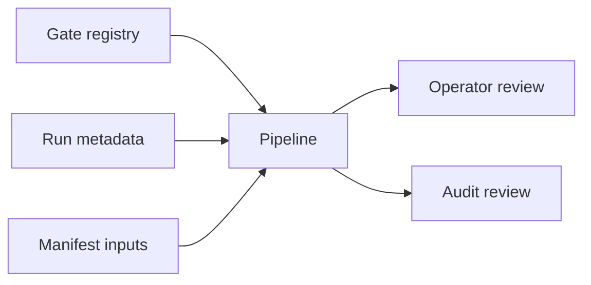

# Pipeline Semantic Contract v1

日期：2026-04-29

状态：draft / pre-gate / not frozen

## 1. 合同目的

本合同定义 Pipeline 在 Asteria 中的语义边界。Pipeline 只能记录编排状态和门禁状态，不得定义业务语义，不得把 gate 状态当作策略状态，不得写回任何业务模块。

## 2. 前置门槛

本合同在以下条件满足前不得冻结：

```text
MALF bounded proof gate passed
active card explicitly authorizes Pipeline freeze review
```

Pipeline 的正式输入字段必须来自模块运行元数据、门禁账本或 manifest 约定，而不是业务表语义。

当前唯一业务下一步是 `Alpha freeze review`。Pipeline 不得因 MALF gate passed
自行进入冻结、建库或全链路编排。

## 3. 输入语义

Pipeline 只读消费以下元数据：

| 输入 | 语义来源 |
|---|---|
| `module_name` | gate registry / run metadata |
| `gate_name` | gate registry |
| `gate_status` | gate registry |
| `step_name` | pipeline step metadata |
| `step_status` | pipeline step metadata |
| `artifact_name` | build manifest |
| `artifact_role` | build manifest |
| `source_ref` | build manifest |
| `target_ref` | build manifest |

Pipeline 不得把这些字段解释成买卖、持仓、目标暴露、订单或成交事实。

## 4. Pipeline 语义

| 对象 | 语义 |
|---|---|
| `pipeline_run` | 一次编排运行 |
| `pipeline_step_run` | 一次编排运行中的单步记录 |
| `module_gate_snapshot` | 某时刻的门禁快照 |
| `build_manifest` | 本次构建的 source / target / artifact 记录 |
| `pipeline_status` | 编排状态 |

Pipeline status 只表示 orchestration health，不表示业务结论。

## 5. 输出语义

Pipeline 正式输出分四层：

| 输出 | 语义 |
|---|---|
| `pipeline_run` | 编排运行记录 |
| `pipeline_step_run` | 步骤运行记录 |
| `module_gate_snapshot` | 门禁快照 |
| `build_manifest` | 构建清单 |

这些输出只能给 operator / audit review 使用，不能覆盖业务模块事实。

## 6. Pipeline Run 最小字段

| 字段 | 要求 |
|---|---|
| `pipeline_run_id` | 必填 |
| `pipeline_version` | 必填 |
| `run_scope` | 必填 |
| `run_mode` | `bounded / segmented / full / resume / audit-only` |
| `run_status` | `planned / running / passed / failed / skipped` |
| `started_at` | 必填 |
| `ended_at` | 可空但字段必有 |
| `manifest_version` | 必填 |

## 7. Pipeline Step 最小字段

| 字段 | 要求 |
|---|---|
| `pipeline_step_id` | 必填 |
| `pipeline_run_id` | 必填 |
| `step_seq` | 必填 |
| `step_name` | 必填 |
| `module_name` | 必填 |
| `step_status` | `planned / running / passed / failed / skipped` |
| `source_ref` | 可空但字段必有 |
| `target_ref` | 可空但字段必有 |
| `started_at` | 可空但字段必有 |
| `ended_at` | 可空但字段必有 |

## 8. 不允许表达

| 表达 | 裁决 |
|---|---|
| Pipeline 定义 MALF / Alpha / Signal 等业务字段 | 禁止 |
| Pipeline 修改业务模块输出 | 禁止 |
| Pipeline 把 gate 状态当作策略信号 | 禁止 |
| Pipeline 合并模块 DB | 禁止 |
| Pipeline 绕过冻结直接运行全链路 | 禁止 |
| Pipeline 覆盖模块 release 结论 | 禁止 |

## 9. 消费原则



Pipeline 是编排与记录层，不向业务模块反馈新的业务含义。
