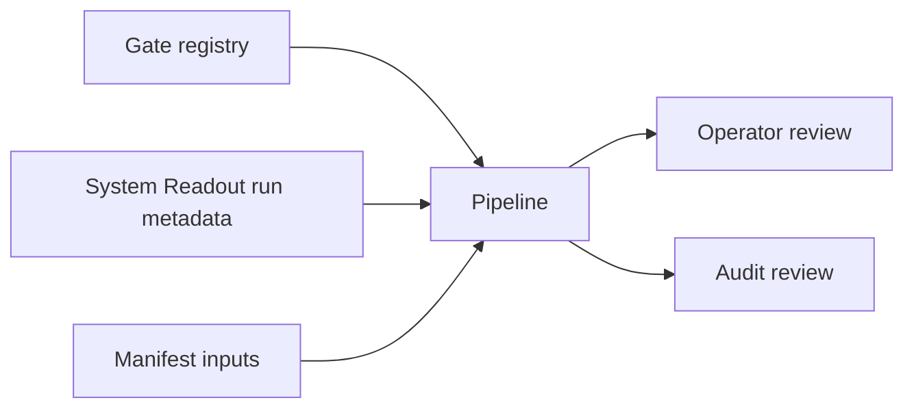

# Pipeline Semantic Contract v1

日期：2026-04-29

状态：frozen / freeze review passed / single-module orchestration build passed / full-chain dry-run passed / full-chain day bounded proof passed / one-year strategy behavior replay blocked / year replay rerun blocked / alpha-signal repair prepared

## 1. 合同目的

本合同定义 Pipeline 在 Asteria 中的语义边界。Pipeline 只能记录编排状态和门禁状态，不得定义业务语义，不得把 gate 状态当作策略状态，不得写回任何业务模块。

## 2. 当前释放面

当前正式释放面只覆盖：

```text
module_scope = system_readout with run_mode in {bounded, resume, audit-only}
module_scope = full_chain_day with run_mode in {bounded, dry-run, resume, audit-only}
module_scope = year_replay with run_mode in {bounded, resume, audit-only}
module_scope = year_replay_rerun with run_mode in {bounded, resume, audit-only}
```

full / segmented / daily_incremental 仍未放行；full-chain dry-run 与 full-chain bounded proof 已通过；year replay 与 year replay rerun 都已执行，但当前都保持 blocked。

## 3. 输入语义

Pipeline 只读消费以下元数据：

| 输入 | 语义来源 |
|---|---|
| `active_mainline_module` | gate registry |
| `current_allowed_next_card` | gate registry |
| `module_name` | gate registry / run metadata |
| `gate_name` | gate registry |
| `gate_value` | gate registry |
| `artifact_name` | build manifest |
| `artifact_role` | build manifest |
| `source_ref` | build manifest |
| `source_release_version` | source System Readout run |

Pipeline 不得把这些字段解释成买卖、持仓、组合暴露、订单或成交事实。

## 4. 输出语义

| 对象 | 语义 |
|---|---|
| `pipeline_run` | 一次编排运行 |
| `pipeline_step_run` | 一次编排运行中的单步记录 |
| `module_gate_snapshot` | 某时刻门禁快照 |
| `build_manifest` | source / target / artifact 记录 |
| `pipeline_audit` | 编排层硬审计结果 |

## 5. 最小字段口径

`pipeline_run` 当前至少记录：

```text
pipeline_run_id
module_scope
run_mode
run_status
source_release_version
gate_registry_version
schema_version
pipeline_version
created_at
```

`pipeline_step_run` 当前至少记录：

```text
pipeline_step_run_id
pipeline_run_id
step_seq
module_name
step_name
step_status
source_db
source_run_id
source_release_version
started_at
completed_at
created_at
```

## 6. 不允许表达

| 表达 | 裁决 |
|---|---|
| Pipeline 定义 MALF / Alpha / Signal 等业务字段 | 禁止 |
| Pipeline 修改任何业务模块输出 | 禁止 |
| Pipeline 把 gate 状态当作策略信号 | 禁止 |
| Pipeline 把步骤状态冒充模块 release 结论 | 禁止 |
| Pipeline 在完整自然年不足时把 year replay 说成 passed | 禁止 |

## 7. 消费原则



Pipeline 只向 operator / audit review 暴露编排元数据，不向业务模块反馈新的业务含义。
