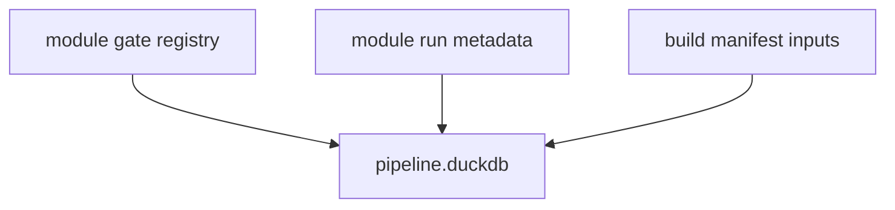
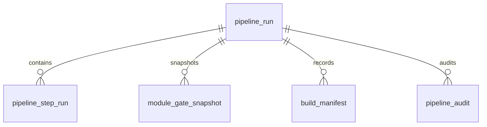

# Pipeline Database Schema Spec v1

日期：2026-04-29

状态：draft / pre-gate / not frozen

## 1. 规格范围

本规格为 Pipeline pre-gate draft。正式 schema 冻结必须等待：

```text
MALF bounded proof gate passed
active card explicitly authorizes Pipeline freeze review
```

目标 Pipeline DB：

```text
H:\Asteria-data\pipeline.duckdb
```

该库在 Pipeline 设计冻结前不得创建。MALF bounded proof gate passed 本身不授权
创建正式 Pipeline DB。

## 2. 上游关系



Pipeline 只记录编排输入，不读业务表来定义业务语义。

## 3. 表族

| 表 | 自然键 | 说明 |
|---|---|---|
| `pipeline_run` | `pipeline_run_id` | 编排运行记录 |
| `pipeline_step_run` | `pipeline_run_id + step_seq` | 单步运行记录 |
| `module_gate_snapshot` | `pipeline_run_id + module_name + gate_name` | 门禁快照 |
| `build_manifest` | `pipeline_run_id + artifact_name + artifact_role` | 构建清单 |
| `pipeline_audit` | `audit_id` | Pipeline 审计 |

## 4. 通用审计字段

Pipeline 正式表必须带：

```text
run_id
schema_version
pipeline_version
created_at
```

如需追溯门禁与 manifest 版本，还必须带：

```text
gate_registry_version
manifest_version
```

## 5. pipeline_run

最小字段：

| 字段 | 要求 |
|---|---|
| `pipeline_run_id` | 主体 id |
| `pipeline_version` | 必填 |
| `run_scope` | 必填 |
| `run_mode` | `bounded / segmented / full / resume / audit-only` |
| `run_status` | `planned / running / passed / failed / skipped` |
| `started_at` | 必填 |
| `ended_at` | 可空但字段必有 |
| `manifest_version` | 必填 |

## 6. pipeline_step_run

最小字段：

| 字段 | 要求 |
|---|---|
| `pipeline_step_id` | 主体 id |
| `pipeline_run_id` | 必填 |
| `step_seq` | 必填 |
| `step_name` | 必填 |
| `module_name` | 必填 |
| `step_status` | `planned / running / passed / failed / skipped` |
| `source_ref` | 可空但字段必有 |
| `target_ref` | 可空但字段必有 |
| `started_at` | 可空但字段必有 |
| `ended_at` | 可空但字段必有 |

## 7. module_gate_snapshot

最小字段：

| 字段 | 要求 |
|---|---|
| `module_gate_snapshot_id` | 主体 id |
| `pipeline_run_id` | 必填 |
| `module_name` | 必填 |
| `gate_name` | 必填 |
| `gate_status` | 必填 |
| `gate_reason` | 可空但字段必有 |
| `gate_registry_version` | 必填 |

## 8. build_manifest

最小字段：

| 字段 | 要求 |
|---|---|
| `build_manifest_id` | 主体 id |
| `pipeline_run_id` | 必填 |
| `artifact_name` | 必填 |
| `artifact_role` | 必填 |
| `source_ref` | 可空但字段必有 |
| `target_ref` | 可空但字段必有 |
| `artifact_status` | `planned / produced / promoted / archived / failed` |
| `manifest_version` | 必填 |

## 9. pipeline_audit

最小字段：

| 字段 | 说明 |
|---|---|
| `audit_id` | 审计 id |
| `run_id` | Pipeline run |
| `check_name` | 检查项 |
| `severity` | `hard / soft` |
| `status` | `pass / fail / observe` |
| `failed_count` | 失败行数 |
| `sample_payload` | 样例 |

## 10. ER 图



## 11. 写入裁决

| 规则 | 裁决 |
|---|---|
| 正式 DB 路径 | `H:\Asteria-data` |
| working DB 路径 | `H:\Asteria-temp\pipeline\<run_id>\` |
| 写入方式 | 批量写入 |
| 同库多写 | 禁止 |
| 旧数据替换 | staging 审计通过后 promote |
| `run_id` | 审计字段，不作为业务自然键 |
| formal DB create | Pipeline design freeze 后才允许 |

## 12. 不允许的 schema

| 字段或表 | 裁决 |
|---|---|
| MALF / Alpha / Signal 等业务字段 | 禁止 |
| 策略信号字段 | 禁止 |
| 业务 mutation table | 禁止 |
| 合并模块 DB 的映射表 | 禁止 |
