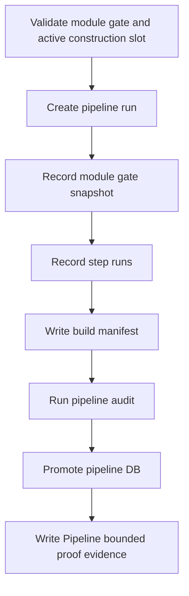

# Pipeline Runner Contract v1

日期：2026-04-27

状态：draft / pre-gate / not frozen

## 1. Runner 目标

Pipeline runner 负责在 MALF bounded proof gate 之后，记录单模块或受限范围内的编排运行、步骤记录、门禁快照和构建 manifest。

在 Pipeline 设计冻结前，本文件只冻结草案方向，不要求创建代码文件。

## 2. 前置门槛

所有 Pipeline runner 必须在运行前验证：

```text
MALF bounded proof gate
```

缺少门禁账本、缺少最小模块运行证据、或当前施工位不允许该模块进入时，runner 必须拒绝推进编排。

## 3. Runner 列表

| Runner | 职责 |
|---|---|
| `scripts/pipeline/run_pipeline_record.py` | 记录 pipeline_run / pipeline_step_run / gate snapshot / manifest |
| `scripts/pipeline/run_pipeline_audit.py` | 执行 Pipeline 只编排、不定义业务语义的审计 |
| `scripts/pipeline/run_pipeline_bounded_proof.py` | 编排受限范围的 Pipeline bounded proof |

这些 runner 在 pre-gate draft 阶段不创建代码文件。

## 4. 构建顺序



## 5. 运行模式

| 模式 | 要求 |
|---|---|
| `bounded` | 必须限制在单模块或单批次范围 |
| `segmented` | 必须传 step range、batch id 或 module scope |
| `full` | 只能在治理明确允许时开启 |
| `resume` | 必须读取 checkpoint |
| `audit-only` | 不写业务表，只写 audit 或报告 |

## 6. 公共参数

| 参数 | 要求 |
|---|---|
| `--module-scope` | 必填，例如 `malf` |
| `--mode` | `bounded / segmented / full / resume / audit-only` |
| `--run-id` | 可传入；未传入时由 runner 生成 |
| `--gate-ledger` | 门禁账本路径 |
| `--target-pipeline-db` | Pipeline 目标 DB 路径 |
| `--step-limit` | bounded / segmented 可选条件 |
| `--schema-version` | 必填 |
| `--pipeline-version` | 必填 |
| `--gate-registry-version` | 必填 |
| `--manifest-version` | 必填 |

## 7. 幂等与断点

| 规则 | 裁决 |
|---|---|
| 同一 run 重跑 | 必须可识别并拒绝重复 promote |
| bounded 重算 | 允许覆盖同 scope staging |
| promote | 只能在审计通过后执行 |
| checkpoint | 存放在 `H:\Asteria-temp\pipeline\<run_id>\` |
| 失败恢复 | resume 必须从 checkpoint 或 staging 状态恢复 |
| active module lock | 必须验证当前施工位只允许一个主线模块 |

## 8. 输出证据

每个 runner 必须产生：

| 证据 | 位置 |
|---|---|
| run ledger | `pipeline.duckdb` |
| gate snapshot | `pipeline.duckdb` |
| audit report | `H:\Asteria-report\pipeline\<date>\` |
| release evidence | `H:\Asteria-Validated\` |

正式证据不得写入 repo 根目录。

## 9. 禁止行为

| 行为 | 裁决 |
|---|---|
| 绕过模块冻结直接推进下游模块 | 禁止 |
| 修改任何业务模块输出 | 禁止 |
| 在 Pipeline 中定义业务字段 | 禁止 |
| 合并模块 DB | 禁止 |
| 让一个 run 同时施工多个主线模块 | 禁止 |
