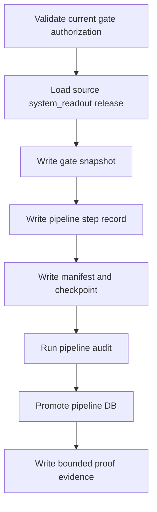

# Pipeline Runner Contract v1

日期：2026-04-29

状态：frozen / freeze review passed / single-module orchestration build passed / full-chain not executed

## 1. 当前 runner 面

本轮已创建并通过的正式 runner：

| Runner | 职责 |
|---|---|
| `scripts/pipeline/run_pipeline_record.py` | 写入 `pipeline_run / pipeline_step_run / module_gate_snapshot / build_manifest` |
| `scripts/pipeline/run_pipeline_audit.py` | 独立执行 Pipeline 审计 |
| `scripts/pipeline/run_pipeline_bounded_proof.py` | 执行本卡 bounded proof 并产出 closeout / manifest / validated zip |

## 2. 当前门禁

当前 release 面只允许：

```text
module_scope = system_readout
run_mode = bounded / resume / audit-only
```

任何 full / segmented / daily_incremental / full-chain 行为都未授权。

## 3. 构建顺序



## 4. 公共参数

| 参数 | 要求 |
|---|---|
| `--repo-root` | repo 根目录 |
| `--source-system-db` | 来源 `system.duckdb` |
| `--target-pipeline-db` | 目标 `pipeline.duckdb` |
| `--report-root` | 报告根目录 |
| `--validated-root` | validated 根目录 |
| `--temp-root` | 临时根目录 |
| `--module-scope` | 当前固定 `system_readout` |
| `--mode` | `bounded / resume / audit-only` |
| `--run-id` | 必填 |
| `--source-chain-release-version` | 必填 |

## 5. 幂等与断点

| 规则 | 裁决 |
|---|---|
| 同一 run 重跑 | 必须拒绝重复 promote |
| `resume` | 读取已完成 checkpoint 并复用 |
| `audit-only` | 不重新写步骤与快照，只重审已落库结果 |
| step checkpoint | 存放在 `H:\Asteria-temp\pipeline\<run_id>\` |
| batch ledger | 记录 `started / promoted / failed` |

## 6. 输出证据

每个 bounded proof 运行必须产出：

| 证据 | 位置 |
|---|---|
| run ledger | `H:\Asteria-data\pipeline.duckdb` |
| audit report | `H:\Asteria-report\pipeline\<date>\` |
| closeout / manifest | `H:\Asteria-report\pipeline\<date>\<run_id>\` |
| validated zip | `H:\Asteria-Validated\` |

## 7. 禁止行为

| 行为 | 裁决 |
|---|---|
| 绕过模块冻结推进下游模块 | 禁止 |
| 修改任何业务模块输出 | 禁止 |
| 在 Pipeline 中定义业务字段 | 禁止 |
| 让一个 run 同时施工多个主线模块 | 禁止 |
| 以当前 released surface 宣称 full-chain 已放行 | 禁止 |
