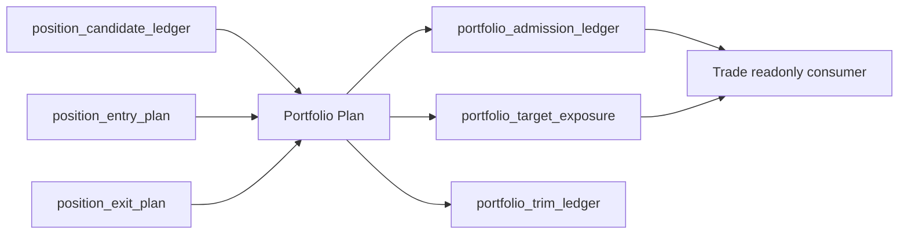
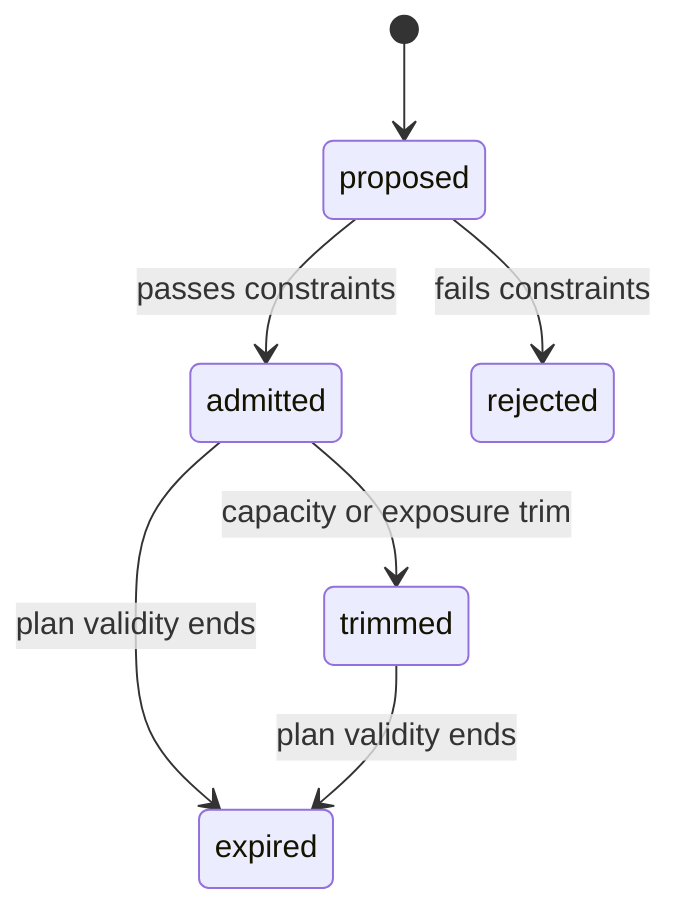

# Portfolio Plan Authority Design v1

日期：2026-04-27

状态：draft / pre-gate / not frozen

## 1. 模块定义

Portfolio Plan 是 Asteria 主线中位于 Position 之后、Trade 之前的组合层裁决模块。

Portfolio Plan 只负责把已放行的 Position 输出转化为组合准入、资金分配、容量约束、目标暴露和裁剪后的 portfolio plan。Portfolio Plan 不解释 MALF 结构，不重新计算 Alpha 或 Signal，不修改 Position 历史计划，不生成订单或成交事实。

## 2. 前置门槛

Portfolio Plan 设计冻结和施工必须等待：

```text
Position released
```

该门槛至少要求：

| 项 | 要求 |
|---|---|
| Position DB | 已存在可审计的 position candidate / entry plan / exit plan |
| Position Audit | Position hard audit 全通过 |
| Position Contract | Position 输出可被 Portfolio Plan 只读消费 |
| Release Evidence | Position bounded proof / release evidence 已落档 |

在上述条件满足前，本文件只作为 pre-gate draft，不允许施工。

## 3. 权威来源

Portfolio Plan 的唯一上游语义来源是已放行的 Position 输出：

```text
position_candidate_ledger
position_entry_plan
position_exit_plan
```

Portfolio Plan 不得直接读取 Signal、Alpha 或 MALF 并绕过 Position 形成组合裁决。

## 4. 模块只回答什么

| 问题 | Portfolio Plan 是否回答 |
|---|---:|
| 哪些 position candidate 被组合层准入 | 是 |
| 组合资金和容量如何约束 | 是 |
| 每个 admitted plan 的目标暴露是什么 | 是 |
| 哪些计划被 trim / reject | 是 |
| 是否生成订单 | 否 |
| 实际成交价格和数量是什么 | 否 |
| 全链路运行读出是什么 | 否 |

## 5. 模块不回答什么

| 禁止输出 | 归属模块 |
|---|---|
| WavePosition 结构事实 | MALF |
| Alpha opportunity event / score | Alpha |
| formal signal 聚合 | Signal |
| position candidate / entry / exit plan | Position |
| order intent / fill | Trade |
| 全链路 readout | System Readout |

## 6. 输入

Portfolio Plan 第一阶段只读消费 Position DB：

```text
H:\Asteria-data\position.duckdb
```

核心输入表：

```text
position_candidate_ledger
position_entry_plan
position_exit_plan
```

Portfolio Plan 不得直接消费 Signal、Alpha 或 MALF 作为正式业务输入。

## 7. 输出

Portfolio Plan 目标 DB：

```text
H:\Asteria-data\portfolio_plan.duckdb
```

输出表族：

| 表 | 职责 |
|---|---|
| `portfolio_plan_run` | Portfolio Plan build 审计 |
| `portfolio_plan_schema_version` | schema 版本 |
| `portfolio_plan_rule_version` | 组合裁决规则版本 |
| `portfolio_position_snapshot` | Position 输入快照 |
| `portfolio_constraint_ledger` | 组合约束账本 |
| `portfolio_admission_ledger` | 准入 / 拒绝裁决 |
| `portfolio_target_exposure` | 目标暴露 |
| `portfolio_trim_ledger` | 裁剪记录 |
| `portfolio_plan_audit` | Portfolio Plan 审计 |

该 DB 只能在 Portfolio Plan 设计冻结且 Position released 后创建。

## 8. 数据流



## 9. 状态机



Portfolio Plan 状态只描述组合层裁决生命周期，不表达订单提交或成交状态。

## 10. 自然键

| 表 | 自然键 |
|---|---|
| `portfolio_plan_run` | `run_id` |
| `portfolio_plan_schema_version` | `schema_version` |
| `portfolio_plan_rule_version` | `portfolio_plan_rule_version` |
| `portfolio_position_snapshot` | `portfolio_run_id + position_candidate_id` |
| `portfolio_constraint_ledger` | `constraint_scope + constraint_name + portfolio_plan_rule_version` |
| `portfolio_admission_ledger` | `position_candidate_id + portfolio_plan_rule_version` |
| `portfolio_target_exposure` | `portfolio_admission_id + exposure_type + portfolio_plan_rule_version` |
| `portfolio_trim_ledger` | `portfolio_admission_id + trim_reason + portfolio_plan_rule_version` |
| `portfolio_plan_audit` | `audit_id` |

## 11. 版本字段

正式 Portfolio Plan 表默认包含：

```text
run_id
schema_version
portfolio_plan_rule_version
source_position_release_version
created_at
```

若 Portfolio Plan 使用风险预算、容量样本或校准阈值，必须增加：

```text
sample_version
sample_scope
```

## 12. 上下游边界

上游：

```text
Position -> position candidate / entry plan / exit plan
```

下游：

```text
Trade -> readonly admitted portfolio plan / target exposure
```

Portfolio Plan 不得修改 Position 历史输出。Trade 和 System Readout 不得写回 Portfolio Plan。

## 13. 上线门禁

Portfolio Plan 未来冻结必须满足：

| 门禁 | 要求 |
|---|---|
| Position Release | Position released |
| Design | Portfolio Plan 六件套从 pre-gate draft 升级并审阅 |
| Schema | `portfolio_plan.duckdb` 表族、自然键、版本字段冻结 |
| Runner | bounded / segmented / full / resume 语义冻结 |
| Audit | 只读 Position、无订单成交输出、自然键唯一等硬审计冻结 |
| Evidence | Portfolio Plan bounded proof 证据落入 `H:\Asteria-report` 或 `H:\Asteria-Validated` |
