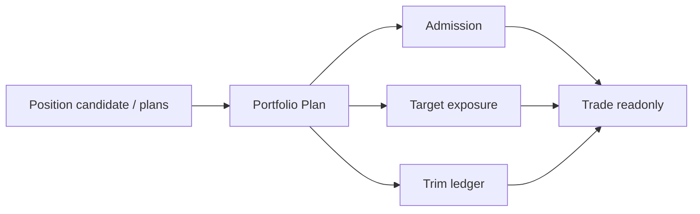

# Portfolio Plan Semantic Contract v1

日期：2026-04-27

状态：frozen / freeze review passed / bounded proof passed / full build not executed

## 1. 合同目的

本合同定义 Portfolio Plan 在 Asteria 主线中的语义边界。Portfolio Plan 只能把已放行的 Position 输出转化为组合准入、资金约束、目标暴露和裁剪后的组合计划，不得重定义 Position、Signal、Alpha 或 MALF，不得输出订单或成交语义。

## 2. 冻结依据

本合同已在以下上游 release 后完成 freeze review：

```text
Position bounded proof passed
```

Portfolio Plan 的任何正式输入字段必须以 Position 已放行字段为准。
`portfolio-plan-bounded-proof-build-card-20260507-01` 已创建 bounded proof DB 与 runner；
full build 仍必须另开卡。

## 3. 输入语义

Portfolio Plan 只读消费 Position 的最小字段：

| 字段 | 语义来源 |
|---|---|
| `position_candidate_id` | Position |
| `signal_id` | Position provenance |
| `symbol` | Position |
| `timeframe` | Position |
| `candidate_dt` | Position |
| `candidate_type` | Position |
| `candidate_state` | Position |
| `position_bias` | Position |
| `entry_plan_id` | Position |
| `exit_plan_id` | Position |
| `source_signal_release_version` | Position provenance |
| `position_rule_version` | Position |

Portfolio Plan 不得把 Position 缺行解释为 Signal、Alpha 或 MALF 数据错误。缺行只表示 Position 未发布正式输入。

## 4. Portfolio Plan 语义

| 对象 | 语义 |
|---|---|
| `portfolio_position_snapshot` | 本次 run 读取到的 Position 快照 |
| `portfolio_constraint` | 组合层约束、容量、风险预算或准入规则 |
| `portfolio_admission` | 对 position candidate 的准入 / 拒绝裁决 |
| `target_exposure` | 组合层目标暴露 |
| `portfolio_trim` | 因约束导致的裁剪记录 |
| `portfolio_plan_state` | proposed / admitted / rejected / trimmed / expired |

Portfolio Plan 是组合裁决，不是订单。

## 5. 输出语义

Portfolio Plan 正式输出分五层：

| 输出 | 语义 |
|---|---|
| `portfolio_position_snapshot` | 记录本轮 Position 输入 |
| `portfolio_constraint_ledger` | 组合约束账本 |
| `portfolio_admission_ledger` | 准入 / 拒绝裁决 |
| `portfolio_target_exposure` | 目标暴露 |
| `portfolio_trim_ledger` | 裁剪记录 |

这些输出只能给 Trade 做只读消费。

## 6. Admission 最小字段

| 字段 | 要求 |
|---|---|
| `portfolio_admission_id` | 必填 |
| `position_candidate_id` | 必填 |
| `symbol` | 必填 |
| `timeframe` | 必填 |
| `plan_dt` | 必填 |
| `admission_state` | `proposed / admitted / rejected / trimmed / expired` |
| `admission_reason` | 必填 |
| `source_position_release_version` | 必填 |
| `portfolio_plan_rule_version` | 必填 |

`admission_state = admitted` 只表示组合层允许进入目标计划，不表示订单已发出。

## 7. Target Exposure 最小字段

| 字段 | 要求 |
|---|---|
| `target_exposure_id` | 必填 |
| `portfolio_admission_id` | 必填 |
| `exposure_type` | 必填 |
| `target_weight` | 可空但字段必有 |
| `target_notional` | 可空但字段必有 |
| `target_quantity_hint` | 可空但字段必有 |
| `exposure_valid_from` | 必填 |
| `exposure_valid_until` | 可空但字段必有 |
| `portfolio_plan_rule_version` | 必填 |

`target_quantity_hint` 是计划提示，不是订单数量，也不是成交数量。

## 8. Trim 最小字段

| 字段 | 要求 |
|---|---|
| `portfolio_trim_id` | 必填 |
| `portfolio_admission_id` | 必填 |
| `trim_reason` | 必填 |
| `pre_trim_exposure` | 可空但字段必有 |
| `post_trim_exposure` | 可空但字段必有 |
| `constraint_name` | 必填 |
| `portfolio_plan_rule_version` | 必填 |

Trim 只表达组合约束裁剪，不表达交易执行。

## 9. 不允许表达

| 表达 | 裁决 |
|---|---|
| Portfolio Plan 修改 Position 历史输出 | 禁止 |
| Portfolio Plan 重新定义 Signal 强弱 | 禁止 |
| Portfolio Plan 重定义 MALF WavePosition | 禁止 |
| Portfolio Plan 直接读取 MALF / Alpha / Signal 绕过 Position | 禁止 |
| Portfolio Plan 输出 order intent / fill | 禁止 |
| Trade 回写 Portfolio Plan | 禁止 |
| System Readout 触发业务重算 | 禁止 |

## 10. 下游消费原则



Trade 只能读取 Portfolio Plan 输出并形成 order intent / execution / fill ledger。Trade 不得修改 Portfolio Plan 历史事实。
