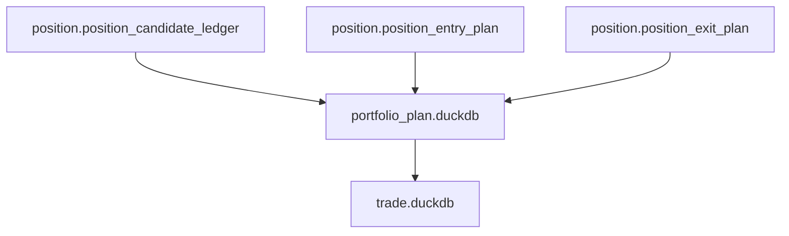
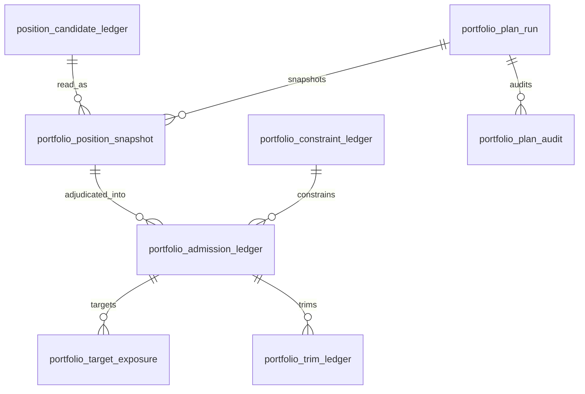

# Portfolio Plan Database Schema Spec v1

日期：2026-04-27

状态：draft / pre-gate / not frozen

## 1. 规格范围

本规格为 Portfolio Plan pre-gate draft。正式 schema 冻结必须等待：

```text
Position released
```

目标 Portfolio Plan DB：

```text
H:\Asteria-data\portfolio_plan.duckdb
```

该库在 Portfolio Plan 设计冻结前不得创建。

## 2. 上游关系



Portfolio Plan 只向 Trade 提供只读 admitted plan、target exposure 和 trim ledger。Trade 不得写回 Portfolio Plan。

## 3. 表族

| 表 | 自然键 | 说明 |
|---|---|---|
| `portfolio_plan_run` | `run_id` | Portfolio Plan build 审计 |
| `portfolio_plan_schema_version` | `schema_version` | schema 版本 |
| `portfolio_plan_rule_version` | `portfolio_plan_rule_version` | 组合裁决规则版本 |
| `portfolio_position_snapshot` | `portfolio_run_id + position_candidate_id` | Position 输入快照 |
| `portfolio_constraint_ledger` | `constraint_scope + constraint_name + portfolio_plan_rule_version` | 组合约束 |
| `portfolio_admission_ledger` | `position_candidate_id + portfolio_plan_rule_version` | 准入裁决 |
| `portfolio_target_exposure` | `portfolio_admission_id + exposure_type + portfolio_plan_rule_version` | 目标暴露 |
| `portfolio_trim_ledger` | `portfolio_admission_id + trim_reason + portfolio_plan_rule_version` | 裁剪记录 |
| `portfolio_plan_audit` | `audit_id` | Portfolio Plan 审计 |

## 4. 通用审计字段

Portfolio Plan 正式表必须带：

```text
run_id
schema_version
portfolio_plan_rule_version
source_position_release_version
created_at
```

若 Portfolio Plan 使用风险预算、容量样本或校准阈值，还必须带：

```text
sample_version
sample_scope
```

## 5. portfolio_position_snapshot

最小字段：

| 字段 | 要求 |
|---|---|
| `portfolio_position_snapshot_id` | 主体 id |
| `portfolio_run_id` | 必填 |
| `position_candidate_id` | 必填 |
| `symbol` | 必填 |
| `timeframe` | 必填 |
| `candidate_dt` | 必填 |
| `candidate_state` | 必填 |
| `position_bias` | 必填 |
| `entry_plan_id` | 必填 |
| `exit_plan_id` | 必填 |
| `position_rule_version` | 必填 |
| `source_position_release_version` | 必填 |

## 6. portfolio_constraint_ledger

最小字段：

| 字段 | 要求 |
|---|---|
| `constraint_id` | 主体 id |
| `constraint_scope` | 必填 |
| `constraint_name` | 必填 |
| `constraint_type` | 必填 |
| `constraint_value` | 可空但字段必有 |
| `constraint_state` | `active / inactive / observe` |
| `portfolio_plan_rule_version` | 必填 |

## 7. portfolio_admission_ledger

最小字段：

| 字段 | 要求 |
|---|---|
| `portfolio_admission_id` | 主体 id |
| `position_candidate_id` | 必填 |
| `symbol` | 必填 |
| `timeframe` | 必填 |
| `plan_dt` | 必填 |
| `admission_state` | `proposed / admitted / rejected / trimmed / expired` |
| `admission_reason` | 必填 |
| `source_position_release_version` | 必填 |
| `portfolio_plan_rule_version` | 必填 |

## 8. portfolio_target_exposure

最小字段：

| 字段 | 要求 |
|---|---|
| `target_exposure_id` | 主体 id |
| `portfolio_admission_id` | 必填 |
| `exposure_type` | 必填 |
| `target_weight` | 可空但字段必有 |
| `target_notional` | 可空但字段必有 |
| `target_quantity_hint` | 可空但字段必有 |
| `exposure_valid_from` | 必填 |
| `exposure_valid_until` | 可空但字段必有 |
| `portfolio_plan_rule_version` | 必填 |

## 9. portfolio_trim_ledger

最小字段：

| 字段 | 要求 |
|---|---|
| `portfolio_trim_id` | 主体 id |
| `portfolio_admission_id` | 必填 |
| `trim_reason` | 必填 |
| `pre_trim_exposure` | 可空但字段必有 |
| `post_trim_exposure` | 可空但字段必有 |
| `constraint_name` | 必填 |
| `portfolio_plan_rule_version` | 必填 |

## 10. portfolio_plan_audit

最小字段：

| 字段 | 说明 |
|---|---|
| `audit_id` | 审计 id |
| `run_id` | Portfolio Plan run |
| `check_name` | 检查项 |
| `severity` | `hard / soft` |
| `status` | `pass / fail / observe` |
| `failed_count` | 失败行数 |
| `sample_payload` | 样例 |

## 11. ER 图



## 12. 写入裁决

| 规则 | 裁决 |
|---|---|
| 正式 DB 路径 | `H:\Asteria-data` |
| working DB 路径 | `H:\Asteria-temp\portfolio_plan\<run_id>\` |
| 写入方式 | 批量写入 |
| 同库多写 | 禁止 |
| 旧数据替换 | staging 审计通过后 promote |
| `run_id` | 审计字段，不作为业务自然键 |
| formal DB create | Portfolio Plan design freeze 后才允许 |

## 13. 不允许的 schema

| 字段或表 | 裁决 |
|---|---|
| `order_intent_id` | 禁止，归属 Trade |
| `execution_price` | 禁止，归属 Trade |
| `fill_id` | 禁止，归属 Trade |
| `system_readout_id` | 禁止，归属 System Readout |
| 自定义 MALF / Alpha / Signal / Position 字段 | 禁止 |
