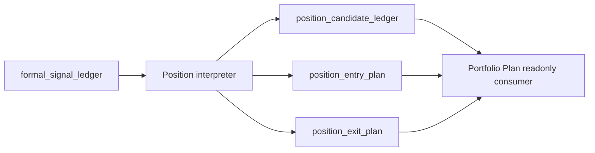
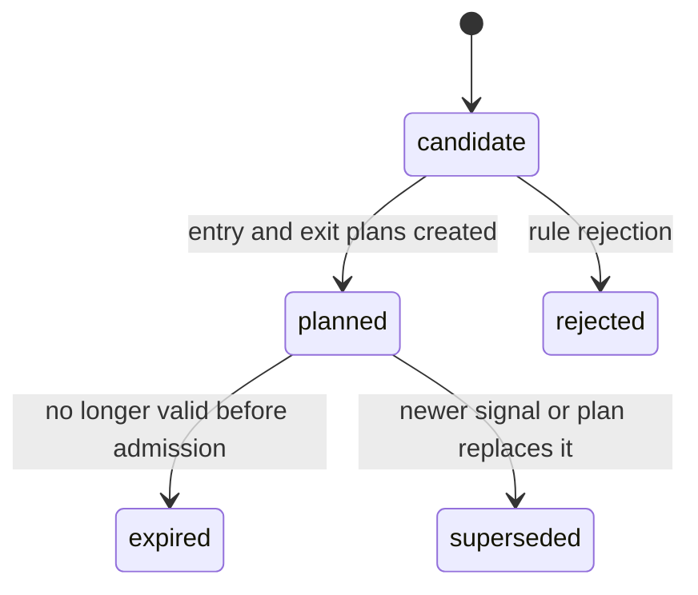

# Position Authority Design v1

日期：2026-04-27

状态：freeze review passed / design contract frozen / build not executed

## 1. 模块定义

Position 是 Asteria 主线中位于 Signal 之后、Portfolio Plan 之前的持仓语义模块。

Position 只负责把已放行的 formal signal 转化为 position candidate、entry plan 和 exit plan。Position 不解释 MALF 结构，不重新计算 Alpha 机会，不修改 Signal 历史输出，不处理组合资金分配、容量裁决、订单或成交。

## 2. 前置门槛

Position 设计冻结已由 `position-freeze-review-reentry-20260430-01` 只读评审通过。
后续施工仍必须等待：

```text
Position bounded proof build card
```

该施工门槛至少要求：

| 项 | 要求 |
|---|---|
| Signal DB | 已存在可审计的 `formal_signal_ledger` |
| Signal Audit | Signal hard audit 全通过 |
| Signal Contract | formal signal 可被 Position 只读消费 |
| Freeze Evidence | Position freeze review re-entry passed |
| Build Card | Position bounded proof build card 已明确打开 |

在 build card 明确打开前，本文件只冻结 Position 文档和合同口径，不允许施工。

## 3. 权威来源

Position 的唯一上游语义来源是已放行的 Signal 输出：

```text
formal_signal_ledger
signal_component_ledger
```

Position 不得直接读取 Alpha 或 MALF 并绕过 Signal 形成持仓语义。

## 4. 模块只回答什么

| 问题 | Position 是否回答 |
|---|---:|
| 某个 formal signal 是否形成 position candidate | 是 |
| candidate 的 entry plan 是什么 | 是 |
| candidate 的 exit plan 是什么 | 是 |
| 持仓语义的状态和生命周期是什么 | 是 |
| 组合资金如何分配 | 否 |
| 目标组合敞口是多少 | 否 |
| 是否生成订单、成交价格是什么 | 否 |

## 5. 模块不回答什么

| 禁止输出 | 归属模块 |
|---|---|
| WavePosition 结构事实 | MALF |
| Alpha opportunity event / score | Alpha |
| formal signal 聚合 | Signal |
| portfolio constraints / target exposure | Portfolio Plan |
| order intent / fill | Trade |
| 全链路 readout | System Readout |

## 6. 输入

Position 第一阶段只读消费 Signal DB：

```text
H:\Asteria-data\signal.duckdb
```

核心输入表：

```text
formal_signal_ledger
signal_component_ledger
```

Position 不得直接消费 MALF Service 或 Alpha family DB 作为正式业务输入。

## 7. 输出

Position 目标 DB：

```text
H:\Asteria-data\position.duckdb
```

输出表族：

| 表 | 职责 |
|---|---|
| `position_run` | Position build 审计 |
| `position_schema_version` | schema 版本 |
| `position_rule_version` | 持仓规则版本 |
| `position_signal_snapshot` | Signal 输入快照 |
| `position_candidate_ledger` | 持仓候选账本 |
| `position_entry_plan` | 入场计划语义 |
| `position_exit_plan` | 退出计划语义 |
| `position_audit` | Position 审计 |

该 DB 只能在 Position bounded proof build card 明确打开并执行时创建。

## 8. 数据流



## 9. 状态机



Position 状态只描述持仓候选和计划生命周期，不表达组合准入、目标权重或实际成交。

## 10. 自然键

| 表 | 自然键 |
|---|---|
| `position_run` | `run_id` |
| `position_schema_version` | `schema_version` |
| `position_rule_version` | `position_rule_version` |
| `position_signal_snapshot` | `position_run_id + signal_id` |
| `position_candidate_ledger` | `signal_id + candidate_type + position_rule_version` |
| `position_entry_plan` | `position_candidate_id + entry_plan_type + position_rule_version` |
| `position_exit_plan` | `position_candidate_id + exit_plan_type + position_rule_version` |
| `position_audit` | `audit_id` |

## 11. 版本字段

正式 Position 表默认包含：

```text
run_id
schema_version
position_rule_version
source_signal_release_version
created_at
```

若 Position 规则使用样本校准或风险阈值，必须增加：

```text
sample_version
sample_scope
```

## 12. 上下游边界

上游：

```text
Signal -> formal_signal_ledger
```

下游：

```text
Portfolio Plan -> readonly position candidate / entry plan / exit plan
```

Position 不得修改 Signal 历史输出。Portfolio Plan、Trade、System Readout 不得写回 Position。

## 13. 上线门禁

Position 后续 bounded proof 必须满足：

| 门禁 | 要求 |
|---|---|
| Signal Release | Signal bounded proof evidence 已落档 |
| Design | Position 六件套已通过 freeze review re-entry |
| Schema | `position.duckdb` 表族、自然键、版本字段已冻结为合同表面 |
| Runner | bounded / segmented / full / resume 语义已冻结为未来 runner 合同 |
| Audit | 只读 Signal、无组合资金和订单输出、自然键唯一等硬审计已冻结 |
| Evidence | Position bounded proof 证据落入 `H:\Asteria-report` 或 `H:\Asteria-Validated` |
