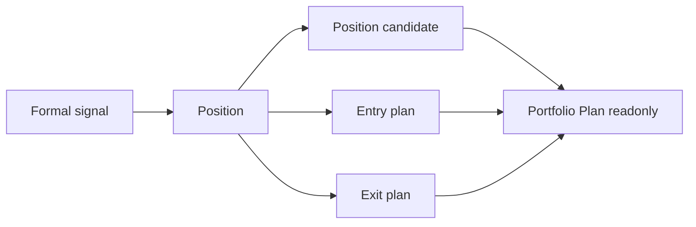

# Position Semantic Contract v1

日期：2026-04-27

状态：freeze review passed / design contract frozen / build not executed

## 1. 合同目的

本合同定义 Position 在 Asteria 主线中的语义边界。Position 只能把已放行的 formal signal 转化为持仓候选、入场计划和退出计划，不得重定义 Signal、Alpha 或 MALF，不得输出组合资金、目标权重、订单或成交语义。

## 2. 前置门槛

本合同已由 `position-freeze-review-reentry-20260430-01` 只读评审冻结。正式
Position bounded proof 施工仍必须等待：

```text
Position bounded proof build card
```

Position 的任何正式输入字段必须以 Signal 已放行字段为准。

## 3. 输入语义

Position 只读消费 Signal 的最小字段：

| 字段 | 语义来源 |
|---|---|
| `signal_id` | Signal |
| `symbol` | Signal |
| `timeframe` | Signal |
| `signal_dt` | Signal |
| `signal_type` | Signal |
| `signal_state` | Signal |
| `signal_bias` | Signal |
| `signal_strength` | Signal |
| `confidence_bucket` | Signal |
| `source_alpha_release_version` | Signal provenance |
| `signal_rule_version` | Signal |

Position 不得把 Signal 缺行解释为 Alpha 或 MALF 数据错误。缺行只表示 Signal 未发布正式输入。

## 4. Position 语义

| 对象 | 语义 |
|---|---|
| `position_signal_snapshot` | 本次 run 读取到的 Signal 快照 |
| `position_candidate` | 由 formal signal 产生的持仓候选 |
| `entry_plan` | 入场触发、有效期和计划语义 |
| `exit_plan` | 退出触发、失效和保护语义 |
| `position_plan_state` | candidate / planned / rejected / expired / superseded |

Position 的计划是持仓语义，不是组合准入裁决，也不是订单。

## 5. 输出语义

Position 正式输出分四层：

| 输出 | 语义 |
|---|---|
| `position_signal_snapshot` | 记录本轮 Signal 输入 |
| `position_candidate_ledger` | 持仓候选账本 |
| `position_entry_plan` | 入场计划 |
| `position_exit_plan` | 退出计划 |

这些输出只能给 Portfolio Plan 做只读消费。

## 6. Position Candidate 最小字段

| 字段 | 要求 |
|---|---|
| `position_candidate_id` | 必填 |
| `signal_id` | 必填 |
| `symbol` | 必填 |
| `timeframe` | 必填 |
| `candidate_dt` | 必填 |
| `candidate_type` | 必填，由 position rule 定义 |
| `candidate_state` | `candidate / planned / rejected / expired / superseded` |
| `position_bias` | `long_candidate / short_candidate / neutral_candidate` |
| `source_signal_release_version` | 必填 |
| `position_rule_version` | 必填 |

`position_bias` 只表达持仓候选方向，不表达资金权重或订单。

## 7. Entry Plan 最小字段

| 字段 | 要求 |
|---|---|
| `entry_plan_id` | 必填 |
| `position_candidate_id` | 必填 |
| `entry_plan_type` | 必填 |
| `entry_trigger_type` | 必填 |
| `entry_reference_dt` | 必填 |
| `entry_valid_from` | 必填 |
| `entry_valid_until` | 可空但字段必有 |
| `entry_state` | `planned / invalidated / expired` |
| `position_rule_version` | 必填 |

Entry plan 不得包含 order intent、fill 或 portfolio target weight。

## 8. Exit Plan 最小字段

| 字段 | 要求 |
|---|---|
| `exit_plan_id` | 必填 |
| `position_candidate_id` | 必填 |
| `exit_plan_type` | 必填 |
| `exit_trigger_type` | 必填 |
| `exit_reference_dt` | 必填 |
| `exit_valid_from` | 必填 |
| `exit_valid_until` | 可空但字段必有 |
| `exit_state` | `planned / invalidated / expired` |
| `position_rule_version` | 必填 |

Exit plan 只描述退出语义，不描述真实成交。

## 9. 不允许表达

| 表达 | 裁决 |
|---|---|
| Position 修改 Signal 历史输出 | 禁止 |
| Position 重新计算 Alpha 机会 | 禁止 |
| Position 重定义 MALF WavePosition | 禁止 |
| Position 直接读取 MALF 或 Alpha 绕过 Signal | 禁止 |
| Position 输出 portfolio allocation / target exposure | 禁止 |
| Position 输出 order intent / fill | 禁止 |
| Portfolio Plan 回写 Position | 禁止 |

## 10. 下游消费原则



Portfolio Plan 只能读取 Position 输出并形成组合层准入、资金和目标敞口裁决。Portfolio Plan 不得修改 Position 历史事实。
