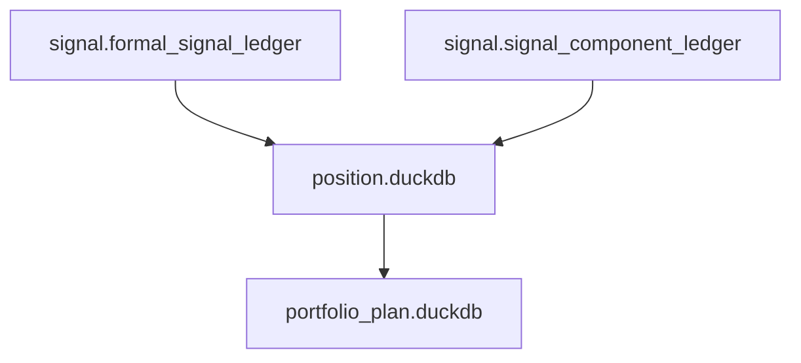
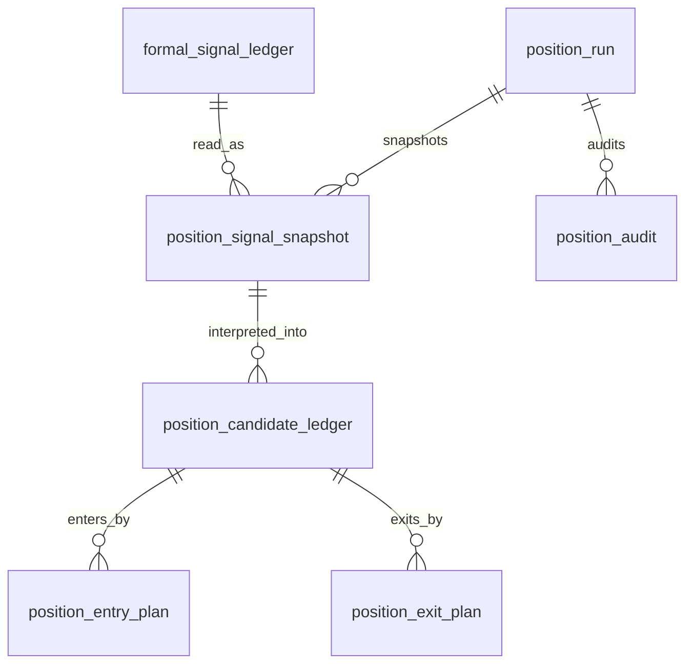

# Position Database Schema Spec v1

日期：2026-04-27

状态：draft / pre-gate / not frozen

## 1. 规格范围

本规格为 Position pre-gate draft。正式 schema 冻结必须等待：

```text
Signal released
```

目标 Position DB：

```text
H:\Asteria-data\position.duckdb
```

该库在 Position 设计冻结前不得创建。

## 2. 上游关系



Position 只向 Portfolio Plan 提供只读 position candidate / entry plan / exit plan。Portfolio Plan 不得写回 Position。

## 3. 表族

| 表 | 自然键 | 说明 |
|---|---|---|
| `position_run` | `run_id` | Position build 审计 |
| `position_schema_version` | `schema_version` | schema 版本 |
| `position_rule_version` | `position_rule_version` | 持仓规则版本 |
| `position_signal_snapshot` | `position_run_id + signal_id` | Signal 输入快照 |
| `position_candidate_ledger` | `signal_id + candidate_type + position_rule_version` | 持仓候选 |
| `position_entry_plan` | `position_candidate_id + entry_plan_type + position_rule_version` | 入场计划 |
| `position_exit_plan` | `position_candidate_id + exit_plan_type + position_rule_version` | 退出计划 |
| `position_audit` | `audit_id` | Position 审计 |

## 4. 通用审计字段

Position 正式表必须带：

```text
run_id
schema_version
position_rule_version
source_signal_release_version
created_at
```

若 Position 使用样本分布或校准阈值，还必须带：

```text
sample_version
sample_scope
```

## 5. position_signal_snapshot

最小字段：

| 字段 | 要求 |
|---|---|
| `position_signal_snapshot_id` | 主体 id |
| `position_run_id` | 必填 |
| `signal_id` | 必填 |
| `symbol` | 必填 |
| `timeframe` | 必填 |
| `signal_dt` | 必填 |
| `signal_type` | 必填 |
| `signal_state` | 必填 |
| `signal_bias` | 必填 |
| `signal_strength` | 必填 |
| `signal_rule_version` | 必填 |
| `source_signal_release_version` | 必填 |

## 6. position_candidate_ledger

最小字段：

| 字段 | 要求 |
|---|---|
| `position_candidate_id` | 主体 id |
| `signal_id` | 必填 |
| `symbol` | 必填 |
| `timeframe` | 必填 |
| `candidate_dt` | 必填 |
| `candidate_type` | 必填 |
| `candidate_state` | `candidate / planned / rejected / expired / superseded` |
| `position_bias` | `long_candidate / short_candidate / neutral_candidate` |
| `source_signal_release_version` | 必填 |
| `position_rule_version` | 必填 |

## 7. position_entry_plan

最小字段：

| 字段 | 要求 |
|---|---|
| `entry_plan_id` | 主体 id |
| `position_candidate_id` | 必填 |
| `entry_plan_type` | 必填 |
| `entry_trigger_type` | 必填 |
| `entry_reference_dt` | 必填 |
| `entry_valid_from` | 必填 |
| `entry_valid_until` | 可空但字段必有 |
| `entry_state` | `planned / invalidated / expired` |
| `position_rule_version` | 必填 |

## 8. position_exit_plan

最小字段：

| 字段 | 要求 |
|---|---|
| `exit_plan_id` | 主体 id |
| `position_candidate_id` | 必填 |
| `exit_plan_type` | 必填 |
| `exit_trigger_type` | 必填 |
| `exit_reference_dt` | 必填 |
| `exit_valid_from` | 必填 |
| `exit_valid_until` | 可空但字段必有 |
| `exit_state` | `planned / invalidated / expired` |
| `position_rule_version` | 必填 |

## 9. position_audit

最小字段：

| 字段 | 说明 |
|---|---|
| `audit_id` | 审计 id |
| `run_id` | Position run |
| `check_name` | 检查项 |
| `severity` | `hard / soft` |
| `status` | `pass / fail / observe` |
| `failed_count` | 失败行数 |
| `sample_payload` | 样例 |

## 10. ER 图



## 11. 写入裁决

| 规则 | 裁决 |
|---|---|
| 正式 DB 路径 | `H:\Asteria-data` |
| working DB 路径 | `H:\Asteria-temp\position\<run_id>\` |
| 写入方式 | 批量写入 |
| 同库多写 | 禁止 |
| 旧数据替换 | staging 审计通过后 promote |
| `run_id` | 审计字段，不作为业务自然键 |
| formal DB create | Position design freeze 后才允许 |

## 12. 不允许的 schema

| 字段或表 | 裁决 |
|---|---|
| `portfolio_allocation` | 禁止，归属 Portfolio Plan |
| `target_weight` | 禁止，归属 Portfolio Plan |
| `target_exposure` | 禁止，归属 Portfolio Plan |
| `order_intent_id` | 禁止，归属 Trade |
| `fill_id` | 禁止，归属 Trade |
| 自定义 MALF / Alpha / Signal 字段 | 禁止 |
