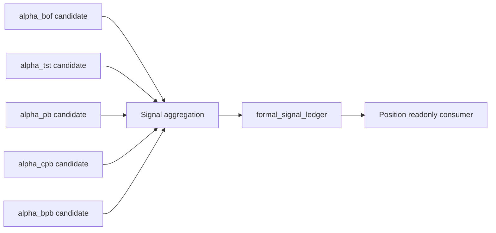

# Signal Authority Design v1

日期：2026-04-27

状态：draft / pre-gate / not frozen

## 1. 模块定义

Signal 是 Asteria 主线中位于 Alpha 之后、Position 之前的正式信号账本模块。

Signal 只负责把已放行的 Alpha family 输出聚合为正式 signal ledger。Signal 不解释 MALF 结构，不修改 Alpha 历史输出，不处理仓位、资金、组合约束、订单或成交。

## 2. 前置门槛

Signal 设计冻结和施工必须等待：

```text
Alpha released
```

该门槛至少要求：

| 项 | 要求 |
|---|---|
| Alpha family DB | 已存在可审计的 alpha family 输出 |
| Alpha Audit | Alpha hard audit 全通过 |
| Alpha Contract | `alpha_signal_candidate` 可被 Signal 只读消费 |
| Release Evidence | Alpha bounded proof / release evidence 已落档 |

在上述条件满足前，本文件只作为 pre-gate draft，不允许施工。

## 3. 权威来源

Signal 的唯一上游语义来源是已放行的 Alpha 输出：

```text
alpha_signal_candidate
alpha_event_ledger
alpha_score_ledger
```

Signal 不得直接读取 MALF 并重新解释 WavePosition。MALF 结构事实必须经 Alpha 机会解释后，才进入 Signal 聚合。

## 4. 模块只回答什么

| 问题 | Signal 是否回答 |
|---|---:|
| 多个 Alpha candidate 是否形成正式 signal | 是 |
| signal 的方向性机会偏向是什么 | 是 |
| signal 的强度、状态、来源构成是什么 | 是 |
| signal 是否足以交给 Position 消费 | 是 |
| 是否建仓、持仓多少 | 否 |
| 组合资金如何分配 | 否 |
| 是否下单、成交价格是什么 | 否 |

## 5. 模块不回答什么

| 禁止输出 | 归属模块 |
|---|---|
| WavePosition 结构事实 | MALF |
| Alpha opportunity event / score | Alpha |
| position candidate / entry / exit plan | Position |
| capital allocation / target exposure | Portfolio Plan |
| order intent / fill | Trade |
| 全链路 readout | System Readout |

## 6. 输入

Signal 第一阶段只读消费 Alpha family DB：

```text
H:\Asteria-data\alpha_bof.duckdb
H:\Asteria-data\alpha_tst.duckdb
H:\Asteria-data\alpha_pb.duckdb
H:\Asteria-data\alpha_cpb.duckdb
H:\Asteria-data\alpha_bpb.duckdb
```

核心输入表：

```text
alpha_signal_candidate
alpha_event_ledger
alpha_score_ledger
```

Signal 不得直接消费 MALF Service 作为正式业务输入。

## 7. 输出

Signal 目标 DB：

```text
H:\Asteria-data\signal.duckdb
```

输出表族：

| 表 | 职责 |
|---|---|
| `signal_run` | Signal build 审计 |
| `signal_schema_version` | schema 版本 |
| `signal_rule_version` | signal 聚合规则版本 |
| `signal_input_snapshot` | Alpha 输入快照 |
| `formal_signal_ledger` | 正式 signal 账本 |
| `signal_component_ledger` | 构成 signal 的 Alpha component |
| `signal_audit` | Signal 审计 |

该 DB 只能在 Signal 设计冻结且 Alpha released 后创建。

## 8. 数据流



## 9. 自然键

| 表 | 自然键 |
|---|---|
| `signal_run` | `run_id` |
| `signal_schema_version` | `schema_version` |
| `signal_rule_version` | `signal_rule_version` |
| `signal_input_snapshot` | `signal_run_id + alpha_family + alpha_candidate_id` |
| `formal_signal_ledger` | `symbol + timeframe + signal_dt + signal_type + signal_rule_version` |
| `signal_component_ledger` | `signal_id + alpha_family + alpha_candidate_id + signal_rule_version` |
| `signal_audit` | `audit_id` |

## 10. 版本字段

正式 Signal 表默认包含：

```text
run_id
schema_version
signal_rule_version
source_alpha_release_version
created_at
```

若 Signal 聚合使用样本校准或阈值分布，必须增加：

```text
sample_version
sample_scope
```

## 11. 上下游边界

上游：

```text
Alpha -> alpha_signal_candidate
```

下游：

```text
Position -> readonly formal_signal_ledger
```

Signal 不得修改 Alpha 历史输出。Position、Portfolio Plan、Trade、System Readout 不得写回 Signal。

## 12. 上线门禁

Signal 未来冻结必须满足：

| 门禁 | 要求 |
|---|---|
| Alpha Release | Alpha released |
| Design | Signal 六件套从 pre-gate draft 升级并审阅 |
| Schema | `signal.duckdb` 表族、自然键、版本字段冻结 |
| Runner | bounded / segmented / full / resume 语义冻结 |
| Audit | 只读 Alpha、无资金订单输出、自然键唯一等硬审计冻结 |
| Evidence | Signal bounded proof 证据落入 `H:\Asteria-report` 或 `H:\Asteria-Validated` |
