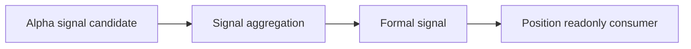

# Signal Semantic Contract v1

日期：2026-04-27

状态：draft / pre-gate / not frozen

## 1. 合同目的

本合同定义 Signal 在 Asteria 主线中的语义边界。Signal 只能聚合已放行的 Alpha 输出为正式 signal ledger，不得重定义 Alpha 或 MALF，不得输出仓位、资金或订单语义。

## 2. 前置门槛

本合同在以下条件满足前不得冻结：

```text
Alpha released
```

Signal 的任何正式输入字段必须以 Alpha 已放行字段为准。

## 3. 输入语义

Signal 只读消费 Alpha 的最小字段：

| 字段 | 语义来源 |
|---|---|
| `alpha_candidate_id` | Alpha |
| `alpha_event_id` | Alpha |
| `alpha_family` | Alpha |
| `symbol` | Alpha |
| `timeframe` | Alpha |
| `bar_dt` | Alpha |
| `candidate_type` | Alpha |
| `candidate_state` | Alpha |
| `opportunity_bias` | Alpha |
| `confidence_bucket` | Alpha |
| `reason_code` | Alpha |
| `alpha_rule_version` | Alpha |
| `source_malf_service_version` | Alpha provenance |

Signal 不得把 Alpha 缺行解释为 MALF 数据错误。缺行只表示该 Alpha family 未发布候选输入。

## 4. Signal 语义

| 对象 | 语义 |
|---|---|
| `signal_input_snapshot` | 本次 run 读取到的 Alpha candidate 快照 |
| `formal_signal` | 多个 Alpha candidate 聚合后的正式信号 |
| `signal_component` | 某个 formal signal 的 Alpha 来源构成 |
| `signal_state` | signal 当前账本状态 |
| `signal_strength` | signal 聚合强度 |

formal signal 是 Position 的上游输入，不是持仓计划。

## 5. 输出语义

Signal 正式输出分三层：

| 输出 | 语义 |
|---|---|
| `signal_input_snapshot` | 记录本轮 Alpha 输入 |
| `formal_signal_ledger` | 正式 signal 账本 |
| `signal_component_ledger` | signal 与 Alpha component 的对应关系 |

`formal_signal_ledger` 不得被解释为 position size、portfolio allocation、order intent 或 fill。

## 6. Formal Signal 最小字段

| 字段 | 要求 |
|---|---|
| `signal_id` | 必填 |
| `symbol` | 必填 |
| `timeframe` | 必填 |
| `signal_dt` | 必填 |
| `signal_type` | 必填，由 signal rule 定义 |
| `signal_state` | `active / inactive / rejected / expired` |
| `signal_bias` | `up_opportunity / down_opportunity / neutral` |
| `signal_strength` | 必填 |
| `confidence_bucket` | `low / medium / high / unranked` |
| `source_alpha_release_version` | 必填 |
| `signal_rule_version` | 必填 |

`signal_bias` 只表达机会偏向，不表达买入、卖出、做多仓位、做空仓位或订单。

## 7. Signal Component 最小字段

| 字段 | 要求 |
|---|---|
| `signal_component_id` | 必填 |
| `signal_id` | 必填 |
| `alpha_family` | 必填 |
| `alpha_candidate_id` | 必填 |
| `component_role` | `support / conflict / neutral / rejected` |
| `component_weight` | 聚合权重，不是资金权重 |
| `alpha_rule_version` | 必填 |
| `signal_rule_version` | 必填 |

`component_weight` 只用于 signal 聚合解释，不得作为 portfolio 权重。

## 8. 不允许表达

| 表达 | 裁决 |
|---|---|
| Signal 修改 Alpha 历史输出 | 禁止 |
| Signal 重定义 MALF WavePosition | 禁止 |
| Signal 直接读取 MALF 并绕过 Alpha | 禁止 |
| Signal 输出 position size / target exposure | 禁止 |
| Signal 输出 order intent / fill | 禁止 |
| Position 回写 Signal | 禁止 |
| Portfolio Plan 用 signal 字段替代组合约束 | 禁止 |

## 9. 下游消费原则



Position 只能读取 formal signal 并形成自身 position candidate / entry / exit plan。Position 不得修改 Signal 历史事实。
