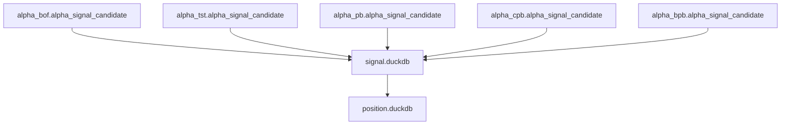
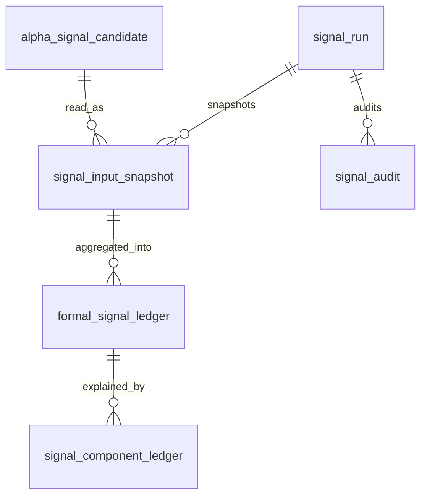

# Signal Database Schema Spec v1

日期：2026-04-27

状态：draft / pre-gate / not frozen

## 1. 规格范围

本规格为 Signal pre-gate draft。正式 schema 冻结必须等待：

```text
Alpha released
```

目标 Signal DB：

```text
H:\Asteria-data\signal.duckdb
```

该库在 Signal 设计冻结前不得创建。

## 2. 上游关系



Signal 只向 Position 提供只读 formal signal。Position 不得写回 Signal。

## 3. 表族

| 表 | 自然键 | 说明 |
|---|---|---|
| `signal_run` | `run_id` | Signal build 审计 |
| `signal_schema_version` | `schema_version` | schema 版本 |
| `signal_rule_version` | `signal_rule_version` | 聚合规则版本 |
| `signal_input_snapshot` | `signal_run_id + alpha_family + alpha_candidate_id` | Alpha 输入快照 |
| `formal_signal_ledger` | `symbol + timeframe + signal_dt + signal_type + signal_rule_version` | 正式 signal |
| `signal_component_ledger` | `signal_id + alpha_family + alpha_candidate_id + signal_rule_version` | signal 构成 |
| `signal_audit` | `audit_id` | Signal 审计 |

## 4. 通用审计字段

Signal 正式表必须带：

```text
run_id
schema_version
signal_rule_version
source_alpha_release_version
created_at
```

若 Signal 使用样本分布或校准阈值，还必须带：

```text
sample_version
sample_scope
```

## 5. signal_input_snapshot

最小字段：

| 字段 | 要求 |
|---|---|
| `signal_input_snapshot_id` | 主体 id |
| `signal_run_id` | 必填 |
| `alpha_family` | 必填 |
| `alpha_candidate_id` | 必填 |
| `alpha_event_id` | 必填 |
| `symbol` | 必填 |
| `timeframe` | 必填 |
| `bar_dt` | 必填 |
| `candidate_state` | 必填 |
| `opportunity_bias` | 必填 |
| `confidence_bucket` | 必填 |
| `alpha_rule_version` | 必填 |
| `source_alpha_release_version` | 必填 |

## 6. formal_signal_ledger

最小字段：

| 字段 | 要求 |
|---|---|
| `signal_id` | 主体 id |
| `symbol` | 必填 |
| `timeframe` | 必填 |
| `signal_dt` | 必填 |
| `signal_type` | 必填 |
| `signal_state` | `active / inactive / rejected / expired` |
| `signal_bias` | `up_opportunity / down_opportunity / neutral` |
| `signal_strength` | 必填 |
| `confidence_bucket` | `low / medium / high / unranked` |
| `source_alpha_release_version` | 必填 |
| `signal_rule_version` | 必填 |

## 7. signal_component_ledger

最小字段：

| 字段 | 要求 |
|---|---|
| `signal_component_id` | 主体 id |
| `signal_id` | 必填 |
| `alpha_family` | 必填 |
| `alpha_candidate_id` | 必填 |
| `component_role` | `support / conflict / neutral / rejected` |
| `component_weight` | 必填，解释权重，不是资金权重 |
| `alpha_rule_version` | 必填 |
| `signal_rule_version` | 必填 |

## 8. signal_audit

最小字段：

| 字段 | 说明 |
|---|---|
| `audit_id` | 审计 id |
| `run_id` | Signal run |
| `check_name` | 检查项 |
| `severity` | `hard / soft` |
| `status` | `pass / fail / observe` |
| `failed_count` | 失败行数 |
| `sample_payload` | 样例 |

## 9. ER 图



## 10. 写入裁决

| 规则 | 裁决 |
|---|---|
| 正式 DB 路径 | `H:\Asteria-data` |
| working DB 路径 | `H:\Asteria-temp\signal\<run_id>\` |
| 写入方式 | 批量写入 |
| 同库多写 | 禁止 |
| 旧数据替换 | staging 审计通过后 promote |
| `run_id` | 审计字段，不作为业务自然键 |
| formal DB create | Signal design freeze 后才允许 |

## 11. 不允许的 schema

| 字段或表 | 裁决 |
|---|---|
| `position_size` | 禁止，归属 Position / Portfolio Plan |
| `target_weight` | 禁止，归属 Portfolio Plan |
| `order_intent_id` | 禁止，归属 Trade |
| `fill_id` | 禁止，归属 Trade |
| 自定义 MALF WavePosition 字段 | 禁止 |
