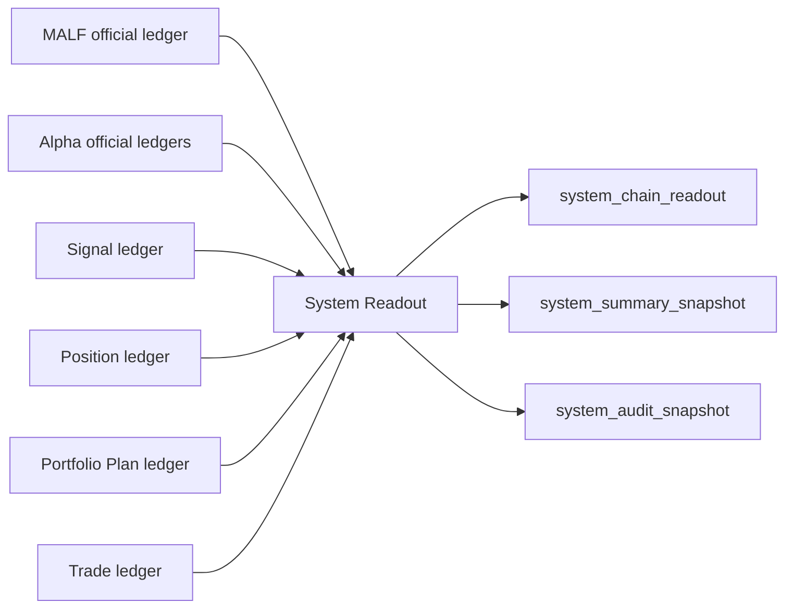

# System Readout Authority Design v1

日期：2026-04-27

状态：frozen / freeze review passed / bounded proof passed / full build not executed

## 1. 模块定义

System Readout 是 Asteria 主线中位于 Trade 之后的只读全链路读出模块。

System Readout 只负责读取已放行的正式账本，生成全链路 readout、summary 和 audit snapshot。System Readout 不定义业务语义，不触发业务重算，不修改 MALF、Alpha、Signal、Position、Portfolio Plan 或 Trade 的历史事实。

`system-readout-freeze-review-20260507-01` 已完成 review-only 审阅；
`system-readout-bounded-proof-build-card-20260508-01` 已通过。本文件当前作为已冻结并已完成
day bounded proof 的 authority design 合同表面；这仍不等于 System full build 已打开。

## 2. 前置门槛

System Readout 设计冻结和施工必须等待：

```text
Trade released
```

该门槛至少要求：

| 项 | 要求 |
|---|---|
| Trade DB | 已存在可审计的 order intent / execution / fill / rejection |
| Trade Audit | Trade hard audit 全通过 |
| Upstream Chain | MALF -> Alpha -> Signal -> Position -> Portfolio Plan -> Trade 均有 release evidence |
| Readout Contract | 全链路正式账本可被 System Readout 只读消费 |

在上述条件满足前，本文件只作为 pre-gate draft，不允许施工。Trade released 后，本文件已进入
freeze review passed 状态，并已由 bounded proof build card 闭环 day bounded proof。

## 3. 权威来源

System Readout 的输入只来自已放行的正式账本：

```text
malf_service_day.duckdb
alpha_*.duckdb
signal.duckdb
position.duckdb
portfolio_plan.duckdb
trade.duckdb
```

System Readout 不得直接修正任何上游账本，也不得通过重算替换上游语义。

## 4. 模块只回答什么

| 问题 | System Readout 是否回答 |
|---|---:|
| 某次构建的全链路读出是什么 | 是 |
| 每个模块 release / run / source 关系是什么 | 是 |
| 全链路 audit snapshot 是否完整 | 是 |
| 人读 summary / report 如何呈现 | 是 |
| 是否改变上游业务事实 | 否 |
| 是否重新计算 Alpha、Signal、Position、Trade | 否 |
| 是否触发订单或成交 | 否 |

## 5. 模块不回答什么

| 禁止输出 | 归属模块 |
|---|---|
| WavePosition 结构事实 | MALF |
| Alpha opportunity event / score | Alpha |
| formal signal 聚合 | Signal |
| position candidate / entry / exit plan | Position |
| portfolio constraints / target exposure | Portfolio Plan |
| order intent / fill | Trade |

## 6. 输入

System Readout 第一阶段只读消费全链路正式 DB：

```text
H:\Asteria-data\malf_service_day.duckdb
H:\Asteria-data\alpha_bof.duckdb
H:\Asteria-data\alpha_tst.duckdb
H:\Asteria-data\alpha_pb.duckdb
H:\Asteria-data\alpha_cpb.duckdb
H:\Asteria-data\alpha_bpb.duckdb
H:\Asteria-data\signal.duckdb
H:\Asteria-data\position.duckdb
H:\Asteria-data\portfolio_plan.duckdb
H:\Asteria-data\trade.duckdb
```

System Readout 只能读取这些库的正式表和审计表。

## 7. 输出

System Readout 目标 DB：

```text
H:\Asteria-data\system.duckdb
```

输出表族：

| 表 | 职责 |
|---|---|
| `system_readout_run` | System Readout build 审计 |
| `system_schema_version` | schema 版本 |
| `system_readout_version` | readout 版本 |
| `system_source_manifest` | 全链路 source manifest |
| `system_module_status_snapshot` | 模块状态快照 |
| `system_chain_readout` | 全链路读出 |
| `system_summary_snapshot` | 人读 summary 快照 |
| `system_audit_snapshot` | 全链路审计快照 |
| `system_readout_audit` | System Readout 自身审计 |

该 DB 已在 System Readout day bounded proof 中创建，但当前只放行 bounded proof 表面；
System full build 仍需新卡。

## 8. 数据流



## 9. 状态边界

System Readout 可读取 `system_state` 和 `wave_core_state`，但不得合并二者。

| 字段 | 归属 | 裁决 |
|---|---|---|
| `system_state` | MALF Service | 只读展示 |
| `wave_core_state` | MALF Core / Service | 只读展示 |
| readout status | System Readout | 只描述读出完整性 |

## 10. 自然键

| 表 | 自然键 |
|---|---|
| `system_readout_run` | `run_id` |
| `system_schema_version` | `schema_version` |
| `system_readout_version` | `system_readout_version` |
| `system_source_manifest` | `system_readout_run_id + module_name + source_run_id` |
| `system_module_status_snapshot` | `system_readout_run_id + module_name + module_release_version` |
| `system_chain_readout` | `symbol + timeframe + readout_dt + system_readout_version` |
| `system_summary_snapshot` | `summary_scope + summary_dt + system_readout_version` |
| `system_audit_snapshot` | `audit_scope + audit_dt + system_readout_version` |
| `system_readout_audit` | `audit_id` |

## 11. 版本字段

正式 System Readout 表默认包含：

```text
run_id
schema_version
system_readout_version
source_chain_release_version
created_at
```

每个 source manifest 行必须记录：

```text
module_name
source_db
source_run_id
source_release_version
source_schema_version
```

## 12. 上下游边界

上游：

```text
MALF / Alpha / Signal / Position / Portfolio Plan / Trade official ledgers
```

下游：

```text
Human readout / reports / audit review
```

System Readout 是主线末端只读模块，不得写回任何业务模块。

## 13. 上线门禁

System Readout 未来冻结必须满足：

| 门禁 | 要求 |
|---|---|
| Trade Release | Trade released |
| Chain Release | 上游模块 release evidence 完整 |
| Design | System Readout 六件套从 pre-gate draft 升级并审阅 |
| Schema | `system.duckdb` 表族、自然键、版本字段冻结 |
| Runner | bounded / resume / audit-only 已落地；segmented / full 仍保留合同，不在本卡打开 |
| Audit | 只读全链路、无业务 mutation、状态边界不混淆等硬审计冻结 |
| Evidence | System Readout bounded proof 证据落入 `H:\Asteria-report` 或 `H:\Asteria-Validated` |
