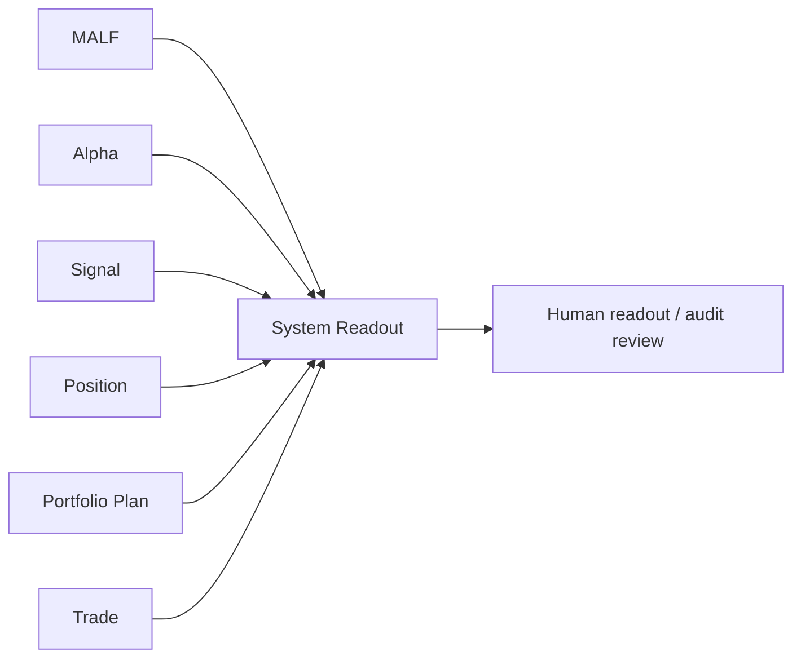

# System Readout Semantic Contract v1

日期：2026-04-27

状态：frozen / freeze review passed / bounded proof passed / full build not executed

## 1. 合同目的

本合同定义 System Readout 在 Asteria 主线中的语义边界。System Readout 只能只读汇总已放行的正式账本，生成全链路 readout、summary 和 audit snapshot，不得重定义业务字段，不得触发业务重算，不得写回任何上游模块。

`system-readout-freeze-review-20260507-01` 已通过后，本合同已冻结为文档表面；
`system-readout-bounded-proof-build-card-20260508-01` 已把 day bounded proof 闭环。
当前允许宣称的是 `System Readout bounded proof passed / full build not executed`，
不允许直接宣称 System full build opened。

## 2. 前置门槛

本合同在以下条件满足前不得冻结：

```text
Trade released
```

System Readout 的任何正式输入字段必须以对应上游模块已放行字段为准。

## 3. 输入语义

System Readout 可读取的上游事实：

| 输入 | 语义来源 |
|---|---|
| `malf_wave_position` | MALF |
| `alpha_event_ledger / alpha_score_ledger / alpha_signal_candidate` | Alpha |
| `formal_signal_ledger / signal_component_ledger` | Signal |
| `position_candidate_ledger / position_entry_plan / position_exit_plan` | Position |
| `portfolio_admission_ledger / portfolio_target_exposure / portfolio_trim_ledger` | Portfolio Plan |
| `order_intent_ledger / execution_plan_ledger / fill_ledger / order_rejection_ledger` | Trade |

System Readout 不得把缺失上游行解释为可自行补算。缺行只能记录为 source gap 或 release gap。

## 4. Readout 语义

| 对象 | 语义 |
|---|---|
| `system_source_manifest` | 本次 readout 使用的 source DB、run、release、schema |
| `system_module_status_snapshot` | 模块 release / audit 状态快照 |
| `system_chain_readout` | symbol / timeframe / date 级全链路读出 |
| `system_summary_snapshot` | 人读 summary |
| `system_audit_snapshot` | 全链路审计摘要 |
| `readout_status` | readout 完整性状态 |

Readout 是只读呈现，不是业务裁决。

## 5. 输出语义

System Readout 正式输出分五层：

| 输出 | 语义 |
|---|---|
| `system_source_manifest` | source 追溯 |
| `system_module_status_snapshot` | 模块状态 |
| `system_chain_readout` | 全链路结构化读出 |
| `system_summary_snapshot` | 人读汇总 |
| `system_audit_snapshot` | 审计快照 |

这些输出不得被任何上游模块用来覆盖自身历史账本。

## 6. Chain Readout 最小字段

| 字段 | 要求 |
|---|---|
| `system_readout_id` | 必填 |
| `symbol` | 必填 |
| `timeframe` | 必填 |
| `readout_dt` | 必填 |
| `readout_status` | `complete / partial / source_gap / audit_gap` |
| `malf_state_ref` | 可空但字段必有 |
| `alpha_ref` | 可空但字段必有 |
| `signal_ref` | 可空但字段必有 |
| `position_ref` | 可空但字段必有 |
| `portfolio_plan_ref` | 可空但字段必有 |
| `trade_ref` | 可空但字段必有 |
| `system_readout_version` | 必填 |

引用字段只保存来源指针或摘要，不复制并改写上游语义。

## 7. Summary Snapshot 最小字段

| 字段 | 要求 |
|---|---|
| `summary_id` | 必填 |
| `summary_scope` | 必填 |
| `summary_dt` | 必填 |
| `summary_payload` | 必填 |
| `readout_status` | 必填 |
| `source_chain_release_version` | 必填 |
| `system_readout_version` | 必填 |

`summary_payload` 是人读摘要，不是业务表权威来源。

## 8. Audit Snapshot 最小字段

| 字段 | 要求 |
|---|---|
| `system_audit_snapshot_id` | 必填 |
| `audit_scope` | 必填 |
| `audit_dt` | 必填 |
| `module_name` | 必填 |
| `source_audit_ref` | 必填 |
| `source_audit_status` | 必填 |
| `system_readout_version` | 必填 |

## 9. 不允许表达

| 表达 | 裁决 |
|---|---|
| System Readout 写回 MALF / Alpha / Signal / Position / Portfolio / Trade | 禁止 |
| System Readout 触发重算并改变历史事实 | 禁止 |
| System Readout 重定义业务字段含义 | 禁止 |
| System Readout 输出新的 execution / fill | 禁止 |
| System Readout 合并 `wave_core_state` 与 `system_state` | 禁止 |
| 上游模块读取 System Readout 覆盖自身事实 | 禁止 |

## 10. 消费原则



System Readout 是主线末端，不产生新的业务 mutation。
