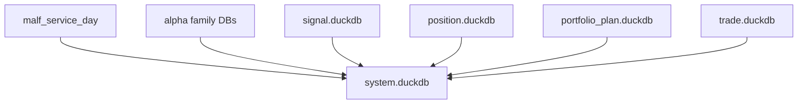
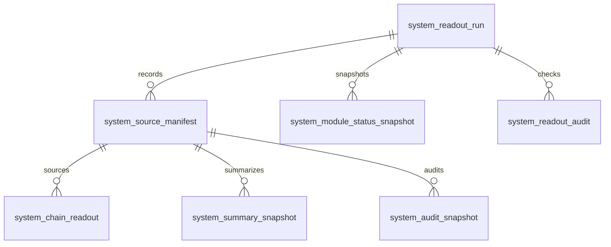

# System Readout Database Schema Spec v1

日期：2026-04-27

状态：draft / pre-gate / not frozen

## 1. 规格范围

本规格为 System Readout pre-gate draft。正式 schema 冻结必须等待：

```text
Trade released
```

目标 System Readout DB：

```text
H:\Asteria-data\system.duckdb
```

该库在 System Readout 设计冻结前不得创建。

## 2. 上游关系



System Readout 只读全链路正式账本，不向任何业务模块写回。

## 3. 表族

| 表 | 自然键 | 说明 |
|---|---|---|
| `system_readout_run` | `run_id` | System Readout build 审计 |
| `system_schema_version` | `schema_version` | schema 版本 |
| `system_readout_version` | `system_readout_version` | readout 版本 |
| `system_source_manifest` | `system_readout_run_id + module_name + source_run_id` | source manifest |
| `system_module_status_snapshot` | `system_readout_run_id + module_name + module_release_version` | 模块状态 |
| `system_chain_readout` | `symbol + timeframe + readout_dt + system_readout_version` | 全链路读出 |
| `system_summary_snapshot` | `summary_scope + summary_dt + system_readout_version` | 人读 summary |
| `system_audit_snapshot` | `audit_scope + audit_dt + system_readout_version` | 审计快照 |
| `system_readout_audit` | `audit_id` | System Readout 审计 |

## 4. 通用审计字段

System Readout 正式表必须带：

```text
run_id
schema_version
system_readout_version
source_chain_release_version
created_at
```

Source manifest 必须额外带：

```text
module_name
source_db
source_run_id
source_release_version
source_schema_version
source_audit_status
```

## 5. system_source_manifest

最小字段：

| 字段 | 要求 |
|---|---|
| `source_manifest_id` | 主体 id |
| `system_readout_run_id` | 必填 |
| `module_name` | 必填 |
| `source_db` | 必填 |
| `source_run_id` | 必填 |
| `source_release_version` | 必填 |
| `source_schema_version` | 必填 |
| `source_audit_status` | 必填 |

## 6. system_module_status_snapshot

最小字段：

| 字段 | 要求 |
|---|---|
| `module_status_snapshot_id` | 主体 id |
| `system_readout_run_id` | 必填 |
| `module_name` | 必填 |
| `module_status` | 必填 |
| `module_release_version` | 必填 |
| `module_audit_status` | 必填 |
| `source_manifest_id` | 必填 |

## 7. system_chain_readout

最小字段：

| 字段 | 要求 |
|---|---|
| `system_readout_id` | 主体 id |
| `symbol` | 必填 |
| `timeframe` | 必填 |
| `readout_dt` | 必填 |
| `readout_status` | `complete / partial / source_gap / audit_gap` |
| `malf_state_ref` | 可空但字段必有 |
| `alpha_ref` | 可空但字段必有 |
| `signal_ref` | 可空但字段必有 |
| `position_ref` | 可空但字段必有 |
| `portfolio_plan_ref` | 可空但字段必有 |
| `trade_ref` | 可空但字段必有 |
| `system_readout_version` | 必填 |

## 8. system_summary_snapshot

最小字段：

| 字段 | 要求 |
|---|---|
| `summary_id` | 主体 id |
| `summary_scope` | 必填 |
| `summary_dt` | 必填 |
| `summary_payload` | 必填 |
| `readout_status` | 必填 |
| `source_chain_release_version` | 必填 |
| `system_readout_version` | 必填 |

## 9. system_audit_snapshot

最小字段：

| 字段 | 要求 |
|---|---|
| `system_audit_snapshot_id` | 主体 id |
| `audit_scope` | 必填 |
| `audit_dt` | 必填 |
| `module_name` | 必填 |
| `source_audit_ref` | 必填 |
| `source_audit_status` | 必填 |
| `system_readout_version` | 必填 |

## 10. system_readout_audit

最小字段：

| 字段 | 说明 |
|---|---|
| `audit_id` | 审计 id |
| `run_id` | System Readout run |
| `check_name` | 检查项 |
| `severity` | `hard / soft` |
| `status` | `pass / fail / observe` |
| `failed_count` | 失败行数 |
| `sample_payload` | 样例 |

## 11. ER 图



## 12. 写入裁决

| 规则 | 裁决 |
|---|---|
| 正式 DB 路径 | `H:\Asteria-data` |
| working DB 路径 | `H:\Asteria-temp\system_readout\<run_id>\` |
| 写入方式 | 批量写入 |
| 同库多写 | 禁止 |
| 旧数据替换 | staging 审计通过后 promote |
| `run_id` | 审计字段，不作为业务自然键 |
| formal DB create | System Readout design freeze 后才允许 |

## 13. 不允许的 schema

| 字段或表 | 裁决 |
|---|---|
| 自定义 `wave_core_state` / `system_state` | 禁止，归属 MALF |
| 自定义 Alpha / Signal / Position / Portfolio / Trade 字段 | 禁止 |
| 业务重算结果表 | 禁止 |
| 上游 mutation table | 禁止 |
