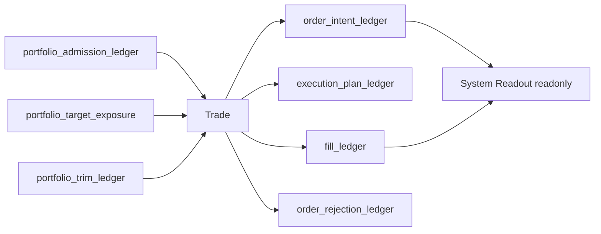
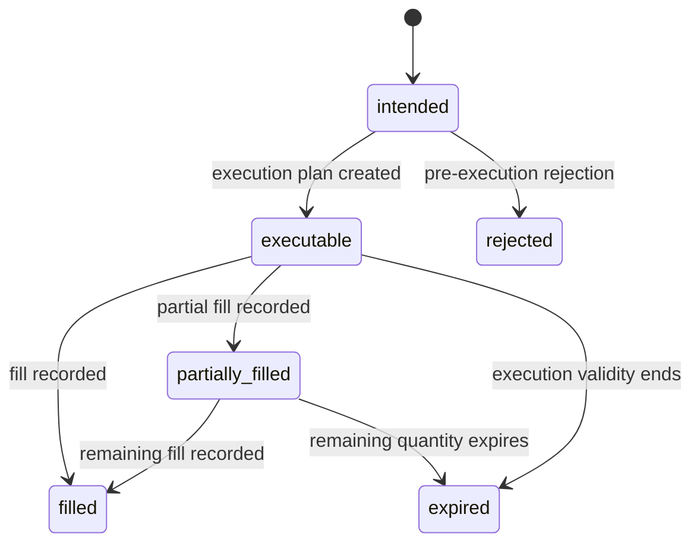

# Trade Authority Design v1

日期：2026-04-27

状态：frozen / freeze review passed / bounded proof passed / full build not executed

## 1. 模块定义

Trade 是 Asteria 主线中位于 Portfolio Plan 之后、System Readout 之前的执行事实模块。

Trade 只负责把已放行的 Portfolio Plan 输出转化为 order intent、execution plan、fill ledger 和 rejection ledger。Trade 不解释 MALF 结构，不重新计算 Alpha、Signal、Position 或 Portfolio Plan，不修改 Portfolio Plan 历史裁决，不输出系统级结论。

`trade-freeze-review-20260507-01` 已将本文件冻结为 Trade v1 合同表面，且
`trade-bounded-proof-build-card-20260507-01` 已完成 day bounded proof。当前仍不授权
Trade full build、System Readout 正式库或 full-chain Pipeline。

## 2. 前置门槛

Trade 设计冻结和施工必须等待：

```text
Portfolio Plan released
```

该门槛至少要求：

| 项 | 要求 |
|---|---|
| Portfolio Plan DB | 已存在可审计的 admitted plan / target exposure |
| Portfolio Plan Audit | Portfolio Plan hard audit 全通过 |
| Portfolio Plan Contract | Portfolio Plan 输出可被 Trade 只读消费 |
| Release Evidence | Portfolio Plan bounded proof / release evidence 已落档 |

在上述条件满足前，本文件只作为 pre-gate draft，不允许施工。

## 3. 权威来源

Trade 的唯一上游语义来源是已放行的 Portfolio Plan 输出：

```text
portfolio_admission_ledger
portfolio_target_exposure
portfolio_trim_ledger
```

Trade 不得直接读取 Position、Signal、Alpha 或 MALF 并绕过 Portfolio Plan 形成订单意图。

## 4. 模块只回答什么

| 问题 | Trade 是否回答 |
|---|---:|
| 已准入 portfolio plan 如何形成 order intent | 是 |
| 订单意图的执行价格线和有效期是什么 | 是 |
| 执行是否被拒绝以及原因是什么 | 是 |
| 成交账本如何记录 | 是 |
| 策略评分是多少 | 否 |
| 组合层目标暴露如何裁决 | 否 |
| 全链路系统结论是什么 | 否 |

## 5. 模块不回答什么

| 禁止输出 | 归属模块 |
|---|---|
| WavePosition 结构事实 | MALF |
| Alpha opportunity event / score | Alpha |
| formal signal 聚合 | Signal |
| position candidate / entry / exit plan | Position |
| portfolio constraints / target exposure 裁决 | Portfolio Plan |
| 全链路 readout | System Readout |

## 6. 输入

Trade 第一阶段只读消费 Portfolio Plan DB：

```text
H:\Asteria-data\portfolio_plan.duckdb
```

核心输入表：

```text
portfolio_admission_ledger
portfolio_target_exposure
portfolio_trim_ledger
```

Trade 不得直接消费 Position、Signal、Alpha 或 MALF 作为正式业务输入。

## 7. 输出

Trade 目标 DB：

```text
H:\Asteria-data\trade.duckdb
```

输出表族：

| 表 | 职责 |
|---|---|
| `trade_run` | Trade build 审计 |
| `trade_schema_version` | schema 版本 |
| `trade_rule_version` | 执行规则版本 |
| `trade_portfolio_snapshot` | Portfolio Plan 输入快照 |
| `order_intent_ledger` | 订单意图账本 |
| `execution_plan_ledger` | 执行价格线与有效期 |
| `fill_ledger` | 成交账本 |
| `order_rejection_ledger` | 拒单 / 拒绝执行账本 |
| `trade_audit` | Trade 审计 |

该 DB 只能在 Trade 设计冻结、Portfolio Plan released，且后续 Trade bounded proof build card 明确执行后创建。freeze review passed 本身不创建正式 Trade DB。

## 8. 数据流



## 9. 状态机



Trade 状态只描述执行事实生命周期，不表达策略机会质量或系统级结论。

## 10. 自然键

| 表 | 自然键 |
|---|---|
| `trade_run` | `run_id` |
| `trade_schema_version` | `schema_version` |
| `trade_rule_version` | `trade_rule_version` |
| `trade_portfolio_snapshot` | `trade_run_id + portfolio_admission_id` |
| `order_intent_ledger` | `portfolio_admission_id + order_side + trade_rule_version` |
| `execution_plan_ledger` | `order_intent_id + execution_plan_type + trade_rule_version` |
| `fill_ledger` | `order_intent_id + execution_dt + fill_seq + trade_rule_version` |
| `order_rejection_ledger` | `order_intent_id + rejection_reason + trade_rule_version` |
| `trade_audit` | `audit_id` |

## 11. 版本字段

正式 Trade 表默认包含：

```text
run_id
schema_version
trade_rule_version
source_portfolio_plan_release_version
created_at
```

若 Trade 使用成交模型、滑点模型或执行样本，必须增加：

```text
execution_model_version
sample_version
sample_scope
```

## 12. 上下游边界

上游：

```text
Portfolio Plan -> admitted plan / target exposure
```

下游：

```text
System Readout -> readonly order intent / execution / fill / rejection
```

Trade 不得修改 Portfolio Plan 历史输出。System Readout 不得写回 Trade。

当前 Data 正式表面只证明 `execution_price_line = none` 已物化，尚未提供 evidence-backed fill source。
`trade-bounded-proof-build-card-20260507-01` 已执行完成，但 `fill_ledger` 仍保持空表，并由
`trade_audit` 显式记录 retained gap。

## 13. 上线门禁

Trade 未来冻结必须满足：

| 门禁 | 要求 |
|---|---|
| Portfolio Plan Release | Portfolio Plan released |
| Design | Trade 六件套从 pre-gate draft 升级并审阅 |
| Schema | `trade.duckdb` 表族、自然键、版本字段冻结 |
| Runner | bounded / segmented / full / resume 语义冻结 |
| Audit | 只读 Portfolio Plan、无策略重算和系统结论输出、自然键唯一等硬审计冻结 |
| Evidence | Trade bounded proof 证据落入 `H:\Asteria-report` 或 `H:\Asteria-Validated` |

freeze review 通过后的下一张允许卡是 `trade_bounded_proof_build_card`；该卡已执行完成。
下一步允许准备 `system_readout_freeze_review`。Trade full build、System Readout 施工和
full-chain Pipeline 仍未放行。
