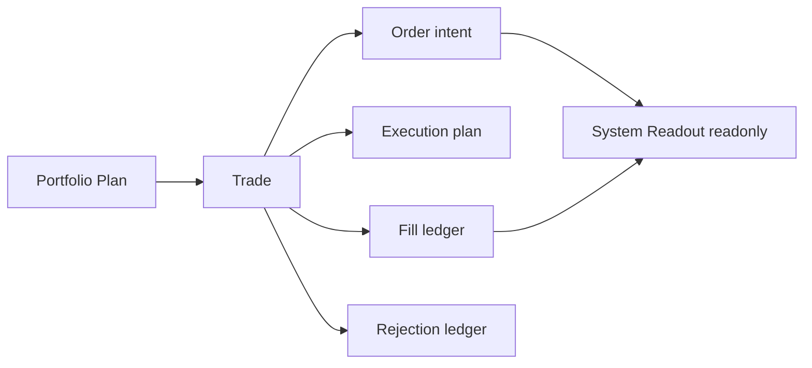

# Trade Semantic Contract v1

日期：2026-04-27

状态：frozen / freeze review passed / bounded proof passed / full build not executed

## 1. 合同目的

本合同定义 Trade 在 Asteria 主线中的语义边界。Trade 只能把已放行的 Portfolio Plan 输出转化为订单意图、执行计划、成交和拒单事实，不得重定义 Portfolio Plan、Position、Signal、Alpha 或 MALF，不得输出系统级读出。

## 2. 前置门槛

本合同在以下条件满足前不得冻结：

```text
Portfolio Plan released
```

Trade 的任何正式输入字段必须以 Portfolio Plan 已放行字段为准。

## 3. 输入语义

Trade 只读消费 Portfolio Plan 的最小字段：

| 字段 | 语义来源 |
|---|---|
| `portfolio_admission_id` | Portfolio Plan |
| `position_candidate_id` | Portfolio Plan provenance |
| `symbol` | Portfolio Plan |
| `timeframe` | Portfolio Plan |
| `plan_dt` | Portfolio Plan |
| `admission_state` | Portfolio Plan |
| `target_exposure_id` | Portfolio Plan |
| `target_weight` | Portfolio Plan |
| `target_notional` | Portfolio Plan |
| `target_quantity_hint` | Portfolio Plan |
| `source_position_release_version` | Portfolio Plan provenance |
| `portfolio_plan_rule_version` | Portfolio Plan |

Trade 不得把 Portfolio Plan 缺行解释为 Position、Signal、Alpha 或 MALF 数据错误。缺行只表示 Portfolio Plan 未发布正式输入。

## 4. Trade 语义

| 对象 | 语义 |
|---|---|
| `trade_portfolio_snapshot` | 本次 run 读取到的 Portfolio Plan 快照 |
| `order_intent` | 从 admitted plan 生成的订单意图 |
| `execution_plan` | 执行价格线、有效期和执行方式 |
| `fill` | 成交事实 |
| `order_rejection` | 拒单或拒绝执行事实 |
| `trade_state` | intended / executable / filled / partially_filled / rejected / expired |

Trade 是执行事实层，不是策略解释层。

`trade-freeze-review-20260507-01` 已冻结本语义合同，且 `trade-bounded-proof-build-card-20260507-01`
已完成执行。Trade v1 仍只读消费 released Portfolio Plan bounded proof surface，不直接读取
Position / Signal / Alpha / MALF 形成业务输出，不回写任何上游模块。

## 5. 输出语义

Trade 正式输出分五层：

| 输出 | 语义 |
|---|---|
| `trade_portfolio_snapshot` | 记录本轮 Portfolio Plan 输入 |
| `order_intent_ledger` | 订单意图账本 |
| `execution_plan_ledger` | 执行计划 |
| `fill_ledger` | 成交账本 |
| `order_rejection_ledger` | 拒单 / 拒绝执行账本 |

这些输出只能给 System Readout 做只读消费。

## 6. Order Intent 最小字段

| 字段 | 要求 |
|---|---|
| `order_intent_id` | 必填 |
| `portfolio_admission_id` | 必填 |
| `symbol` | 必填 |
| `intent_dt` | 必填 |
| `order_side` | `buy / sell / reduce / close` |
| `order_intent_state` | `intended / executable / rejected / expired` |
| `target_quantity_hint` | 可空但字段必有 |
| `source_portfolio_plan_release_version` | 必填 |
| `trade_rule_version` | 必填 |

`target_quantity_hint` 来自 Portfolio Plan，不是成交数量。

## 7. Execution Plan 最小字段

| 字段 | 要求 |
|---|---|
| `execution_plan_id` | 必填 |
| `order_intent_id` | 必填 |
| `execution_plan_type` | 必填 |
| `execution_price_line` | 可空但字段必有 |
| `execution_valid_from` | 必填 |
| `execution_valid_until` | 可空但字段必有 |
| `execution_state` | `planned / rejected / expired / executed` |
| `trade_rule_version` | 必填 |

## 8. Fill 最小字段

| 字段 | 要求 |
|---|---|
| `fill_id` | 必填 |
| `order_intent_id` | 必填 |
| `execution_plan_id` | 必填 |
| `execution_dt` | 必填 |
| `fill_seq` | 必填 |
| `fill_price` | 必填 |
| `fill_quantity` | 必填 |
| `fill_amount` | 必填 |
| `trade_rule_version` | 必填 |

Fill 只记录执行事实，不改写 Portfolio Plan 历史裁决。当前不得伪造真实 fill：在没有 evidence-backed execution / fill source 前，`fill_ledger` 只作为冻结 schema，首轮 bounded proof 可以记录 empty / retained gap 状态，但不得写入模拟成交作为正式事实。

## 9. 不允许表达

| 表达 | 裁决 |
|---|---|
| Trade 修改 Portfolio Plan 历史裁决 | 禁止 |
| Trade 重新定义 target exposure | 禁止 |
| Trade 重定义 Position / Signal / Alpha / MALF | 禁止 |
| Trade 直接读取 MALF / Alpha / Signal / Position 绕过 Portfolio Plan | 禁止 |
| Trade 输出 strategy score | 禁止 |
| Trade 输出 system readout | 禁止 |
| System Readout 回写 Trade | 禁止 |

## 10. 下游消费原则



System Readout 只能读取 Trade 输出并形成全链路只读汇总。System Readout 不得触发业务重算或修改 Trade 历史事实。
