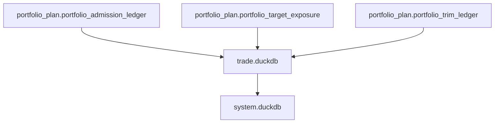
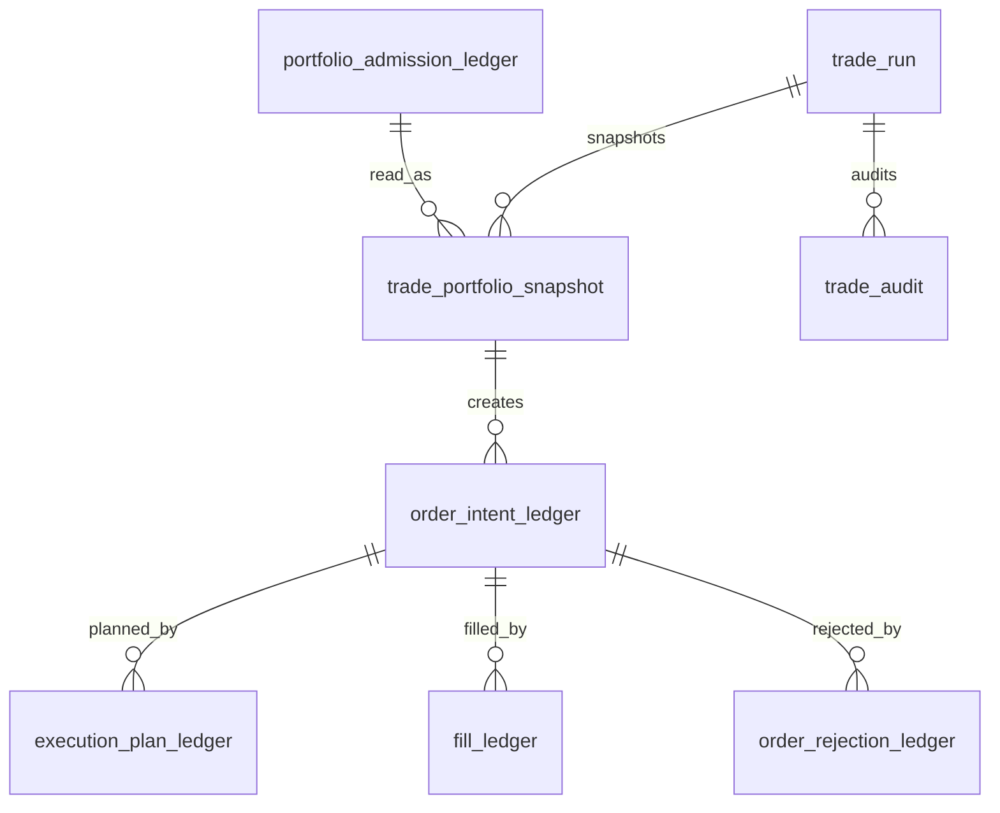

# Trade Database Schema Spec v1

日期：2026-04-27

状态：frozen / freeze review passed / bounded proof not executed

## 1. 规格范围

本规格已由 `trade-freeze-review-20260507-01` 冻结为 Trade v1 schema contract。正式 DB 创建必须等待：

```text
Portfolio Plan released
```

目标 Trade DB：

```text
trade_bounded_proof_build_card
```

该库在 Trade 设计冻结前不得创建。

## 2. 上游关系



Trade 只向 System Readout 提供只读 order intent、execution、fill 和 rejection。System Readout 不得写回 Trade。

## 3. 表族

| 表 | 自然键 | 说明 |
|---|---|---|
| `trade_run` | `run_id` | Trade build 审计 |
| `trade_schema_version` | `schema_version` | schema 版本 |
| `trade_rule_version` | `trade_rule_version` | 执行规则版本 |
| `trade_portfolio_snapshot` | `trade_run_id + portfolio_admission_id` | Portfolio Plan 输入快照 |
| `order_intent_ledger` | `portfolio_admission_id + order_side + trade_rule_version` | 订单意图 |
| `execution_plan_ledger` | `order_intent_id + execution_plan_type + trade_rule_version` | 执行计划 |
| `fill_ledger` | `order_intent_id + execution_dt + fill_seq + trade_rule_version` | 成交事实 |
| `order_rejection_ledger` | `order_intent_id + rejection_reason + trade_rule_version` | 拒单事实 |
| `trade_audit` | `audit_id` | Trade 审计 |

## 4. 通用审计字段

Trade 正式表必须带：

```text
run_id
schema_version
trade_rule_version
source_portfolio_plan_release_version
created_at
```

若 Trade 使用成交模型、滑点模型或执行样本，还必须带：

```text
execution_model_version
sample_version
sample_scope
```

## 5. trade_portfolio_snapshot

最小字段：

| 字段 | 要求 |
|---|---|
| `trade_portfolio_snapshot_id` | 主体 id |
| `trade_run_id` | 必填 |
| `portfolio_admission_id` | 必填 |
| `symbol` | 必填 |
| `timeframe` | 必填 |
| `plan_dt` | 必填 |
| `admission_state` | 必填 |
| `target_exposure_id` | 必填 |
| `target_quantity_hint` | 可空但字段必有 |
| `portfolio_plan_rule_version` | 必填 |
| `source_portfolio_plan_release_version` | 必填 |

## 6. order_intent_ledger

最小字段：

| 字段 | 要求 |
|---|---|
| `order_intent_id` | 主体 id |
| `portfolio_admission_id` | 必填 |
| `symbol` | 必填 |
| `intent_dt` | 必填 |
| `order_side` | `buy / sell / reduce / close` |
| `order_intent_state` | `intended / executable / rejected / expired` |
| `target_quantity_hint` | 可空但字段必有 |
| `source_portfolio_plan_release_version` | 必填 |
| `trade_rule_version` | 必填 |

## 7. execution_plan_ledger

最小字段：

| 字段 | 要求 |
|---|---|
| `execution_plan_id` | 主体 id |
| `order_intent_id` | 必填 |
| `execution_plan_type` | 必填 |
| `execution_price_line` | 可空但字段必有 |
| `execution_valid_from` | 必填 |
| `execution_valid_until` | 可空但字段必有 |
| `execution_state` | `planned / rejected / expired / executed` |
| `trade_rule_version` | 必填 |

## 8. fill_ledger

最小字段：

| 字段 | 要求 |
|---|---|
| `fill_id` | 主体 id |
| `order_intent_id` | 必填 |
| `execution_plan_id` | 必填 |
| `execution_dt` | 必填 |
| `fill_seq` | 必填 |
| `fill_price` | 必填 |
| `fill_quantity` | 必填 |
| `fill_amount` | 必填 |
| `trade_rule_version` | 必填 |

## 9. order_rejection_ledger

最小字段：

| 字段 | 要求 |
|---|---|
| `order_rejection_id` | 主体 id |
| `order_intent_id` | 必填 |
| `rejection_dt` | 必填 |
| `rejection_reason` | 必填 |
| `rejection_stage` | `intent / execution / fill` |
| `trade_rule_version` | 必填 |

## 10. trade_audit

最小字段：

| 字段 | 说明 |
|---|---|
| `audit_id` | 审计 id |
| `run_id` | Trade run |
| `check_name` | 检查项 |
| `severity` | `hard / soft` |
| `status` | `pass / fail / observe` |
| `failed_count` | 失败行数 |
| `sample_payload` | 样例 |

## 11. ER 图



## 12. 写入裁决

| 规则 | 裁决 |
|---|---|
| 正式 DB 路径 | `H:\Asteria-data` |
| working DB 路径 | `H:\Asteria-temp\trade\<run_id>\` |
| 写入方式 | 批量写入 |
| 同库多写 | 禁止 |
| 旧数据替换 | staging 审计通过后 promote |
| `run_id` | 审计字段，不作为业务自然键 |
| formal DB create | Trade design freeze 后才允许 |

## 13. 不允许的 schema

| 字段或表 | 裁决 |
|---|---|
| `strategy_score` | 禁止，归属 Alpha / Signal |
| `portfolio_admission_state_override` | 禁止，归属 Portfolio Plan |
| `system_readout_id` | 禁止，归属 System Readout |
| 自定义 MALF / Alpha / Signal / Position / Portfolio Plan 字段 | 禁止 |

`fill_ledger` 表族在本卡只冻结 schema。后续 bounded proof 若没有 evidence-backed execution / fill source，不得向 `fill_ledger` 写入模拟成交事实；该缺口必须通过 `trade_audit` 记录为 retained gap。
