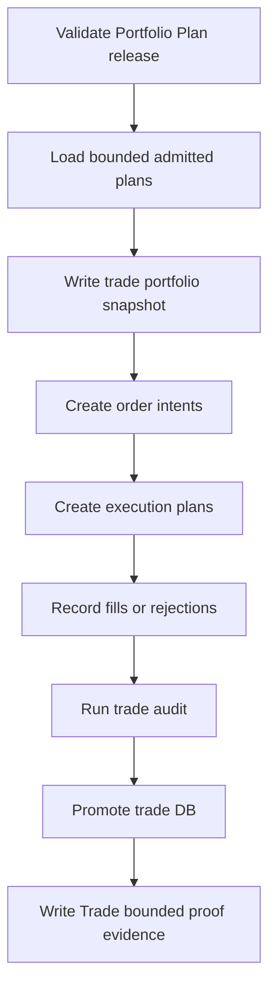

# Trade Runner Contract v1

日期：2026-04-27

状态：frozen / freeze review passed / bounded proof passed / full build not executed

## 1. Runner 目标

Trade runner 负责在 Portfolio Plan released 之后，读取 admitted plan / target exposure，构建 order intent、execution plan、fill ledger 和 rejection ledger，并执行边界与一致性审计。

本文件已由 `trade-freeze-review-20260507-01` 冻结为后续 Trade bounded proof runner 合同，且
`trade-bounded-proof-build-card-20260507-01` 已完成执行。`scripts/trade` 现已创建，但仍只保留
bounded proof / audit / resume 范围。

## 2. 前置门槛

所有 Trade runner 必须在运行前验证：

```text
Portfolio Plan released
```

缺少 Portfolio Plan release evidence、缺少 admitted plan 输出、或 Portfolio Plan hard audit 未通过时，runner 必须拒绝正式 build。

## 3. Runner 列表

| Runner | 职责 |
|---|---|
| `scripts/trade/run_trade_build.py` | 构建 portfolio snapshot / order intent / execution plan / fill / rejection |
| `scripts/trade/run_trade_audit.py` | 执行 Trade 输入、输出、边界审计 |
| `scripts/trade/run_trade_bounded_proof.py` | 编排 Trade bounded proof |

这些 runner 已完成 bounded proof 最小表面创建；production/full runner 仍必须另开卡。

## 4. 构建顺序



## 5. 运行模式

| 模式 | 要求 |
|---|---|
| `bounded` | 必须传 `start_dt / end_dt` 或 `symbol_limit` |
| `segmented` | 必须传 symbol range、batch id 或 timeframe |
| `full` | 只能在 bounded proof 通过后开启 |
| `resume` | 必须读取 checkpoint |
| `audit-only` | 不写业务表，只写 audit 或报告 |

## 6. 公共参数

| 参数 | 要求 |
|---|---|
| `--timeframe` | 第一阶段固定为 `day` |
| `--mode` | `bounded / segmented / full / resume / audit-only` |
| `--run-id` | 可传入；未传入时由 runner 生成 |
| `--source-portfolio-plan-db` | Portfolio Plan DB 路径 |
| `--target-trade-db` | Trade 目标 DB 路径 |
| `--start-dt` | bounded 可选条件 |
| `--end-dt` | bounded 可选条件 |
| `--symbol-limit` | bounded 可选条件 |
| `--schema-version` | 必填 |
| `--trade-rule-version` | 必填 |
| `--source-portfolio-plan-release-version` | 必填 |

## 7. 幂等与断点

| 规则 | 裁决 |
|---|---|
| 同一 run 重跑 | 必须可识别并拒绝重复 promote |
| bounded 重算 | 允许覆盖同 scope staging |
| promote | 只能在审计通过后执行 |
| checkpoint | 存放在 `H:\Asteria-temp\trade\<run_id>\` |
| 失败恢复 | resume 必须从 checkpoint 或 staging 状态恢复 |
| source lock | 必须记录 source Portfolio Plan release version |

## 8. 输出证据

每个 runner 必须产生：

| 证据 | 位置 |
|---|---|
| run ledger | `trade.duckdb` |
| input snapshot | `trade.duckdb` |
| audit report | `H:\Asteria-report\trade\<date>\` |
| release evidence | `H:\Asteria-Validated\` |

正式证据不得写入 repo 根目录。

## 9. 禁止行为

| 行为 | 裁决 |
|---|---|
| 修改 Portfolio Plan DB | 禁止 |
| 直接读取 Position / Signal / Alpha / MALF 形成 order intent | 禁止 |
| 创建 System DB | 禁止 |
| 写入 system readout 字段 | 禁止 |
| 绕过 Portfolio Plan release gate 启动 full build | 禁止 |

当前不得伪造成交事实。`trade-bounded-proof-build-card-20260507-01` 已执行完成，但因缺少
evidence-backed execution / fill source，`fill_ledger` 保持为空并由 retained gap 审计记录；
不得把 Data `analysis_price_line`、Portfolio Plan target exposure 或人工样例当作真实成交价。
