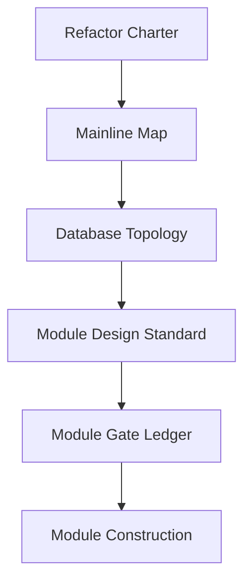

# Asteria 文档入口

本目录是 Asteria 星脉系统重构的文档主入口。



## 文件分层

| 目录 | 职责 |
|---|---|
| `00-governance` | 重构总纲、施工纪律、上线门禁 |
| `01-architecture` | 主线模块图、数据库拓扑、跨模块依赖 |
| `02-modules` | 单模块权威设计与设计模板 |
| `03-refactor` | 当前施工状态、门禁账本、执行顺序 |

## 外部权威锚点

MALF 三份终稿位于：

```text
H:\Asteria-Validated\MALF_Three_Part_Design_Set_v1_2
```

其中：

| 文件 | 职责 |
|---|---|
| `MALF_01_Core_Definitions_Theorems_v1_3.md` | Core 结构定义与定理 |
| `MALF_02_Lifespan_Stats_Definitions_Theorems_v1_2.md` | 波段统计学定义 |
| `MALF_03_System_Service_Interface_v1_2.md` | MALF 对系统其它模块的服务接口 |
| `MALF_00_Three_Documents_Bridge_v1_2.md` | 三份文件关联总纲 |

Validated 资产清单：

- [Asteria Validated 资产清单](H:/Asteria/docs/01-architecture/02-validated-asset-inventory-v1.md)

前辈系统资产清单：

- [前辈系统主线模块资产清单](H:/Asteria/docs/01-architecture/03-predecessor-system-module-inventory-v1.md)

重构来路：

- [Asteria 重构来路与决策链](H:/Asteria/docs/00-governance/01-asteria-refactor-origin-trace-v1.md)
